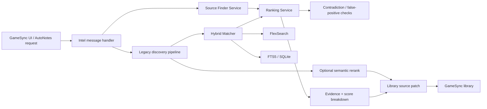

# GameSync Source Finder / Entity Resolver Wiki

**Project Constellation ID:** PCX-054  
**Status:** ACTIVE / TRACKED  
**Shipping implementation:** [Herbertofury/Gamesync](https://github.com/Herbertofury/Gamesync), GameSync `0.6.3`, observed head `a8e37976eb0b3ee3c4ec5e802b02d3bfa1f41928`  
**GameSync Next implementation:** [Herbertofury/GameSync-Next](https://github.com/Herbertofury/GameSync-Next), observed head `9e337c720f0180cffa577f140b181c699f0a1650`  
**Primary shipping source root:** `app/`  
**Primary shipping runtime:** Manifest V3 browser extension service worker  

## Purpose

GameSync Source Finder / Entity Resolver is the identity and source-discovery subsystem used to connect a local game or mod record to the correct external entity and the strongest available source pages without silently merging unrelated items.

The Project Constellation goal for this track is:

> Resolve game/mod identity and strongest source pages across providers without false merges.

The durable requirements are strong identity, duplicate isolation, source provenance, confidence, and user-correctable matches. Current project-owned source in both GameSync repositories now matters: the shipping repository remains the richest source for the mature identity/ranking pipeline, while GameSync Next has a separately verified Found Mods and multi-source discovery implementation that must not be omitted from the current documentation picture.

## What is implemented

The current GameSync `0.6.3` background service worker imports and wires a dedicated source-finder service, ranking service, hybrid matcher, FlexSearch layer, FTS5/SQLite ranker, remote federated-search broker, Typesense and Meilisearch clients, evidence collector, score-breakdown persistence, and legacy source-discovery pipeline.

Source discovery is not a single fuzzy-title lookup. The current shipping architecture combines provider-aware discovery, URL classification, multiple recall backends, evidence-aware scoring, contradiction blocking, optional semantic reranking, and explicit confidence decisions.

GameSync Next also contains a typed multi-source discovery implementation in `packages/shared/src/modSourceDiscovery.ts` plus a React Found Mods workspace in `apps/extension-v2/src/ui/app/FoundModsView.tsx`. The canonical parity matrix marks `source-discovery-and-found-mods` as **verified**, with isolated Opera evidence that the packaged offscreen MiniLM/WASM reranker executed with valid scores. The parity record explicitly keeps broader provider-by-provider equivalence as a separate remaining concern.

## Shipping architecture



### Main shipping modules

| Module | Role |
| --- | --- |
| `app/background/background.js` | MV3 service-worker composition root. Imports and wires source finding, entity resolution, search, ranking, diagnostics, persistence, and message handling. |
| `app/src/services/source-finder-service.js` | Provider registry, URL classification, discovery-candidate scoring, download-candidate scoring, source evidence logic. |
| `app/src/modsources/discovery.js` | Full legacy-compatible source-discovery pipeline and provider-specific search behavior. Integrates the Hybrid Matcher behind a feature-gated path. |
| `app/src/search/HybridMatcher.js` | Shared entity resolver for games, mods, and creators. Unions recall backends, scores candidates, blocks contradictions, and emits decision levels. |
| `app/src/services/ranking-service.js` | Shared composite scoring weights, fuzzy scoring, library-match scoring, false-positive checks, and score breakdowns. |
| `app/src/search/FlexSearchLayer.js` | Fast local recall backend used by Hybrid Matcher. |
| `app/src/search/sql/sql-ranker.js` | FTS5/SQLite authoritative lexical search and ranking backend. |
| `app/src/search/remote/search-broker.js` | Federated remote-search path. |
| `app/src/search/EvidenceCollector.js` | Evidence records and query dossiers for explainable decisions. |
| `app/src/search/ScoreBreakdown.js` | Persisted score decomposition for debugging and explainability. |
| `app/modules/mods-intel-suite/background/intel-message-handler.js` | Message API for AutoNotes source finding, library matching, semantic reranking, and patching discovered sources into the library. |

## GameSync Next verified parity lane

### Shared external source-discovery engine

`packages/shared/src/modSourceDiscovery.ts` is a typed discovery implementation rather than a placeholder wrapper. Its current source defines:

- discovery result types with confidence, evidence, freshness, source kind, version/date information, current/latest URLs, update state, and patch output;
- more than 25 recognized source-platform keys including Patreon, Boosty, Kemono, LoversLab, TS4 Rebels, Aqxaro Mods, Synthira, The Sims Resource, ModTheSims, SimsFinds, Mod Collective, CurseForge, WCIF.cc, Sim File Share, Nexus Mods, Modrinth, Planet Minecraft, Silverlock, ENBDev, YouTube, Tistory, blog.jp, X, Tumblr, and Afdian;
- feed-source classification for Patreon, Boosty, Kemono, Tumblr, X, and Afdian;
- Sims-only platform classification;
- game-family discovery profiles for Sims, Minecraft Java/Bedrock, Skyrim SE, Fallout 4, Starfield, Cyberpunk 2077, Hytale, and a default profile;
- direct/profile/linked source classification;
- canonical URL cleanup that removes common tracking parameters;
- provider-specific direct-page and ignored-path rules;
- provider profile inference/canonicalization;
- version and publication-date extraction/ordering;
- provider-priority boosts based on the resolved game profile.

This typed Next implementation overlaps materially with the shipping discovery domain, but it is not a byte-for-byte port of every shipping source-finder module. Treat the two implementations as a parity pair with explicit equivalence evidence rather than assuming that one file fully supersedes the shipping pipeline.

### Found Mods workspace

`apps/extension-v2/src/ui/app/FoundModsView.tsx` is the current React workflow for local discovered mods. It exposes:

- Connect + Scan;
- refresh;
- free-text filtering;
- game filtering;
- connected-folder filtering;
- optional inclusion of ignored discoveries;
- Add to library;
- Merge with a library entry;
- Ignore/unignore;
- connected-folder management.

The view loads discovered items and connected folders through typed background-message calls. When the user chooses Merge and the discovery is not already linked, the UI requests an `intelLibraryMatch` result and currently requires confidence `>= 0.45` before permitting that **manual user-initiated** merge path. This 0.45 threshold must not be confused with the shipping Hybrid Matcher's automatic attachment threshold of `>= 0.86`; a future automatic merge path must preserve the stricter identity contract.

When Add to library succeeds, the view rebuilds the AutoNotes library and then links the discovery to the newly created library entry when it can derive the entry identity. Errors remain surfaced to the user through the active UI flow rather than being represented as success.

### Current no-cap regression in Found Mods retrieval

The current Found Mods view requests discovered rows with:

`limit: 5000`

That is a source-level hard retrieval cap. Project Constellation and GameSync's standing complete-library rule prohibit hidden count caps, viewport admission limits, or other quantity-reduction shortcuts. A library containing more than 5,000 matching discoveries can therefore be incompletely represented by this view even though the UI reports item/visible counts for the returned set.

This is not a theoretical style concern. The hard `5000` request limit is present in the current `FoundModsView.tsx` source. The corrective design should use complete pagination/streaming or another lossless retrieval contract that eventually admits every matching discovery while preserving responsiveness and stable identity. Do not replace the cap with viewport virtualization or another hidden completeness limit.

A focused acceptance test should create more than 5,000 discoveries, prove every matching record can be reached and acted on, and verify that filtering, merge/add/ignore, reload, and restart still operate on the full canonical set.

## Source discovery provider coverage

The shipping source-finder service currently recognizes more than 25 platform keys. Verified registry entries include:

- Patreon
- Boosty
- Kemono
- LoversLab
- TS4 Rebels
- AMLGames
- Aqxaro Mods
- Synthira
- The Sims Resource
- ModTheSims
- SimsFinds
- Mod Collective
- CurseForge
- WCIF.cc
- Sim File Share
- Nexus Mods
- Modrinth
- Planet Minecraft
- Silverlock
- ENBDev
- YouTube
- Tistory
- blog.jp / Livedoor-style pages
- X / Twitter
- Tumblr
- Afdian

The implementation also distinguishes feed-oriented sources and Sims-only providers so source discovery can use game context rather than querying every provider indiscriminately.

The current GameSync Next typed discovery registry overlaps heavily with this list but is not identical. For example, the shipping documentation/evidence includes AMLGames while the current Next `DISCOVERY_PLATFORMS` set inspected in this pass does not. Keep provider equivalence explicit instead of collapsing both registries into one unsupported claim.

### Game-aware filtering

`discovery.js` has explicit Sims-versus-non-Sims context inference from the current URL and game key. Sims-only providers are skipped for known non-Sims games. Ambiguous contexts retain backward-compatible Sims behavior rather than pretending certainty.

Known non-Sims family hints include Skyrim, Fallout, Cyberpunk, The Witcher, Starfield, Baldur's Gate, Oblivion, Morrowind, and Stardew-related keys.

GameSync Next also resolves game-specific discovery profiles and provider preference ordering from explicit game keys or known provider URLs. Current typed profiles cover at least Sims 4, Minecraft Java/Bedrock, Skyrim SE, Fallout 4, Starfield, Cyberpunk 2077, Hytale, and a default profile.

## URL identity and classification

`source-finder-service.js` first detects a platform from the URL, then classifies the page as one of:

- `direct`
- `profile`
- `search`
- `tag`
- `generic`

Direct mod/project pages receive positive ranking weight. Search and tag pages receive penalties. Provider-specific path rules are used for Nexus Mods, Modrinth, CurseForge, Patreon, Kemono, LoversLab, AMLGames, The Sims Resource, ModTheSims, and other supported providers.

The older discovery implementation contains additional direct-path and ignored-path patterns to keep navigation pages, login pages, generic listings, and known bad discovery destinations from being treated as canonical source pages.

GameSync Next similarly canonicalizes URLs, strips common tracking parameters, identifies host platforms, applies direct-path and ignored-path patterns, canonicalizes creator/profile URLs, and classifies sources as `direct`, `profile`, or `linked` in its typed discovery result.

## Entity-resolution pipeline

### 1. Recall

`HybridMatcher.resolveEntityCandidate()` gathers candidates from available local backends.

Current verified recall stages are:

1. **FlexSearch** for fast instant recall.
2. **FTS5 / SQLite** when the `fts5Ranking` feature flag is enabled.
3. Union and de-duplication by entity ID.

The service supports `game`, `mod`, and `creator` entity types.

### 2. Composite scoring

Candidates are evaluated using evidence signals such as:

- exact title match
- partial/fuzzy title match
- author exact/partial match
- game-context match
- filename match
- version match
- source-domain affinity
- token overlap
- FTS5 match stage
- direct-page evidence
- profile-page evidence
- body-title evidence
- archive corroboration
- DuckDuckGo corroboration
- reverse-image corroboration

The ranking service attempts the WASM scoring/fuzzy implementation first and falls back to JavaScript if the WASM path is unavailable or fails.

### 3. Contradiction blocking

A high raw score does not automatically permit attachment.

The current resolver explicitly checks for hard contradictions including:

- conflicting edition markers, such as Special Edition versus a different edition family
- conflicting years
- strong author disagreement

The ranking service separately detects common false-positive patterns such as game-edition conflicts and numeric sequel conflicts such as one numbered installment being matched to another.

### 4. Decision thresholds

The Hybrid Matcher currently uses these confidence thresholds:

| Decision | Threshold |
| --- | ---: |
| Auto-attach | `>= 0.86` when not contradiction-blocked |
| Suggested | `>= 0.72` |
| Weak | `>= 0.55` |
| Rejected | `< 0.55` |

A contradiction can downgrade what would otherwise be an automatic match.

### 5. Explainability

Resolution results contain:

- entity ID
- entity type
- title
- confidence score
- decision level
- per-signal score breakdown
- evidence signal names
- contradiction reasons
- recall source

This is important to the project contract: a match should be inspectable rather than being an unexplained normalized-string guess.

## Discovery candidate scoring

`source-finder-service.js` scores external source candidates independently from the local entity resolver.

Verified factors include:

- title similarity
- multi-token overlap
- body text containing the target title
- author similarity
- version match
- URL kind
- platform boost for established direct mod repositories
- archive evidence
- DuckDuckGo evidence
- reverse-image evidence

Search pages and tag pages are penalized. Scores are clamped to `0..1` and accompanied by an evidence list and breakdown object.

## Download candidate scoring

The source-finder service also has a separate scoring model for downloadable artifacts.

Positive evidence includes:

- archive extensions such as ZIP, 7z, RAR, tar.gz, tar.bz2, and tgz
- installable mod file types such as `.package`, `.ts4script`, `.esp`, `.esm`, `.esl`, `.dll`, `.asi`, `.jar`, and `.pak`
- known hosted-file/download URL patterns
- meaningful filenames

Negative evidence includes:

- social-share URLs
- navigation labels such as Home, FAQ, Login, Register, Contact, Privacy, and Terms
- app-store links
- ordinary media files when they are not download targets
- vague unlabeled download links with no filename evidence
- README, license, and changelog files when identifying the actual mod payload

This scoring is deliberately separate from page-identity scoring because the strongest information page and the strongest downloadable artifact are not always the same URL.

## AutoNotes and library integration

`intel-message-handler.js` exposes source finding through `AUTONOTES_FIND_SOURCES`.

When `discover: true` is requested, the runtime:

1. calls `discoverModSourcesLegacy()` with title, author, author URL, game key, current URL, known URLs, local/newest version information, known sources, and a result limit;
2. obtains candidate sources;
3. attempts an offscreen semantic rerank;
4. applies the semantic rerank when available;
5. patches the resulting source discovery back into the GameSync library through `applySourceDiscoveryPatchToLibrary()`;
6. returns the discovered sources, source-discovery metadata, whether the library was updated, and target details when available.

If full discovery is not requested, the same message type can call AutoNotes' likely-source URL finder instead.

The same intelligence message handler exposes `INTEL_LIBRARY_MATCH`, allowing the shared AutoNotes/entity intelligence layer to match incoming evidence against the current GameSync library.

GameSync Next's Found Mods workspace also calls its typed `intelLibraryMatch` background message when a discovered local mod is not already linked to a library entry. Keep these matching contracts aligned when the shared resolver or confidence semantics change.

## Legacy compatibility and migration strategy

The shipping project is intentionally transitional rather than a one-shot rewrite.

`discovery.js` still owns a substantial provider-specific discovery implementation, while the newer service and Hybrid Matcher extract shared responsibilities into reusable modules. The legacy file imports the Hybrid Matcher and evidence/breakdown persistence so newer matching can replace title-first behavior incrementally without throwing away provider-specific logic that already works.

GameSync Next adds another migration dimension. The parity matrix currently treats source discovery and Found Mods as verified at the capability level, but the provider registries and UI/runtime contracts are not identical. Preserve both current implementations until provider-equivalence, identity, no-cap completeness, and real workflow tests prove the replacement boundary explicitly.

## Search backends and optional capabilities

The GameSync service worker currently imports:

- FlexSearch
- FTS5 / SQLite worker search
- remote federated search
- Typesense client support
- Meilisearch client support
- WASM search/scoring helpers

These imports prove the capability is part of the current architecture. They do not by themselves prove that every optional remote backend is configured in every user's installation. Treat backend availability as runtime/configuration state, not a universal assumption.

GameSync Next's canonical parity evidence additionally verifies execution of its packaged offscreen MiniLM/WASM reranker in isolated Opera for the source-discovery capability. That proof does not imply that every external provider or optional remote search service was live-qualified in the same run.

## Installation and development

### Shipping prerequisites

Use a current [Node.js](https://nodejs.org/) / npm environment capable of installing the shipping repository dependencies and running its Vite build.

The shipping project package is `gamesync-extension` version `0.6.3`.

### Shipping install and build

```powershell
npm ci
npm run dev
npm run build
```

The shipping repository uses `app/` as canonical editable extension source. The generated `dist/` directory is the production extension and is the folder that should be loaded unpacked in [Opera GX](https://www.opera.com/gx) / Chromium after a build.

### GameSync Next install and Extension V2 build

From the [GameSync Next repository](https://github.com/Herbertofury/GameSync-Next):

```powershell
npm ci
npm --workspace apps/extension-v2 run build
```

For migration/parity-sensitive work, also run the repository parity audit and relevant Opera verification path rather than treating a TypeScript build as equivalent runtime proof.

## Verifying source-finder changes

The shipping root package manifest currently exposes development/build commands plus Bounty-specific test/benchmark scripts. It does not expose a source-finder-specific root test command. Therefore a shipping source-finder change should not be declared verified from `npm run build` alone.

A meaningful cross-generation verification pass should exercise at least these workflows:

1. build the shipping extension successfully;
2. load the newly generated shipping `dist/` build, not stale prior output;
3. build the exact GameSync Next Extension V2 source under test;
4. run `npm run audit:gamesync-parity` and confirm the source-discovery capability remains semantically consistent;
5. identify a known library mod with a correct direct source and confirm the correct source wins;
6. test an ambiguous title and confirm the candidate list is suggested rather than falsely auto-attached;
7. test a conflicting edition/year/author case and confirm contradiction blocking works;
8. test at least one Sims-only provider with Sims context and with a known non-Sims context;
9. test a direct page, profile page, search page, and tag/listing page classification where the implementation exposes those classes;
10. verify evidence and score breakdown output for the shipping decision path;
11. verify a discovered source patches/links to the intended library entity rather than a similarly named record;
12. exercise GameSync Next Connect + Scan, Add, manual Merge, Ignore, filters, reload, and persistence;
13. create more than 5,000 GameSync Next discoveries and prove the full result set remains reachable without a hard retrieval cap, viewport virtualization, or silent quantity loss;
14. restart the extension/browser and confirm persisted library identity/source state remains correct where the affected path is stateful.

## How to add or modify a provider

When adding a provider, review all relevant layers instead of inserting a hostname in one place only.

Typical shipping work may include:

1. add the provider key to the discovery platform registry;
2. add hostname detection in `source-finder-service.js` if the provider has a stable host;
3. define direct/profile/search classification patterns;
4. add provider labels and fallback search hosts in `discovery.js` where required;
5. add direct-path patterns and ignored/navigation paths;
6. mark the provider Sims-only only when that classification is actually correct;
7. decide whether it is feed-oriented;
8. preserve creator/profile semantics separately from direct mod/page semantics;
9. test representative real URLs and deliberately wrong URLs;
10. verify the provider does not reduce identity confidence for unrelated games or creators.

For GameSync Next, make the equivalent update in the typed discovery platform/profile/URL-rule layer when the provider is intended to participate there. Do not silently add a provider to only one generation while claiming cross-generation parity.

## How to modify entity matching

Changes to normalization or scoring can affect GameSync far beyond Source Finder because the Hybrid Matcher is intended as a shared resolver for multiple subsystems.

Before modifying weights or thresholds:

- identify the actual false-positive/false-negative case;
- preserve score-breakdown output;
- preserve contradiction checks;
- compare exact, partial, author, game, filename, version, and URL evidence separately;
- avoid stripping identity-significant edition, sequel, year, or author information merely to improve recall;
- verify both strong matches and known confusable pairs;
- keep automatic attachment stricter than suggestion;
- distinguish automatic identity thresholds from explicitly user-confirmed manual merge thresholds.

Do not replace the resolver with aggressive normalization that makes unrelated entities look identical.

## Performance considerations

The shipping implementation includes several deliberate performance mechanisms:

- FlexSearch as the instant-recall layer
- FTS5 as an optional authoritative lexical layer
- WASM fuzzy/composite scoring when available
- batch scoring for candidate lists of three or more
- cached regular expressions in legacy discovery
- limited candidate counts before ranking
- feature flags around optional search/ranking paths

Performance optimization must not weaken duplicate isolation, contradiction detection, evidence capture, supported-provider coverage, or complete result availability.

For GameSync Next, the current `limit: 5000` Found Mods retrieval is specifically not an acceptable long-term performance mechanism because it can reduce the accessible result set. Replace it with a lossless complete-data strategy and prove the full dataset remains available.

## Diagnostics and troubleshooting

### A wrong source is auto-attached

Inspect the returned score breakdown, evidence signals, and contradiction list first. Check whether the title, author, game, filename, version, source domain, or edition/year signals are missing or being misclassified.

Do not fix one false positive by globally lowering identity precision or stripping more information from every title.

### A correct source only appears as a search page

Check provider URL classification and the provider's direct-path rules. Search/tag pages intentionally carry penalties, so a provider whose direct path is not recognized may rank too low.

### Sims sources appear for a non-Sims mod

Check the game key and current source URL being passed into discovery. The shipping legacy pipeline filters Sims-only platforms only when it can infer a non-Sims context. GameSync Next also derives discovery profiles from game keys and provider URLs, so verify the resolved profile before broadening provider participation.

### The Hybrid Matcher returns no candidates

Check the local search indexes and feature flags. FlexSearch is the first recall layer; FTS5 participation depends on the `fts5Ranking` flag and available SQLite/worker infrastructure.

### A high-scoring shipping match is only `suggested`

Inspect contradiction reasons. Edition, year, or strong author conflicts can intentionally prevent auto-attach even when lexical similarity is high.

### A GameSync Next manual Merge is blocked below 0.45

That threshold belongs to the current user-initiated Found Mods merge flow. It is not permission to lower the shipping automatic attachment threshold or create an automatic Next merge at 0.45. Verify whether the user intends to force/link the discovery manually or whether stronger identity evidence should be collected first.

### Found Mods counts stop at 5,000

Inspect the request issued by `FoundModsView.refreshData()`. The current source asks for `limit: 5000`; that is the documented completeness defect. Fix the retrieval contract rather than hiding the missing rows, adding viewport-only loading, or treating 5,000 as a supported catalog maximum.

### Semantic reranking is unavailable

The shipping AutoNotes source-discovery flow treats semantic reranking as optional. Failure is logged and the pre-rerank candidate list remains usable. Do not convert optional semantic-rerank failure into loss of the entire source-discovery result.

GameSync Next has isolated Opera evidence for its packaged MiniLM/WASM reranker, but a particular failure should still be reported truthfully and should not erase the non-semantic evidence path unless the product contract explicitly requires that runtime.

### Optional remote search is not configured

Typesense, Meilisearch, and federated remote-search support are architectural capabilities, not evidence that a particular endpoint is configured in the current browser profile. Verify runtime configuration before debugging them as if they were mandatory.

## Data and correctness invariants

Preserve these rules when changing the subsystem:

- user-owned library identity must not be silently replaced by a weak external match;
- source URLs must retain provenance and evidence;
- direct source pages and downloadable artifacts are related but distinct concepts;
- strong contradictions can block automatic attachment;
- ambiguous results should remain suggestions rather than manufactured certainty;
- duplicate isolation is more important than maximizing raw recall;
- score/evidence breakdowns must remain inspectable where the matching path provides them;
- provider-specific knowledge should not be flattened away unless replacement behavior is proven across the provider set;
- changes to shared matching must be regression-tested against games, mods, and creators that use the same resolver;
- a manual user-confirmed merge threshold must not silently become an automatic attachment threshold;
- every matching discovery must remain reachable regardless of catalog size;
- no viewport virtualization, hidden hard count cap, or reduced provider set may be used to make the system appear faster or more complete.

## Current verification boundary

Verified from current shipping project-owned source:

- GameSync version `0.6.3` at observed head `a8e37976eb0b3ee3c4ec5e802b02d3bfa1f41928`;
- MV3 module service worker wiring;
- Source Finder Service and provider registry;
- legacy provider-aware discovery implementation;
- Hybrid Matcher recall/scoring/decision model;
- FlexSearch and optional FTS5 architecture;
- ranking weights and false-positive checks;
- AutoNotes source-discovery message path and library patch integration;
- evidence and score-breakdown architecture;
- root install/development/build commands.

Verified from current GameSync Next source/evidence:

- observed head `9e337c720f0180cffa577f140b181c699f0a1650`;
- typed `packages/shared/src/modSourceDiscovery.ts` provider/profile/URL/freshness discovery model;
- React `FoundModsView.tsx` with connect/scan, filters, add, manual merge, ignore, and connected-folder workflows;
- parity-matrix status `verified` for `source-discovery-and-found-mods`;
- isolated Opera evidence that the packaged offscreen MiniLM/WASM reranker executed with valid scores;
- a current source-level hard `limit: 5000` in Found Mods retrieval that violates the complete-result/no-cap requirement and remains unresolved.

Not claimed from this documentation pass:

- fresh end-to-end source discovery against every supported live provider in either generation;
- full provider-by-provider equivalence between shipping GameSync and GameSync Next;
- fresh real-browser qualification of every optional shipping search backend;
- successful configuration of Typesense or Meilisearch in a particular user profile;
- a fresh >5,000-discovery GameSync Next runtime test after removal of the current cap;
- a dedicated shipping source-finder root test suite beyond the broader project verification paths.

## Exact current next action

Repair GameSync Next Found Mods completeness first: replace the hard 5,000-row retrieval ceiling with a lossless complete-data retrieval strategy, then run a >5,000-discovery regression that exercises filtering, Add, manual Merge, Ignore, reload, and restart without viewport culling or quantity loss. In the same parity pass, retain the shipping Hybrid Matcher identity thresholds and compare provider coverage so current GameSync Next `verified` capability status does not get misread as full provider equivalence.

## Maintenance triggers

Update this wiki when any of the following materially changes:

- GameSync shipping version;
- GameSync Next source-discovery parity status;
- provider registry or provider URL patterns in either generation;
- GameSync Next discovery profiles or Found Mods workflow;
- Hybrid Matcher thresholds;
- Found Mods manual merge confidence behavior;
- Found Mods retrieval/pagination/no-cap behavior;
- ranking weights;
- contradiction/false-positive logic;
- local search backends;
- remote search backends;
- evidence/breakdown persistence;
- AutoNotes source-discovery message contract;
- library-patch/link behavior;
- build/test commands;
- verified runtime behavior across supported providers.