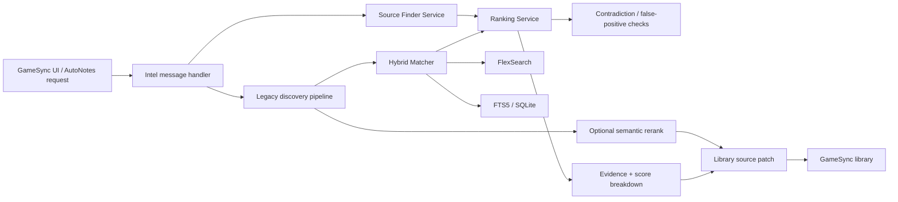

# GameSync Source Finder / Entity Resolver Wiki

**Project Constellation ID:** PCX-054  
**Status:** ACTIVE / TRACKED  
**Canonical implementation:** `Herbertofury/Gamesync`  
**Verified shipping version:** GameSync `0.6.3`  
**Primary source root:** `app/`  
**Primary runtime:** Manifest V3 browser extension service worker  

## Purpose

GameSync Source Finder / Entity Resolver is the identity and source-discovery subsystem used to connect a local game or mod record to the correct external entity and the strongest available source pages without silently merging unrelated items.

The Project Constellation goal for this track is:

> Resolve game/mod identity and strongest source pages across providers without false merges.

The durable requirements are strong identity, duplicate isolation, source provenance, confidence, and user-correctable matches. Current project-owned GameSync source provides substantially more implementation detail than the older catalog summary, so this wiki treats the shipping repository as the primary evidence source.

## What is implemented

The current GameSync `0.6.3` background service worker imports and wires a dedicated source-finder service, ranking service, hybrid matcher, FlexSearch layer, FTS5/SQLite ranker, remote federated-search broker, Typesense and Meilisearch clients, evidence collector, score-breakdown persistence, and legacy source-discovery pipeline.

Source discovery is not a single fuzzy-title lookup. The current architecture combines provider-aware discovery, URL classification, multiple recall backends, evidence-aware scoring, contradiction blocking, optional semantic reranking, and explicit confidence decisions.

## Architecture



### Main modules

| Module | Role |
| --- | --- |
| `app/background/background.js` | MV3 service-worker composition root. Imports and wires source finding, entity resolution, search, ranking, diagnostics, persistence, and message handling. |
| `app/src/services/source-finder-service.js` | Provider registry, URL classification, discovery-candidate scoring, download-candidate scoring, source evidence logic. |
| `app/src/modsources/discovery.js` | Full legacy-compatible source-discovery pipeline and provider-specific search behavior. Integrates the Hybrid Matcher behind a feature-gated path. |
| `app/src/search/HybridMatcher.js` | Shared entity resolver for games, mods, and creators. Unions recall backends, scores candidates, blocks contradictions, and emits decision levels. |
| `app/src/services/ranking-service.js` | Shared composite scoring weights, fuzzy scoring, library-match scoring, false-positive checks, and score breakdowns. |
| `app/src/search/FlexSearchLayer.js` | Fast local recall backend used by Hybrid Matcher. |
| `app/src/search/sql/sql-ranker.js` | FTS5/SQLite authoritative lexical search and ranking backend. |
| `app/src/search/remote/search-broker.js` | Federated remote-search path. |
| `app/src/search/EvidenceCollector.js` | Evidence records and query dossiers for explainable decisions. |
| `app/src/search/ScoreBreakdown.js` | Persisted score decomposition for debugging and explainability. |
| `app/modules/mods-intel-suite/background/intel-message-handler.js` | Message API for AutoNotes source finding, library matching, semantic reranking, and patching discovered sources into the library. |

## Source discovery provider coverage

The source-finder service currently recognizes more than 25 platform keys. Verified registry entries include:

- Patreon
- Boosty
- Kemono
- LoversLab
- TS4 Rebels
- AMLGames
- Aqxaro Mods
- Synthira
- The Sims Resource
- ModTheSims
- SimsFinds
- Mod Collective
- CurseForge
- WCIF.cc
- Sim File Share
- Nexus Mods
- Modrinth
- Planet Minecraft
- Silverlock
- ENBDev
- YouTube
- Tistory
- blog.jp / Livedoor-style pages
- X / Twitter
- Tumblr
- Afdian

The implementation also distinguishes feed-oriented sources and Sims-only providers so source discovery can use game context rather than querying every provider indiscriminately.

### Game-aware filtering

`discovery.js` has explicit Sims-versus-non-Sims context inference from the current URL and game key. Sims-only providers are skipped for known non-Sims games. Ambiguous contexts retain backward-compatible Sims behavior rather than pretending certainty.

Known non-Sims family hints include Skyrim, Fallout, Cyberpunk, The Witcher, Starfield, Baldur's Gate, Oblivion, Morrowind, and Stardew-related keys.

## URL identity and classification

`source-finder-service.js` first detects a platform from the URL, then classifies the page as one of:

- `direct`
- `profile`
- `search`
- `tag`
- `generic`

Direct mod/project pages receive positive ranking weight. Search and tag pages receive penalties. Provider-specific path rules are used for Nexus Mods, Modrinth, CurseForge, Patreon, Kemono, LoversLab, AMLGames, The Sims Resource, ModTheSims, and other supported providers.

The older discovery implementation contains additional direct-path and ignored-path patterns to keep navigation pages, login pages, generic listings, and known bad discovery destinations from being treated as canonical source pages.

## Entity-resolution pipeline

### 1. Recall

`HybridMatcher.resolveEntityCandidate()` gathers candidates from available local backends.

Current verified recall stages are:

1. **FlexSearch** for fast instant recall.
2. **FTS5 / SQLite** when the `fts5Ranking` feature flag is enabled.
3. Union and de-duplication by entity ID.

The service supports `game`, `mod`, and `creator` entity types.

### 2. Composite scoring

Candidates are evaluated using evidence signals such as:

- exact title match
- partial/fuzzy title match
- author exact/partial match
- game-context match
- filename match
- version match
- source-domain affinity
- token overlap
- FTS5 match stage
- direct-page evidence
- profile-page evidence
- body-title evidence
- archive corroboration
- DuckDuckGo corroboration
- reverse-image corroboration

The ranking service attempts the WASM scoring/fuzzy implementation first and falls back to JavaScript if the WASM path is unavailable or fails.

### 3. Contradiction blocking

A high raw score does not automatically permit attachment.

The current resolver explicitly checks for hard contradictions including:

- conflicting edition markers, such as Special Edition versus a different edition family
- conflicting years
- strong author disagreement

The ranking service separately detects common false-positive patterns such as game-edition conflicts and numeric sequel conflicts such as one numbered installment being matched to another.

### 4. Decision thresholds

The Hybrid Matcher currently uses these confidence thresholds:

| Decision | Threshold |
| --- | ---: |
| Auto-attach | `>= 0.86` when not contradiction-blocked |
| Suggested | `>= 0.72` |
| Weak | `>= 0.55` |
| Rejected | `< 0.55` |

A contradiction can downgrade what would otherwise be an automatic match.

### 5. Explainability

Resolution results contain:

- entity ID
- entity type
- title
- confidence score
- decision level
- per-signal score breakdown
- evidence signal names
- contradiction reasons
- recall source

This is important to the project contract: a match should be inspectable rather than being an unexplained normalized-string guess.

## Discovery candidate scoring

`source-finder-service.js` scores external source candidates independently from the local entity resolver.

Verified factors include:

- title similarity
- multi-token overlap
- body text containing the target title
- author similarity
- version match
- URL kind
- platform boost for established direct mod repositories
- archive evidence
- DuckDuckGo evidence
- reverse-image evidence

Search pages and tag pages are penalized. Scores are clamped to `0..1` and accompanied by an evidence list and breakdown object.

## Download candidate scoring

The source-finder service also has a separate scoring model for downloadable artifacts.

Positive evidence includes:

- archive extensions such as ZIP, 7z, RAR, tar.gz, tar.bz2, and tgz
- installable mod file types such as `.package`, `.ts4script`, `.esp`, `.esm`, `.esl`, `.dll`, `.asi`, `.jar`, and `.pak`
- known hosted-file/download URL patterns
- meaningful filenames

Negative evidence includes:

- social-share URLs
- navigation labels such as Home, FAQ, Login, Register, Contact, Privacy, and Terms
- app-store links
- ordinary media files when they are not download targets
- vague unlabeled download links with no filename evidence
- README, license, and changelog files when identifying the actual mod payload

This scoring is deliberately separate from page-identity scoring because the strongest information page and the strongest downloadable artifact are not always the same URL.

## AutoNotes and library integration

`intel-message-handler.js` exposes source finding through `AUTONOTES_FIND_SOURCES`.

When `discover: true` is requested, the runtime:

1. calls `discoverModSourcesLegacy()` with title, author, author URL, game key, current URL, known URLs, local/newest version information, known sources, and a result limit;
2. obtains candidate sources;
3. attempts an offscreen semantic rerank;
4. applies the semantic rerank when available;
5. patches the resulting source discovery back into the GameSync library through `applySourceDiscoveryPatchToLibrary()`;
6. returns the discovered sources, source-discovery metadata, whether the library was updated, and target details when available.

If full discovery is not requested, the same message type can call AutoNotes' likely-source URL finder instead.

The same intelligence message handler exposes `INTEL_LIBRARY_MATCH`, allowing the shared AutoNotes/entity intelligence layer to match incoming evidence against the current GameSync library.

## Legacy compatibility and migration strategy

The project is intentionally transitional rather than a one-shot rewrite.

`discovery.js` still owns a substantial provider-specific discovery implementation, while the newer service and Hybrid Matcher extract shared responsibilities into reusable modules. The legacy file imports the Hybrid Matcher and evidence/breakdown persistence so newer matching can replace title-first behavior incrementally without throwing away provider-specific logic that already works.

When modifying this subsystem, preserve this migration strategy unless the legacy path is fully replaced and all supported providers are proven equivalent or better.

## Search backends and optional capabilities

The GameSync service worker currently imports:

- FlexSearch
- FTS5 / SQLite worker search
- remote federated search
- Typesense client support
- Meilisearch client support
- WASM search/scoring helpers

These imports prove the capability is part of the current architecture. They do not by themselves prove that every optional remote backend is configured in every user's installation. Treat backend availability as runtime/configuration state, not a universal assumption.

## Installation and development

### Prerequisites

Use a current Node.js/npm environment capable of installing the repository's current dependencies and running Vite 8.

The shipping project package is `gamesync-extension` version `0.6.3`.

### Install dependencies

```powershell
npm ci
```

### Development build

```powershell
npm run dev
```

### Production build

```powershell
npm run build
```

The repository uses `app/` as canonical editable extension source. The generated `dist/` directory is the production extension and is the folder that should be loaded unpacked in Opera GX/Chromium after a build.

## Verifying source-finder changes

The root package manifest currently exposes development/build commands plus Bounty-specific test/benchmark scripts. It does not expose a source-finder-specific root test command. Therefore a source-finder change should not be declared verified from `npm run build` alone.

A meaningful verification pass should exercise at least these workflows:

1. build the extension successfully;
2. load the newly generated `dist/` build, not a stale prior build;
3. identify a known library mod with a correct direct source and confirm the correct source wins;
4. test an ambiguous title and confirm the candidate list is suggested rather than falsely auto-attached;
5. test a conflicting edition/year/author case and confirm contradiction blocking works;
6. test at least one Sims-only provider with Sims context and with a known non-Sims context;
7. test a direct page, profile page, search page, and tag/listing page classification;
8. verify evidence and score breakdown output for the decision;
9. verify a discovered source patched into the intended library entity rather than a similarly named record;
10. restart the extension/browser and confirm persisted library identity/source state remains correct where the affected path is stateful.

## How to add or modify a provider

When adding a provider, review all relevant layers instead of inserting a hostname in one place only.

Typical work may include:

1. add the provider key to the discovery platform registry;
2. add hostname detection in `source-finder-service.js` if the provider has a stable host;
3. define direct/profile/search classification patterns;
4. add provider labels and fallback search hosts in `discovery.js` where required;
5. add direct-path patterns and ignored/navigation paths;
6. mark the provider Sims-only only when that classification is actually correct;
7. decide whether it is feed-oriented;
8. preserve creator/profile semantics separately from direct mod/page semantics;
9. test representative real URLs and deliberately wrong URLs;
10. verify the provider does not reduce identity confidence for unrelated games or creators.

## How to modify entity matching

Changes to normalization or scoring can affect GameSync far beyond Source Finder because the Hybrid Matcher is intended as a shared resolver for multiple subsystems.

Before modifying weights or thresholds:

- identify the actual false-positive/false-negative case;
- preserve score-breakdown output;
- preserve contradiction checks;
- compare exact, partial, author, game, filename, version, and URL evidence separately;
- avoid stripping identity-significant edition, sequel, year, or author information merely to improve recall;
- verify both strong matches and known confusable pairs;
- keep auto-attach stricter than suggestion.

Do not replace the resolver with aggressive normalization that makes unrelated entities look identical.

## Performance considerations

The current implementation includes several deliberate performance mechanisms:

- FlexSearch as the instant-recall layer
- FTS5 as an optional authoritative lexical layer
- WASM fuzzy/composite scoring when available
- batch scoring for candidate lists of three or more
- cached regular expressions in legacy discovery
- limited candidate counts before ranking
- feature flags around optional search/ranking paths

Performance optimization must not weaken duplicate isolation, contradiction detection, evidence capture, or supported-provider coverage.

## Diagnostics and troubleshooting

### A wrong source is auto-attached

Inspect the returned score breakdown, evidence signals, and contradiction list first. Check whether the title, author, game, filename, version, source domain, or edition/year signals are missing or being misclassified.

Do not fix one false positive by globally lowering identity precision or stripping more information from every title.

### A correct source only appears as a search page

Check provider URL classification and the provider's direct-path rules. Search/tag pages intentionally carry penalties, so a provider whose direct path is not recognized may rank too low.

### Sims sources appear for a non-Sims mod

Check the game key and current source URL being passed into discovery. The legacy pipeline filters Sims-only platforms only when it can infer a non-Sims context.

### The Hybrid Matcher returns no candidates

Check the local search indexes and feature flags. FlexSearch is the first recall layer; FTS5 participation depends on the `fts5Ranking` flag and available SQLite/worker infrastructure.

### A high-scoring match is only `suggested`

Inspect contradiction reasons. Edition, year, or strong author conflicts can intentionally prevent auto-attach even when lexical similarity is high.

### Semantic reranking is unavailable

The AutoNotes source-discovery flow treats semantic reranking as optional. Failure is logged and the pre-rerank candidate list remains usable. Do not convert optional semantic-rerank failure into loss of the entire source-discovery result.

### Optional remote search is not configured

Typesense, Meilisearch, and federated remote-search support are architectural capabilities, not evidence that a particular endpoint is configured in the current browser profile. Verify runtime configuration before debugging them as if they were mandatory.

## Data and correctness invariants

Preserve these rules when changing the subsystem:

- user-owned library identity must not be silently replaced by a weak external match;
- source URLs must retain provenance and evidence;
- direct source pages and downloadable artifacts are related but distinct concepts;
- strong contradictions can block automatic attachment;
- ambiguous results should remain suggestions rather than manufactured certainty;
- duplicate isolation is more important than maximizing raw recall;
- score/evidence breakdowns must remain inspectable;
- provider-specific knowledge should not be flattened away unless replacement behavior is proven across the provider set;
- changes to shared matching must be regression-tested against games, mods, and creators that use the same resolver.

## Current verification boundary

Verified from current project-owned source:

- shipping GameSync version `0.6.3`;
- MV3 module service worker wiring;
- Source Finder Service and provider registry;
- legacy provider-aware discovery implementation;
- Hybrid Matcher recall/scoring/decision model;
- FlexSearch and optional FTS5 architecture;
- ranking weights and false-positive checks;
- AutoNotes source-discovery message path and library patch integration;
- evidence and score-breakdown architecture;
- root install/development/build commands.

Not claimed from this documentation pass:

- fresh end-to-end source discovery against every supported live provider;
- fresh real-browser qualification of every optional search backend;
- successful configuration of Typesense or Meilisearch in a particular user profile;
- a dedicated automated source-finder test suite exposed by the current root package manifest.

## Maintenance triggers

Update this wiki when any of the following materially changes:

- GameSync shipping version;
- provider registry or provider URL patterns;
- Hybrid Matcher thresholds;
- ranking weights;
- contradiction/false-positive logic;
- local search backends;
- remote search backends;
- evidence/breakdown persistence;
- AutoNotes source-discovery message contract;
- library-patch behavior;
- build/test commands;
- verified runtime behavior across supported providers.
