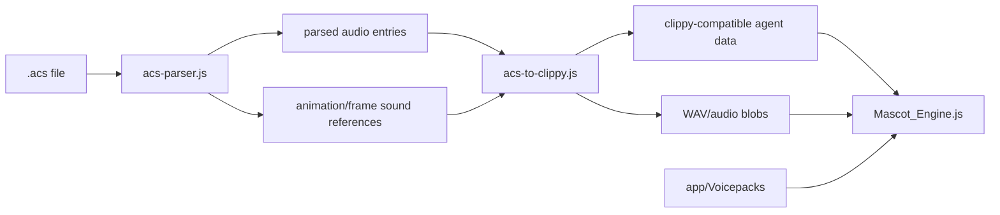

# ACS Voice / Speech Runtime Wiki

**Project Constellation ID:** `PCX-060`
**Status:** ACTIVE / TRACKED
**Current verified host source:** `Herbertofury/Gamesync`
**Verified GameSync version:** `0.6.3`
**Verified source baseline:** commit `a8e37976eb0b3ee3c4ec5e802b02d3bfa1f41928`
**Goal:** Preserve classic agent speech and voice interaction expectations in the modern mascot runtime using real speech/audio services, coordinated animation/state, interruption, cancellation, and truthful fallbacks.

## Purpose

This project covers the voice and speech layer associated with the ACS / Microsoft Agent compatibility track. Speech is not just text-to-audio. Classic agent behavior depends on request ordering, animation coordination, speech balloons, voice selection, interruption, cancellation, and state transitions.

A modern implementation must therefore preserve agent semantics while allowing real local or host speech engines behind explicit adapters.

The broader ACS parser/conversion/request-semantic surface is documented in [`PRJ-006 - ACS Agent Parity Runtime`](PRJ-006-acs-agent-parity-runtime.md). PCX-060 focuses on the voice, speech, listening, balloon, timing, and provider layer rather than duplicating the full ACS format/runtime wiki.

## Current source status

Earlier continuity notes treated the current ACS voice implementation as unresolved. That is now stale. Current project-owned evidence proves that GameSync `0.6.3` is an active implementation host for the ACS/mascot family:

- `app/Mascot_Engine.js` contains the shared mascot runtime and voice-related settings;
- `app/background/acs-parser.js` parses Microsoft Agent `.acs` files and their embedded audio structures;
- `app/background/acs-to-clippy.js` converts parsed ACS data into clippy.js-compatible agent data, spritesheets, and WAV/audio entries;
- `app/background/acs-to-shimeji.js` maps ACS animation states, including thinking/listening/hearing states, into the shared compatibility layer;
- `app/background/background.js` imports the ACS parser/conversion pipeline into the shipping Manifest V3 service worker;
- `app/Voicepacks/` exists as a runtime asset area;
- `app/manifest.json` exposes `Voicepacks/**` and mascot-related runtime resources.

This materially resolves the **host/source identity** problem. It does **not** prove complete classic speech/request parity. The remaining job is to audit the current GameSync behavior against the historical compatibility contract and qualify it in the real extension runtime.

## Verified current voice-facing settings

`app/Mascot_Engine.js` defines current mascot defaults that include:

- `speechFrequency`;
- `voiceEnabled`;
- `voiceRate`;
- `voicePitch`;
- `voiceVolume`;
- active pack/personality/engine selection;
- quiet and snooze modes;
- global and per-skill cooldowns;
- tab-state and mascot-state persistence APIs.

These settings prove that voice is part of the current shared mascot configuration model. They are not by themselves proof that every setting is implemented identically across every ACS, Shimeji, Petz, Webmeji, or built-in mascot engine.

## Recovered historical foundation

The durable ACS parity record preserves an existing foundation that included:

- ACS parsing;
- ACS-to-runtime conversion;
- spritesheets and audio export;
- `pack.acsAgent` metadata;
- state and return maps;
- voice and balloon metadata;
- queued playback, movement, speech, dragging, and idle transitions;
- Shimeji compatibility.

The same record identifies important speech-related gaps:

- true `Think()` behavior;
- request objects and queue semantics such as Wait, Interrupt, StopAll, and Get;
- classic Commands / Voice Commands behavior;
- speech recognition and voice grammar;
- deeper state semantics;
- lip-sync and audio timing;
- local STT/TTS and voice switching;
- inspector/parity tooling.

These are acceptance requirements. Current source proves the implementation base exists, but this documentation pass does not mark those gaps closed without runtime evidence.

## Current ACS audio pipeline

The verified source path is:



`acs-to-clippy.js` explicitly produces audio entries as WAV data and preserves per-frame sound references while it builds the agent animation data. This means ACS audio is part of the conversion contract rather than an unrelated add-on.

Any future audio optimization must preserve the relationship between:

- animation frame;
- frame duration;
- sound reference;
- actual playback timing;
- request completion/cancellation;
- return/idle state.

## Required speech state model

A complete speech request should be able to carry or derive:

- agent identity;
- request ID;
- text or phoneme input;
- speech versus thought mode;
- selected voice/provider;
- rate/pitch/volume when supported;
- balloon behavior;
- animation/state to enter before or during speech;
- audio start/end timing;
- viseme/phoneme timing when available;
- completion/error/cancel status;
- interruptibility and priority;
- queued predecessor/dependency;
- return/idle state.

The queue is part of the product behavior. Swapping TTS engines must not change Wait/Interrupt/StopAll semantics.

## Current local speech-engine research

### Piper TTS

The current `OHF-Voice/piper1-gpl` line is a local neural text-to-speech implementation and remains a useful candidate for an offline/local provider adapter.

Primary source: https://github.com/OHF-Voice/piper1-gpl

**Fit:** candidate for offline/local TTS where deployment, model, and license requirements fit the host.

**Boundary:** adopting Piper must not replace ACS request/state semantics, balloon behavior, or animation timing. It is a speech provider, not the agent runtime.

### whisper.cpp

`ggerganov/whisper.cpp` is a local speech-to-text implementation suitable for evaluating offline recognition and voice-command input.

Primary source: https://github.com/ggml-org/whisper.cpp

**Fit:** candidate recognition adapter for local speech recognition / command grammar experiments.

**Boundary:** free-form transcription is not equivalent to classic command grammar. Recognition results must flow through an explicit grammar/intent layer and must never trigger hidden actions without the same authorization/command rules as other inputs.

The current GameSync source should be audited first. Provider research is not a reason to rewrite a working speech path before its behavior has been measured.

## Adapter architecture

Speech providers should sit behind a narrow capability contract instead of leaking provider-specific APIs into agent behavior.

Suggested TTS capabilities:

- enumerate voices;
- synthesize/play text;
- stop/cancel request;
- pause/resume if supported;
- return duration/timing metadata;
- expose phoneme/viseme timing if supported;
- report offline/online status;
- report deterministic provider/version identity.

Suggested STT capabilities:

- start/stop recognition;
- partial/final transcript;
- confidence;
- language/model identity;
- optional constrained grammar;
- cancellation;
- explicit microphone/error state.

Unsupported capabilities should remain explicit rather than emulated with fake success.

## Queue and interruption contract

At minimum the runtime must prove:

1. two speech requests preserve queue order;
2. Wait blocks until the referenced request completes;
3. Interrupt terminates or supersedes the correct request and produces the correct state transition;
4. StopAll cancels speech/audio/related queued work without leaving stale talking animation or balloon state;
5. cancellation propagates to the actual provider, not only the UI;
6. provider failure resolves the request truthfully and returns the agent to a valid state;
7. drag/move or explicit agent commands interact with queued speech according to the compatibility contract.

## `Think()` contract

Thinking must remain distinct from speaking. A complete implementation should prove:

- a thought balloon instead of audible speech;
- queue participation consistent with the request model;
- interruption/cancellation;
- animation/state coordination;
- balloon cleanup;
- valid return/idle transition;
- no accidental TTS invocation.

The presence of `think`/`thinking` animation mappings in the ACS-to-Shimeji adapter is useful implementation evidence, but animation-name availability alone does not prove a correct `Think()` request path.

## Listening and recognition contract

The current ACS-to-Shimeji mapping includes listening/hearing animation names such as start/stop listening and multiple hearing states. Those mappings provide visual compatibility hooks, but recognition behavior still needs explicit qualification.

A real recognition path should expose:

- microphone permission/device state;
- start/stop/cancel behavior;
- partial/final transcript state;
- constrained grammar or explicit intent mapping where classic commands require it;
- command confidence and rejection behavior;
- visible failures;
- coordination with listening/hearing animations;
- cleanup after recognition ends or fails.

## Animation, lip-sync, and balloons

Speech must coordinate with visual state rather than playing as detached audio.

A testable implementation should track:

- talking-state entry before audible output;
- balloon visibility and text lifetime;
- audio start/end;
- viseme or mouth-frame timing where the provider/runtime supports it;
- transition back to idle/return state;
- cancellation cleanup;
- thought balloon path distinct from audible speech.

When precise viseme timing is unavailable, fallback animation must be labeled as approximate rather than presented as true lip-sync parity.

## Local-first and privacy behavior

A modern voice runtime should be able to run locally when configured for local engines. Cloud providers can remain optional adapters, but secrets/tokens must not be stored in project-brain exports, logs, or portable mascot packs.

Microphone use must be explicit and observable. Speech recognition should fail visibly when permission/device/model state prevents operation.

GameSync's repository already keeps user credentials outside committed source and uses browser-managed runtime storage for user-provided credentials. Voice-provider credentials, if any are introduced, should follow the same separation.

## Building the current host

The canonical GameSync repository defines `app/` as editable source and `dist/` as generated production output.

From a clean checkout:

```powershell
npm ci
npm run build
```

For development:

```powershell
npm run dev
```

Optional legacy acceleration can be rebuilt with:

```powershell
npm run build:wasm:legacy-accel
```

After building, load the generated `dist/` directory unpacked in Opera GX. Do not load `app/` as though it were the production extension.

## Voice/runtime qualification matrix

The next full qualification should exercise at least:

| Area | Proof required |
| --- | --- |
| Voice settings | enable/rate/pitch/volume changes reach the actual speech path and persist where intended. |
| ACS embedded audio | extracted sound plays at the correct animation/frame timing. |
| Speech queue | multiple speech requests preserve order. |
| Wait | dependent request waits for the referenced speech/request completion. |
| Interrupt | correct active request terminates and state cleans up. |
| StopAll | all relevant queued/active speech work cancels without stale UI/animation. |
| Think | distinct thought balloon path with zero unintended audio. |
| Balloon cleanup | normal completion, cancel, interrupt, failure, drag/move, and navigation leave no stale balloon. |
| Animation state | talking/listening/thinking enters and exits the right state. |
| Voice switching | selected voice/provider actually changes output and survives restart when stateful. |
| Recognition | permission, grammar/intent, command dispatch, rejection, and cleanup work end to end. |
| Failure behavior | provider/device/model/audio failure remains visible and returns the mascot to valid state. |
| Restart | stateful voice configuration is restored without replaying stale requests. |

## Proposed engine-matrix experiment

After current GameSync speech/request behavior is captured as a baseline, run one fixed request/animation fixture against:

- the current existing speech provider/path;
- Piper as a local TTS candidate;
- whisper.cpp as a local STT candidate when recognition is in scope.

The fixture should measure:

- time to first audio;
- completion/cancellation latency;
- exact request ordering;
- interrupt/StopAll correctness;
- balloon cleanup;
- talking/idle animation transitions;
- provider failure behavior;
- voice switching;
- restart persistence of voice configuration;
- offline behavior.

Do not adopt an engine merely because synthesis quality is higher if queue/state correctness regresses.

## Anti-degradation rules

- Never replace ACS request semantics with direct `speak(text)` calls.
- Never report approximate lip-sync as classic parity.
- Never leave an agent in talking state after cancellation or provider failure.
- Never make a cloud credential mandatory for baseline speech when a local path is intended.
- Never let recognition trigger commands outside the explicit command/authorization model.
- Never flatten `Think()` into audible speech.
- Never claim voice parity until the real mascot runtime is exercised end to end.
- Never treat a successful GameSync build as speech-runtime qualification.

## Troubleshooting

### ACS agent imports but has no embedded audio

Check the parsed audio-entry count, animation frame sound indices, generated WAV/audio data, runtime resource accessibility, and actual browser playback errors. Separate parser/converter failure from provider/HTML-audio failure.

### Voice settings change but output does not

Confirm which engine/provider is active and whether that engine consumes the shared voice configuration. A visible setting is not proof that every runtime path implements it.

### Agent stays in talking/listening state

Inspect request completion/cancellation and animation return-state cleanup. Do not patch the symptom with an arbitrary timeout until the actual completion event path is understood.

### `Think()` speaks aloud

Treat this as a semantic regression. The thought request must be routed separately from TTS and should have distinct balloon/state behavior.

### Recognition transcribes but commands are wrong

Do not dispatch raw free-form transcripts directly. Inspect grammar/intent mapping, confidence/rejection rules, active command set, and authorization before command execution.

### Wasm acceleration or ACS decoding fails

The ACS parser/converter has JavaScript fallbacks for optional acceleration. Verify the base ACS audio/animation conversion independently before attributing a voice failure to the provider.

## Acceptance test

A speech-runtime upgrade is ready only when the real GameSync mascot runtime proves:

- queue ordering;
- Wait/Interrupt/StopAll behavior;
- cancellation reaches the actual audio provider/path;
- speech and thought paths remain distinct;
- balloons clean up correctly;
- agent animation/state returns correctly;
- configured voice survives restart when stateful;
- provider failure is visible and recoverable;
- local/offline mode works when selected;
- any STT grammar/commands are verified through the actual command path;
- ACS embedded audio still plays correctly;
- no previously working mascot/ACS/Shimeji behavior regresses.

## Exact current next action

Audit the verified GameSync `0.6.3` mascot/ACS implementation against the historical voice/request checklist before changing providers. Build a deterministic browser fixture covering speech, `Think()`, embedded ACS audio, Wait/Interrupt/StopAll, balloon cleanup, voice settings, failure behavior, and restart. Only after that baseline exists should Piper or whisper.cpp be evaluated as provider adapters behind the current request/state contract.
