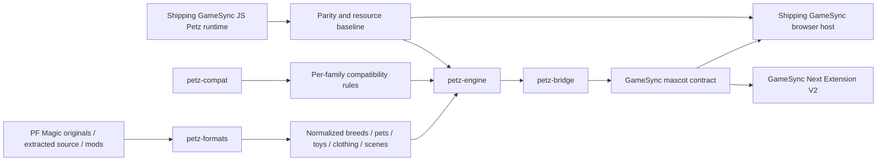
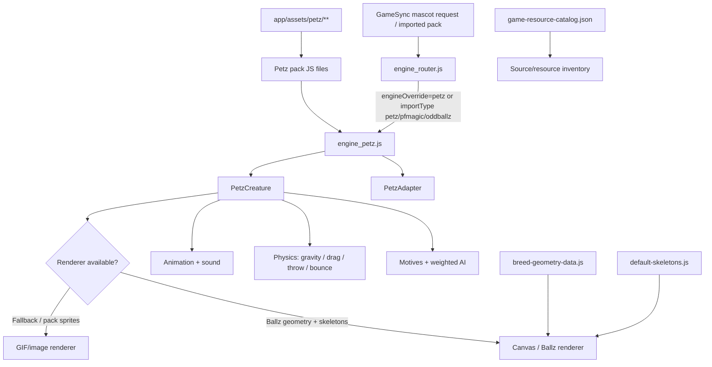

# PCX-061 - Petz Shared Core

**Project Constellation ID:** PCX-061
**Status:** ACTIVE / TRACKED
**Project goal:** preserve PF Magic Petz behavior in one shared core for GameSync hosts.
**Primary requirement:** one engine with adapters, preserved source/assets, and no flattening of Petz into ordinary mascot animation.
**Current strongest shared-core source:** `Herbertofury/GameSync-Next`, with dedicated typed `packages/petz-engine`, `packages/petz-compat`, `packages/petz-formats`, and `packages/petz-bridge` workspaces.
**Current shipping parity baseline:** `Herbertofury/Gamesync` GameSync `0.6.3`, `main` observed at commit `a8e37976eb0b3ee3c4ec5e802b02d3bfa1f41928`.
**Current implementation boundary:** current source proves both a substantial shipping JavaScript Petz runtime and a newer typed cross-host core architecture. Complete original PF Magic behavioral parity, completed save restore through the typed mascot bridge, complete use of every inventoried Petz resource, and end-to-end parity across shipping GameSync, Extension V2, and desktop are not yet proven.

## 1. Purpose and scope

Petz Shared Core is the reusable PF Magic Petz domain/runtime track for the wider GameSync and Mascot ecosystem. Its architectural rule is **one Petz behavior/runtime core with host adapters**, rather than separate browser, Extension V2, and desktop rewrites.

The source picture now has two important layers:

1. **GameSync Next typed shared core:** reusable simulation, compatibility, format parsing, save-state, custom-content, and mascot-bridge packages under `packages/petz-*`.
2. **Shipping GameSync parity baseline:** a substantial JavaScript Petz engine with routing, pack modules, Ballz rendering, extracted geometry, asset inventories, browser persistence, and real packaged extension resources.

The shipping source explicitly describes its Petz implementation as a **reimplementation-first Petz runtime**. The typed GameSync Next source goes further by separating domain behavior from host/rendering APIs. Neither statement should be interpreted as proof of perfect original-executable parity.

## 2. Relationship to other tracked projects

Petz Shared Core overlaps several Project Constellation tracks without being interchangeable with them:

- **PRJ-007 - PF Magic Petz Runtime Integration:** owns integration and rollout of the shared core into actual GameSync hosts. PCX-061 owns the reusable Petz domain/runtime boundary.
- **PRJ-005 - Mascot / Screenmate Platform:** larger umbrella host/runtime that can instantiate Petz alongside ACS, Shimeji, Webmeji, and generic mascot engines.
- **PCX-049 - GameSync Live Mascot Tavern:** user-facing GameSync host surface where live mascot engines can appear.
- **PCX-042 - GameSync Next:** now contains the strongest current reusable Petz architecture, not merely a future parity target.
- **Shipping GameSync:** remains the strongest user-facing browser parity baseline and the richest currently documented source of packaged Petz assets, Ballz geometry, and existing browser behavior.

Petz-specific motives, personality, breeds, actions, formats, Ballz geometry, physics, sounds, content packs, save state, and compatibility semantics must remain Petz-owned behavior. A generic sprite loop is not an acceptable substitute.

## 3. Current cross-host architecture



The key ownership rule is that parsing, family compatibility, simulation state, motives, personality, actions, physics, save data, and custom content belong in the shared Petz domain layer. Browser APIs, DOM rendering, extension storage, desktop windows, and host lifecycle belong at adapter boundaries.

### Typed shared-core packages

| Package | Verified role |
| --- | --- |
| `packages/petz-engine` | Platform-agnostic Petz simulation/domain core, state machine, physics, motives, personality, actions, save serialization/restore, breeds, content packs, custom content, and engine controller. |
| `packages/petz-compat` | Per-family compatibility packs for Dogz 1, Catz 1, Oddballz, Petz 2, Petz 3, Petz 4, Babyz, Petz 5, plus merged Mega compatibility. |
| `packages/petz-formats` | Readers/parsers/scanners for LNZ, breed files, pet saves/genetics, toys, clothing, scenes/environments, and source-content classification. |
| `packages/petz-bridge` | Adapter between `PetzEngine` and the GameSync mascot contract, including sprite/sound resolution, interaction mapping, simulation loop, state projection, and persistence callbacks. |

All four are private TypeScript workspace packages at version `0.1.0`. Each currently exposes `build` as `tsc --build` and `typecheck` as `tsc --noEmit`.

## 4. `@gamesync/petz-engine`

The typed engine is the current strongest reusable Petz core. Its public API exports:

- `PetzFamily` and `PetzCompatMode`;
- motive and personality models;
- semantic action and physics models;
- animations, breeds, toys, clothing, environments, save data, and content-pack types;
- custom breed, toy, clothing, scene, and bundle types;
- default motives, personality, physics, engine config, and known breeds;
- pure state-machine helpers;
- drag and petting interaction helpers;
- serialize/restore helpers;
- the `PetzEngine` controller.

### Supported family identifiers

The current typed model explicitly supports:

- `dogz1`
- `catz1`
- `oddballz`
- `petz2`
- `petz3`
- `petz4`
- `babyz`
- `petz5`

`PetzCompatMode` also supports `mega`.

### Motives

The typed engine defines six 0-100 motives:

- hunger
- happiness
- energy
- social
- fun
- comfort

This is the canonical typed motive vocabulary. The older shipping JavaScript runtime uses a different six-value vocabulary, documented later in this page. Cross-host parity work should define explicit migration/mapping instead of silently treating the two schemas as identical.

### Personality

The typed core models all 22 PF Magic-style personality fields:

- liveliness
- playfulness
- independence
- confidence
- naughtiness
- acrobaticness
- patience
- kindness
- nurturing
- finickiness
- intelligence
- messiness
- quirkiness
- insanity
- constitution
- metabolism
- dogginess
- love destiny
- fertility
- love loyalty
- libido
- offspring-sex tendency

The source records these as 0-100 values corresponding to the actual 22 hex-mapped personality positions in Petz data. It also defines the seven traits used by the community-standard unibreed personality reset.

### Typed action model

The typed action union includes locomotion, care, interaction, species behavior, breeding, and Oddballz-specific states:

`idle`, `walk`, `run`, `sit`, `sleep`, `eat`, `play`, `petting`, `pickup`, `thrown`, `fall`, `land`, `drag`, `toy_interact`, `groom`, `meow`, `bark`, `hiss`, `growl`, `purr`, `wag_tail`, `scratch`, `roll`, `jump`, `climb`, `arrive`, `leave`, `breed`, `nurse`, `bounce`, `zap`, `morph`, and `custom`.

This semantic action model is broader than the currently documented shipping JavaScript adapter vocabulary. Do not collapse one into the other without an explicit compatibility map.

### Typed physics

The typed default physics model currently records:

| Setting | Current typed default |
| --- | ---: |
| gravity | `980 px/s²` |
| friction | `0.85` |
| max fall speed | `600` |

Physics state also carries position, velocity, ground state, and left/right wall state. The shipping JavaScript runtime uses different constants, also preserved later in this page. Treat that difference as parity work, not documentation noise.

## 5. `@gamesync/petz-compat`

The compatibility package exports:

- `DOGZ1_COMPAT`
- `CATZ1_COMPAT`
- `ODDBALLZ_COMPAT`
- `PETZ2_COMPAT`
- `PETZ3_COMPAT`
- `PETZ4_COMPAT`
- `BABYZ_COMPAT`
- `PETZ5_COMPAT`
- `getCompatPack`
- `getAllCompatPacks`
- `buildMegaCompat`

This package is the correct home for family-specific differences that should not be hard-coded into one host UI. New host implementations should request the family compatibility pack instead of duplicating generation-specific behavior in browser or desktop adapters.

## 6. `@gamesync/petz-formats`

The formats package is the normalization boundary for original and community content. Its current public API includes:

### LNZ

- `parseLnz`
- cat and dog ball-name mappings
- Ballz/line/paint-ball/eyelid/whisker/texture/head-shot/project-ball data
- clothing adjustments and overrides
- fur/default-factor/sound-list data

### Breed files

- `readBreedFile`
- `buildSpriteBreedManifest`

### Content scanning

- `classifyFiles`
- `detectGameFamily`

### Toys

- `parseToyFile`
- `KNOWN_TOYS`

### Clothing

- `parseClothingFile`
- `KNOWN_CLOTHING`

### Scenes/environments

- `parseSceneFile`
- `KNOWN_SCENES`

### Pet save/genetics data

- `parsePetFile`
- `hasGeneticData`
- `getGeneration`
- default personality data
- ancestry and genetics types

A format parser proves the repository can inspect/normalize a format. It does not automatically prove every parsed field is used by the simulation or rendered in every host.

## 7. `@gamesync/petz-bridge`

`PetzMascotBridge` maps the shared Petz engine into the GameSync mascot contract. Its source explicitly states that the file is consumed by both the shipping Opera extension and Extension V2.

Verified responsibilities include:

- creating a `PetzEngine` with one selected compatibility family;
- resolving pack asset keys to display URLs;
- forwarding Petz sound events to the host sound callback;
- mapping Petz state into mascot display fields;
- running the simulation through `requestAnimationFrame`;
- capping per-frame delta time to 100 ms to avoid a spiral of death;
- forwarding drag and petting input to the engine;
- exposing the underlying engine and compatibility pack;
- invoking host callbacks for save/load operations.

### Current bridge persistence boundary

The bridge calls `loadPetData()` before spawn, but the current restore branch is still marked `TODO: restore from save`. It therefore has persistence plumbing without completed spawn-time restoration through this inspected path.

`destroy()` serializes engine state and sends it through `savePetData()`. That proves a save path exists, not that a full close/reopen round trip currently restores the same state.

### Current bridge environment boundary

The inspected tick environment currently supplies real viewport/floor/wall dimensions, but uses placeholders for:

- `cursorX: 0`
- `cursorY: 0`
- `cursorNear: false`
- `nearbyToyId: null`

Host integration should feed real cursor and nearby-toy state before claiming those simulation inputs are wired end to end.

## 8. Shipping GameSync JavaScript Petz runtime

The current shipping `Herbertofury/Gamesync` repository remains essential because it contains the richest verified user-facing browser behavior and packaged Petz resources.



### Shipping core files

| File | Verified role |
| --- | --- |
| `app/content/mascot/engine_petz.js` | Dedicated PF Magic Petz runtime. Implements motive decay, weighted action selection, physics, dragging/throwing, petting, animation, sound, breed geometry lookup, creature lifecycle, and the Petz engine adapter. Exposes `window.__gsEnginePetz`. |
| `app/content/mascot/engine_router.js` | Detects Petz packs/overrides, lazy-loads `engine_petz.js`, creates creatures through the Petz engine, and supports engine snapshot/hot-swap behavior. |
| `app/Mascot_Engine.js` | Higher-level mascot host. Loads the Petz engine plus packs/geometry helpers and has Petz-specific creation/fallback paths. |
| `app/content/mascot/ballz-renderer.js` | Canvas/Ballz rendering support used when breed geometry and skeleton data are available. |
| `app/content/mascot/breed-geometry-data.js` | Large extracted breed geometry dataset consumed by the Petz engine. |
| `app/content/mascot/default-skeletons.js` | Skeleton/pose support used by Ballz rendering. |
| `app/content/mascot/anim-player.js` | Animation playback support used by the mascot/Petz stack. |
| `app/content/mascot/petz1-catz-pack.js` | Petz/Catz 1 pack definition. |
| `app/content/mascot/petz1-dogz-pack.js` | Dogz 1 pack definition. |
| `app/content/mascot/petz2-pack.js` | Petz 2 pack definition. |
| `app/content/mascot/petz3-catz-pack.js` | Petz 3 Catz/Dogz pack mapping real FunPack GIF/WAV resources into engine-consumable breed configs. |
| `app/content/mascot/petz4-pack.js` | Petz 4 pack definition. |
| `app/content/mascot/petz5-pack.js` | Petz 5 pack definition. |
| `app/content/mascot/oddballz-pack.js` | Oddballz pack definition. |
| `app/assets/petz/` | Packaged Petz resource tree exposed to the extension runtime. |
| `app/assets/petz/game-resource-catalog.json` | Generated inventory of preserved Petz/Oddballz resources. It is an evidence/index artifact, not proof that every entry is currently simulated. |
| `app/content/mascot/shared_commands.js` | Shared mascot command surface that Petz instances can join through the router/host. |
| `app/modules/mascot-pack/background/*` | Pack import, persistence, runtime, settings, messages, IndexedDB, memory, and session infrastructure used by the wider mascot system. |

## 9. Shipping engine routing and host contract

`engine_router.js` contains a dedicated `petz` engine entry:

- script: `content/mascot/engine_petz.js`
- expected global: `__gsEnginePetz`
- explicit `engineOverride: "petz"` routes to Petz
- import types `petz`, `pfmagic`, `pf-magic`, and `oddballz` route to Petz

The router can lazy-load the engine. On extension pages it injects engine scripts through DOM `<script>` elements. On ordinary web pages it first asks the background layer to inject the required engine scripts and falls back to DOM loading when necessary.

The router also provides a state-snapshot/hot-swap path that preserves the available position, velocity, facing, current action, animation frame, paused state, and scale when switching engines. Any typed/core adapter that replaces this path must preserve equivalent Petz-owned state rather than treating host/engine switching as a fresh spawn.

`Mascot_Engine.js` also contains a direct Petz creation path. When the selected engine resolves to `petz`, it uses `window.__gsEnginePetz`, resolves a Petz breed pack, creates the Petz instance at the selected or fallback position, primes mascot persistence, and registers the instance with shared commands.

## 10. Shipping JavaScript Petz API

The current `window.__gsEnginePetz` export includes:

- `create`
- `buildSpriteConfig`
- `getCreature(id)`
- `getAllCreatures()`
- `removeAll()`
- `registerPack`
- `getAvailablePacks`
- `getPack`
- `getBreed`
- `getAllBreeds`
- `PetzCreature`
- `PetzAdapter`
- `ACTION_WEIGHTS`
- `MOTIVE_DECAY`

The `PetzAdapter` is the shipping compatibility boundary presented to the broader engine/router system. Petz-specific methods include motive inspection and mutation (`getMotives()` and `setMotive(key, value)`) in addition to common creature/engine controls.

### Shipping native action surface

The shipping adapter declares actions covering:

`idle`, `walk`, `run`, `sit`, `sleep`, `eat`, `play`, `groom`, `meow`, `bark`, `purr`, `scratch`, `jump`, `roll`, `beg`, `headtilt`, `stretch`, `yawn`, `sniff`, `chase`, `pounce`, `wag`, `lick`, `hiss`, `scared`, `drag`, `pet`, and `fall`.

This is not identical to the typed action union. Maintain an explicit parity/migration ledger rather than relying on name similarity.

## 11. Shipping motives and autonomous behavior

The shipping JavaScript runtime tracks six motive dimensions on a 0-100 scale:

- hunger
- energy
- fun
- hygiene
- social
- fatigue

The implementation defines motive decay over time and weighted autonomous action selection. Action weights are motive-aware, so sleep, eat, play, groom, running, chasing, begging, and other activities are selected based on more than a generic random animation loop.

Selected actions also affect motives. Existing source examples include eating reducing hunger, sleeping reducing fatigue, play reducing the fun need while consuming energy, grooming reducing hygiene need, and movement/play actions changing energy/fun values.

### Motive-schema parity requirement

The typed core instead uses hunger, happiness, energy, social, fun, and comfort. `hygiene`/`fatigue` and `happiness`/`comfort` are not interchangeable by documentation alone. Migration between shipping and typed state must define and test the mapping.

## 12. Shipping physics and interaction model

Current shipping engine physics constants include:

| Setting | Current shipping value |
| --- | ---: |
| gravity | `900 px/s²` |
| terminal velocity | `800` |
| ground friction | `0.85` |
| throw multiplier | `1.6` |
| bounce coefficient | `0.3` |
| drag damping | `0.15` |

The runtime explicitly implements gravity, dragging, throwing, bouncing, petting, and action-driven motion. These are Petz runtime behaviors, not decorative CSS animation.

When changing or reconciling physics, verify at minimum:

1. drag starts and releases without losing the instance;
2. throw velocity is derived from the interaction rather than teleporting the pet;
3. gravity and terminal velocity remain bounded;
4. ground collision/bounce does not trap the creature outside the viewport;
5. petting remains distinguishable from dragging;
6. motive/action state survives the interaction;
7. state survives the supported router/bridge/persistence path;
8. typed and shipping constants differ only where the difference is intentional and evidence-backed.

## 13. Shipping rendering model

The shipping Petz engine supports two main rendering paths.

### Ballz/geometry path

If `window.PetzBallzRenderer` and `window.__gsPetzSkeletons` are available, the engine prefers a Canvas/Ballz-style path. It looks up breed geometry through `window.__gsPetzBreedGeometry`, using the pack family and breed. Breed-name normalization handles aliases and can fall back across Petz 5, Petz 4, Petz 3, Petz 2, and Oddballz geometry families.

This path preserves structured breed geometry instead of reducing every pet to a flat image.

### Pack sprite/GIF path

Pack definitions can also provide sprite/action arrays and sounds. `buildSpriteConfig()` normalizes a pack into the runtime action model, including FPS, scale, loop behavior, species, breed, sounds, and optional `ballzOnly` behavior.

### Rendering preservation rule

A missing geometry entry may use a verified fallback, but do not silently declare breed parity when the renderer is using a generic/default shape. Record the fallback and add a fixture for the affected breed.

The typed shared core deliberately does not own a rendering API. A host renderer should consume domain state without moving Petz simulation semantics into renderer-specific code.

## 14. Shipping content packs

The shipping repository contains separate pack modules for:

- Catz 1
- Dogz 1
- Petz 2
- Petz 3
- Petz 4
- Petz 5
- Oddballz

The Petz 3 pack is especially explicit about provenance: it maps **real PF Magic FunPack GIF assets and extracted WAV sounds** from ClipArt, Anims, and Sounds source material into breed definitions consumed by `engine_petz.js`.

The current Petz 3 pack source enumerates cat breeds including Orange Shorthair, Calico, Tabby, Persian, Siamese, Alley Cat, B&W Shorthair, Maine Coon, Chinchilla, and Russian Blue, plus dog breeds including Dalmatian, Chihuahua, Bulldog, Poodle, Scottish Terrier, Dachshund, Mutt, Labrador, and additional entries later in the file.

Do not infer complete original-game behavioral parity merely because a content pack exists. Pack presence proves content integration, not complete simulation fidelity.

## 15. Preserved resource inventory

`app/assets/petz/game-resource-catalog.json` is a generated source/resource inventory. Its current summary records:

- 6 Oddballz creatures
- 688 Oddballz WAV files
- 837 Oddballz NE resources
- 568 toys
- 553 clothing resources
- 59 environments
- 299 wallpapers
- 259 sounds

The asset tree also contains `catz`, `dogz`, `oddballz`, `petz2`, `petz3`, `petz4`, `petz5`, `sounds`, and `toyz` directories.

### Important boundary

An inventory entry means the resource was cataloged/preserved. It does **not** mean every toy, clothing item, environment, wallpaper, sound, or Oddballz resource has a working runtime interaction. The typed formats package can parse several of these content categories, but parsing still does not prove runtime use.

## 16. Manifest/runtime exposure in shipping GameSync

GameSync `0.6.3` exposes `assets/petz/**` as web-accessible resources. The manifest also exposes the mascot JS/bin/JSON resources needed by the engine stack. The extension runs as Manifest V3 with `background/background.js` as its module service worker.

The stable extension identity is pinned by the public `key` field in `app/manifest.json`. Preserve extension identity during Petz changes when testing upgrade/persistence behavior.

## 17. Development setup

### Shared typed core prerequisites

GameSync Next is an npm workspace monorepo. Install dependencies from the repository root:

```powershell
npm ci
```

Each Petz package currently has an explicit build and typecheck command:

```powershell
npm --workspace packages/petz-engine run build
npm --workspace packages/petz-engine run typecheck
npm --workspace packages/petz-compat run build
npm --workspace packages/petz-compat run typecheck
npm --workspace packages/petz-formats run build
npm --workspace packages/petz-formats run typecheck
npm --workspace packages/petz-bridge run build
npm --workspace packages/petz-bridge run typecheck
```

### Important aggregate-build boundary

The current GameSync Next root `build:packages` script builds `schema`, `shared`, `engine`, `core`, `pixi-game`, and `ui`. It does **not** currently include the four Petz workspaces. A successful root `npm run build:packages` is therefore not proof that Petz packages compiled.

### Shipping GameSync prerequisites

Verified shipping tooling requires Node/npm and Vite.

From the canonical shipping extension working directory:

```powershell
npm ci
npm run dev
npm run build
```

`app/` is the canonical editable extension source. `dist/` is generated output. After source changes, rebuild; do not hand-edit `dist/` as the source of truth.

### Load in Opera GX

Load the generated absolute `dist` directory as the unpacked shipping extension. The shipping repository README identifies `dist/` as the only folder that should be loaded unpacked in Opera GX.

## 18. How to modify the shared core safely

### Add or change a family compatibility rule

1. Put family-specific compatibility behavior in `packages/petz-compat`, not in one host UI.
2. Keep family identifiers stable.
3. Update `getCompatPack`/Mega behavior only when the new rule has source evidence.
4. Build and typecheck `petz-engine`, `petz-compat`, and any dependent bridge/host.
5. Compare the change against the shipping browser baseline when it affects existing behavior.

### Add or change a format parser

1. Put normalization/parser behavior in `packages/petz-formats`.
2. Preserve raw source provenance and avoid destructive rewriting of originals.
3. Keep unknown fields or unsupported versions visible rather than silently discarding them.
4. Add deterministic fixtures for every newly supported file variant.
5. Verify parsed output can round-trip or map into the typed Petz model where the format supports it.

### Add or change a breed

For shipping GameSync:

1. identify the correct Petz family and verified source assets/geometry;
2. add or update the appropriate `petz*-pack.js` module;
3. give the breed a stable breed ID and correct `species`/`family`;
4. map only verified animation/sound resources;
5. ensure Ballz geometry resolves through `breed-geometry-data.js` or an intentional alias;
6. avoid generic fallback geometry unless explicitly marked;
7. build the extension and verify the breed appears through `getBreed`/`getAllBreeds` or the host picker;
8. spawn the exact breed and exercise idle, walk, interaction, drag/throw, petting, audio, and persistence/reload behavior.

For the typed core, represent the breed through the typed content-pack/breed model and keep rendering/resource resolution in the host adapter.

### Add an action

1. Define the semantic action in the typed Petz action/state model first when it is shared behavior.
2. Add compatibility constraints in `petz-compat` if the action is family-specific.
3. Map the action into shipping/V2 host adapters without changing its meaning.
4. Decide whether motives/personality affect selection or recovery.
5. Test direct invocation and autonomous selection separately.
6. Verify interruption/state transitions so the pet cannot become stuck.

### Change motive logic

Keep motive values bounded to 0-100. Because the shipping and typed motive schemas differ, update the migration/parity mapping explicitly. Validate decay over time, autonomous selection, action recovery, save/restore, and cross-host migration.

### Change physics

Treat physics constants as behavior, not styling. Test low/high-speed drag release, edge collisions, viewport resize, repeated throws, pause/resume, and state migration. Record any intentional difference between the typed defaults and shipping JavaScript constants.

### Add a new Petz-family pack

Use the typed family/content-pack model and the existing Petz registry instead of creating a parallel engine. Use stable family/breed IDs, document provenance, keep resource paths host-portable, and make renderer fallback decisions explicit.

## 19. Host adapter requirements

A host adapter is not complete because it can display a Petz image. It should prove creation, behavior, interaction, persistence, and state migration from the shared model.

Every host should preserve, or explicitly map:

- family/breed identity
- typed motives
- personality traits
- semantic Petz actions
- physics state
- pack/resource identity
- sound semantics
- save/persistence identifiers
- custom-content identity
- deterministic import/export where supported
- renderer-specific Ballz/skeleton state or an explicitly equivalent representation

### Shipping GameSync

Shipping GameSync already has a substantial JavaScript implementation and resource stack. Treat it as the current behavioral parity baseline, not as disposable legacy code.

### Extension V2

The typed bridge source explicitly says it is consumed by Extension V2. Source presence proves integration architecture, but this documentation pass does not claim a fresh end-to-end Extension V2 Petz qualification.

### Desktop

The typed core is designed to be renderer/API independent and its source comments describe browser-extension and desktop consumers. However, this pass did not verify a complete desktop Petz adapter/runtime flow. Treat desktop parity as open until exercised in the actual desktop host.

## 20. Verification and test strategy

### Current automated-command boundary

Each typed Petz workspace exposes `build` and `typecheck`, but none of the four inspected Petz package manifests exposes a dedicated Petz test script. The GameSync Next root aggregate package build currently omits Petz workspaces.

The shipping GameSync package has general development/build commands but no dedicated Petz test script identified in the current project documentation. A successful build is necessary but is not sufficient Petz runtime evidence.

### Required shared-core qualification matrix

| Area | Required proof |
| --- | --- |
| Typed build closure | All four `packages/petz-*` workspaces build and typecheck from a clean install. |
| Typed state machine | Motive decay/recovery, personality influence, semantic actions, physics, drag/pet interactions, serialize and restore behave deterministically under fixtures. |
| Compatibility | Dogz 1, Catz 1, Oddballz, Petz 2, Petz 3, Petz 4, Babyz, Petz 5, and Mega compatibility are exercised. |
| Formats | Representative LNZ, breed, pet, toy, clothing, scene, and content-scan fixtures parse without silent data loss. |
| Bridge lifecycle | Spawn, tick, drag, pet, sound, save, destroy, restore, and restart work through real host callbacks. |
| Environment | Real cursor and nearby-toy state reach the bridge tick environment. |
| Shipping routing | `engineOverride=petz` and Petz/PF Magic/Oddballz import types resolve to the shipping Petz engine. |
| Shipping pack discovery | Catz/Dogz/Petz2/Petz3/Petz4/Petz5/Oddballz packs register and report expected breeds. |
| Rendering | At least one sprite/GIF breed and one Ballz/geometry breed render correctly. |
| Interaction | Pet, drag, throw, collision, bounce, and viewport-edge behavior work. |
| Audio | Verified mapped sound actions play without blocking the state machine. |
| Persistence | Selected breed/instance and typed save state survive the supported reload/restart paths. |
| Cross-host parity | The same representative pet behaves equivalently across shipping GameSync, Extension V2, and desktop for the fields each host promises. |
| Resource packaging | Petz assets resolve from built artifacts, not only from source paths. |
| Errors | Missing geometry/sprite/sound/parser data fails visibly and safely rather than silently corrupting the pet. |

## 21. Troubleshooting

### Typed package changes do not appear in the root build

The current root `build:packages` script does not include `petz-engine`, `petz-compat`, `petz-formats`, or `petz-bridge`. Run the workspace-specific build/typecheck commands explicitly until the aggregate build is updated.

### Saved pet data is written but not restored by the typed bridge

The inspected `PetzMascotBridge.spawnPet()` loads saved data but its restore branch is still TODO. Do not treat save callbacks as proof of restart persistence until that path is implemented and exercised.

### Cursor or toy-aware behavior never triggers through the typed bridge

The inspected bridge environment currently uses placeholder cursor coordinates/proximity and `nearbyToyId: null`. Wire real host environment data before debugging the Petz state machine itself.

### Shipping Petz instance does not appear

Check, in order:

1. the pack/import resolves to `petz` in `engine_router.js`;
2. `content/mascot/engine_petz.js` is packaged and loadable;
3. `window.__gsEnginePetz` exists after engine loading;
4. the selected pack is registered;
5. the selected breed exists;
6. the resource URL resolves from the built extension;
7. the instance was not placed outside the viewport by stale persisted coordinates.

### Pet renders as a generic/default shape

The Ballz renderer may not have found exact breed geometry. Check family/breed IDs, normalization aliases, `breed-geometry-data.js`, and skeleton availability. Do not label the fallback as breed-accurate until exact geometry resolves.

### Pet uses static/GIF rendering instead of Ballz rendering

Verify `window.PetzBallzRenderer`, `window.__gsPetzSkeletons`, and breed geometry lookup. Sprite/GIF fallback can be valid for a pack, but the choice should be intentional and documented.

### Breed exists in assets but not in picker/runtime

Asset presence is not registration. Confirm the corresponding shipping pack module exports/registers the breed and that the engine discovers the pack. For the typed core, confirm the breed is present in the content pack/registry supplied to `PetzEngine`.

### Toy/clothing/environment exists in a catalog or parses but cannot be used

Inventory and parsing are not runtime implementation. Locate an actual simulation/host handler before claiming interaction support. If none exists, record it as preserved/parsed source material awaiting integration.

### Pet stops acting after interaction

Inspect current action duration/state transition, pause state, motive selection, drag release, and physics loop. Verify the adapter/bridge still reports a live pet and no invalid action mapping was introduced.

### Shipping Petz works in source but not built extension

Rebuild `dist/`, then verify the manifest's web-accessible Petz resources and actual generated paths. Do not load `app/` directly as the production extension.

## 22. Current verification boundaries

The following are **not** claimed complete by this documentation pass:

- perfect behavioral parity with every original PF Magic Petz release;
- exact reproduction of the original executable's hidden AI/state machine;
- complete runtime use of all 568 inventoried toys, 553 clothing resources, 59 environments, 299 wallpapers, 259 sounds, or 837 inventoried Oddballz NE resources;
- complete Petz 1 through Petz 5, Babyz, and Oddballz gameplay parity merely because typed compatibility/formats or shipping packs exist;
- a fresh real-Opera Petz end-to-end qualification during this documentation update;
- a dedicated Petz automated test suite in the inspected typed package manifests;
- automatic Petz coverage through GameSync Next root `build:packages`;
- completed spawn-time restore in `PetzMascotBridge`;
- real cursor/toy-proximity input through the inspected typed bridge;
- fresh Extension V2 and desktop end-to-end Petz parity proof;
- proof that the historical local `C:\Users\Owner\Desktop\GameSync\PF Magic` tree and current GitHub packages are byte-for-byte the same lineage.

These gaps should drive the next verification work rather than being hidden behind a generic “implemented” status.

## 23. Contribution and preservation rules

When contributing to Petz Shared Core:

1. work from the newest verified shared Petz source, currently the GameSync Next `packages/petz-*` workspaces, while preserving shipping GameSync as parity evidence;
2. preserve original/extracted resource provenance and do not overwrite source material with generated derivatives;
3. keep Petz behavior in the Petz engine/domain layer and host-specific browser/desktop behavior in adapters;
4. keep format parsing in `petz-formats` and family differences in `petz-compat`;
5. preserve stable pack/breed/pet IDs once user state can reference them;
6. do not substitute generic mascot behavior for motives, personality, Ballz geometry, Petz actions, or pack semantics;
7. add runtime proof for every newly advertised action/control;
8. document typed-vs-shipping schema differences instead of silently normalizing them;
9. keep inventory/parser facts separate from implemented-runtime claims;
10. verify both workspace-specific typed builds and the real built host runtime;
11. preserve `dist/` as generated shipping output from `app/`;
12. update this wiki when engine API, compatibility coverage, format coverage, asset lineage, bridge behavior, host parity, persistence, build commands, or verification status materially changes.

## 24. Next documentation and engineering checkpoint

The highest-value next checkpoint is now a **shared-core parity and persistence proof**, not another source-discovery pass:

1. add Petz-specific automated tests for `petz-engine`, `petz-compat`, `petz-formats`, and `petz-bridge`;
2. finish `PetzMascotBridge` spawn-time restore;
3. feed real cursor and nearby-toy state into the bridge environment;
4. add the Petz workspaces to the intended aggregate build/test lane or document a deliberate separate lane;
5. build and typecheck all Petz packages from a clean checkout;
6. run one representative Catz, one Dogz, and one Oddballz scenario through shipping GameSync and Extension V2, with motive/action/physics/save-state parity evidence;
7. qualify desktop only after a real desktop adapter path is identified and exercised;
8. preserve exact commit/artifact identity and restart evidence for every host;
9. reconcile the historical local PF Magic source tree against current GitHub package provenance when that source becomes readable.

Until those checks pass, GameSync Next is the strongest **shared-core source**, while shipping GameSync remains the strongest **user-facing browser parity and resource baseline**.
