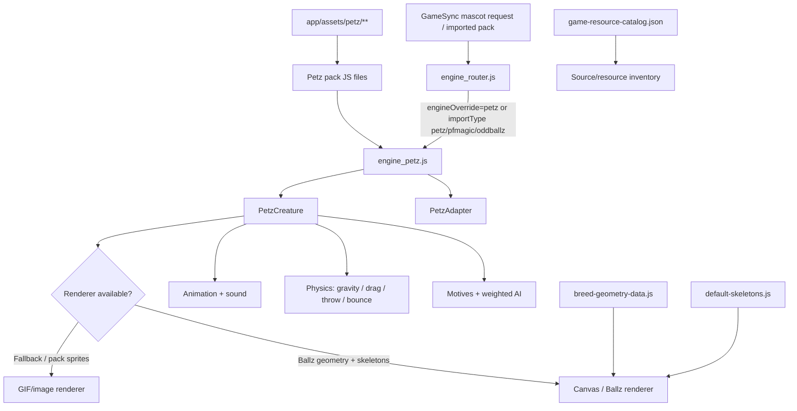

# PCX-061 - Petz Shared Core

**Project Constellation ID:** PCX-061  
**Status:** ACTIVE / TRACKED  
**Project goal:** preserve PF Magic Petz behavior in one shared core for GameSync hosts.  
**Primary requirement:** one engine with adapters, preserved source/assets, and no flattening of Petz into ordinary mascot animation.  
**Current verified implementation host:** `Herbertofury/Gamesync`  
**Verified shipping baseline:** GameSync `0.6.3`, `main` observed at commit `a8e37976eb0b3ee3c4ec5e802b02d3bfa1f41928`  
**Current implementation boundary:** the browser-side Petz runtime is substantial and source-backed. Full original PF Magic behavioral parity, complete use of every inventoried Petz resource, and completed GameSync V2/desktop rollout are not proven by the evidence inspected for this wiki.

## 1. Purpose and scope

Petz Shared Core is the continuity track for the PF Magic Petz runtime used by the wider GameSync/Mascot ecosystem. The intended architecture is a **shared Petz behavior/runtime core with host adapters**, rather than separate browser, V2, and desktop rewrites.

The current shipping GameSync repository already contains a dedicated `petz` engine, Petz-specific routing, pack definitions for multiple Petz generations and Oddballz, extracted animation/geometry data, original-resource inventories, and Petz asset trees. This is materially newer evidence than the older Project Constellation summary that described the project mainly as an integration plan.

The source explicitly calls the browser implementation a **reimplementation-first Petz runtime**. Treat that phrase literally: it proves a real Petz-specific implementation exists, but it does not by itself prove frame-for-frame, state-for-state, or simulation-perfect reproduction of every original PF Magic behavior.

## 2. Relationship to other tracked projects

Petz Shared Core overlaps several Project Constellation tracks without being interchangeable with them:

- **PRJ-007 - PF Magic Petz runtime integration:** historical integration track and rollout intent. PCX-061 represents the reusable core/ownership boundary that should prevent divergent host-specific reimplementations.
- **PRJ-005 - Mascot / Screenmate Platform:** umbrella host/runtime that can instantiate Petz alongside ACS, Shimeji, Webmeji, and generic mascot engines.
- **PCX-049 - GameSync Live Mascot Tavern:** user-facing GameSync host surface where live mascot engines can be exposed.
- **PCX-042 - GameSync Next:** target for parity/migration of the currently shipping browser behavior. Do not assume Petz parity exists there until source and runtime evidence prove it.

Petz-specific motives, breeds, actions, Ballz geometry, physics, sounds, and pack semantics must remain Petz-owned behavior. A generic sprite loop is not an acceptable substitute.

## 3. Current architecture



### Core files

| File | Verified role |
| --- | --- |
| `app/content/mascot/engine_petz.js` | Dedicated PF Magic Petz runtime. Implements motive decay, weighted action selection, physics, dragging/throwing, petting, animation, sound, breed geometry lookup, creature lifecycle, and the Petz engine adapter. Exposes `window.__gsEnginePetz`. |
| `app/content/mascot/engine_router.js` | Detects Petz packs/overrides, lazy-loads `engine_petz.js`, creates creatures through the Petz engine, and supports engine snapshot/hot-swap behavior. |
| `app/Mascot_Engine.js` | Higher-level mascot host. Loads the Petz engine plus packs/geometry helpers and has Petz-specific creation/fallback paths. |
| `app/content/mascot/ballz-renderer.js` | Canvas/Ballz rendering support used when breed geometry and skeleton data are available. |
| `app/content/mascot/breed-geometry-data.js` | Large extracted breed geometry dataset consumed by the Petz engine. |
| `app/content/mascot/default-skeletons.js` | Skeleton/pose support used by Ballz rendering. |
| `app/content/mascot/anim-player.js` | Animation playback support used by the mascot/Petz stack. |
| `app/content/mascot/petz1-catz-pack.js` | Petz/Catz 1 pack definition. |
| `app/content/mascot/petz1-dogz-pack.js` | Dogz 1 pack definition. |
| `app/content/mascot/petz2-pack.js` | Petz 2 pack definition. |
| `app/content/mascot/petz3-catz-pack.js` | Petz 3 Catz/Dogz pack mapping real FunPack GIF/WAV resources into engine-consumable breed configs. |
| `app/content/mascot/petz4-pack.js` | Petz 4 pack definition. |
| `app/content/mascot/petz5-pack.js` | Petz 5 pack definition. |
| `app/content/mascot/oddballz-pack.js` | Oddballz pack definition. |
| `app/assets/petz/` | Packaged Petz resource tree exposed to the extension runtime. |
| `app/assets/petz/game-resource-catalog.json` | Generated inventory of preserved Petz/Oddballz resources. It is an evidence/index artifact, not proof that every entry is currently simulated. |
| `app/content/mascot/shared_commands.js` | Shared mascot command surface that Petz instances can join through the router/host. |
| `app/modules/mascot-pack/background/*` | Pack import, persistence, runtime, settings, messages, IndexedDB, memory, and session infrastructure used by the wider mascot system. |

## 4. Engine routing and host contract

`engine_router.js` contains a dedicated `petz` engine entry:

- script: `content/mascot/engine_petz.js`
- expected global: `__gsEnginePetz`
- explicit `engineOverride: "petz"` routes to Petz
- import types `petz`, `pfmagic`, `pf-magic`, and `oddballz` route to Petz

The router can lazy-load the engine. On extension pages it injects engine scripts through DOM `<script>` elements. On ordinary web pages it first asks the background layer to inject the required engine scripts and falls back to DOM loading when necessary.

The router also provides a state-snapshot/hot-swap path that preserves the available position, velocity, facing, current action, animation frame, paused state, and scale when switching engines. Any future host adapter should preserve equivalent Petz-owned state rather than treating a host switch as a fresh spawn.

`Mascot_Engine.js` also contains a direct Petz creation path. When the selected engine resolves to `petz`, it uses `window.__gsEnginePetz`, resolves a Petz breed pack, creates the Petz instance at the selected or fallback position, primes mascot persistence, and registers the instance with shared commands.

## 5. Petz engine API

The current `window.__gsEnginePetz` export includes:

- `create`
- `buildSpriteConfig`
- `getCreature(id)`
- `getAllCreatures()`
- `removeAll()`
- `registerPack`
- `getAvailablePacks`
- `getPack`
- `getBreed`
- `getAllBreeds`
- `PetzCreature`
- `PetzAdapter`
- `ACTION_WEIGHTS`
- `MOTIVE_DECAY`

The `PetzAdapter` is the compatibility boundary presented to the broader engine/router system. Petz-specific methods include motive inspection and mutation (`getMotives()` and `setMotive(key, value)`) in addition to the common creature/engine controls.

### Native Petz action surface

The current adapter declares Petz-native actions covering:

`idle`, `walk`, `run`, `sit`, `sleep`, `eat`, `play`, `groom`, `meow`, `bark`, `purr`, `scratch`, `jump`, `roll`, `beg`, `headtilt`, `stretch`, `yawn`, `sniff`, `chase`, `pounce`, `wag`, `lick`, `hiss`, `scared`, `drag`, `pet`, and `fall`.

This action vocabulary is a useful extension contract. New host adapters should preserve these semantic action names or provide an explicit lossless mapping.

## 6. Motives and autonomous behavior

The runtime tracks six motive dimensions on a 0-100 scale:

- hunger
- energy
- fun
- hygiene
- social
- fatigue

The implementation defines motive decay over time and weighted autonomous action selection. Action weights are motive-aware, so behaviors such as sleep, eat, play, groom, running, chasing, begging, and other activities are selected based on more than a generic random animation loop.

Selected actions also affect motives. Examples in current source include eating reducing hunger, sleeping reducing fatigue, play reducing the fun need while consuming energy, grooming reducing hygiene need, and movement/play actions changing energy/fun values.

### Preservation requirement

Do not replace motive-driven behavior with a single timer choosing random sprites. Any refactor must preserve the Petz-specific state model, action selection inputs, and observable motive transitions unless a newer verified Petz model supersedes them.

## 7. Physics and interaction model

Current engine physics constants include:

| Setting | Current value |
| --- | ---: |
| gravity | `900 px/s²` |
| terminal velocity | `800` |
| ground friction | `0.85` |
| throw multiplier | `1.6` |
| bounce coefficient | `0.3` |
| drag damping | `0.15` |

The runtime explicitly implements gravity, dragging, throwing, bouncing, petting, and action-driven motion. These are Petz runtime behaviors, not decorative CSS animation.

When changing physics, verify at minimum:

1. drag starts and releases without losing the instance;
2. throw velocity is derived from the interaction rather than teleporting the pet;
3. gravity and terminal velocity remain bounded;
4. ground collision/bounce does not trap the creature outside the viewport;
5. petting remains distinguishable from dragging;
6. motive/action state survives the interaction;
7. state still survives engine/router snapshot or host persistence where that path is supported.

## 8. Rendering model

The Petz engine supports two main rendering paths.

### Ballz/geometry path

If `window.PetzBallzRenderer` and `window.__gsPetzSkeletons` are available, the engine prefers a Canvas/Ballz-style path. It looks up breed geometry through `window.__gsPetzBreedGeometry`, using the pack family and breed. Breed-name normalization handles aliases and can fall back across Petz 5, Petz 4, Petz 3, Petz 2, and Oddballz geometry families.

This path is important because it preserves structured breed geometry instead of reducing every pet to a flat image.

### Pack sprite/GIF path

Pack definitions can also provide sprite/action arrays and sounds. `buildSpriteConfig()` normalizes a pack into the runtime action model, including FPS, scale, loop behavior, species, breed, sounds, and optional `ballzOnly` behavior.

### Rendering preservation rule

A missing geometry entry may use a verified fallback, but do not silently declare breed parity when the renderer is using a generic/default shape. Record the fallback and add a fixture for the affected breed.

## 9. Current content packs

The shipping repository contains separate pack modules for:

- Catz 1
- Dogz 1
- Petz 2
- Petz 3
- Petz 4
- Petz 5
- Oddballz

The Petz 3 pack is especially explicit about provenance: it maps **real PF Magic FunPack GIF assets and extracted WAV sounds** from ClipArt, Anims, and Sounds source material into breed definitions consumed by `engine_petz.js`.

The current Petz 3 pack source enumerates cat breeds including Orange Shorthair, Calico, Tabby, Persian, Siamese, Alley Cat, B&W Shorthair, Maine Coon, Chinchilla, and Russian Blue, plus dog breeds including Dalmatian, Chihuahua, Bulldog, Poodle, Scottish Terrier, Dachshund, Mutt, Labrador, and additional entries later in the file.

Do not infer that a breed or game family has complete original-game behavioral parity merely because a content pack exists. Pack presence proves content integration, not complete simulation fidelity.

## 10. Preserved resource inventory

`app/assets/petz/game-resource-catalog.json` is a generated source/resource inventory. Its current summary records:

- 6 Oddballz creatures
- 688 Oddballz WAV files
- 837 Oddballz NE resources
- 568 toys
- 553 clothing resources
- 59 environments
- 299 wallpapers
- 259 sounds

The asset tree also contains `catz`, `dogz`, `oddballz`, `petz2`, `petz3`, `petz4`, `petz5`, `sounds`, and `toyz` directories.

### Important boundary

An inventory entry means the resource was cataloged/preserved. It does **not** mean every toy, clothing item, environment, wallpaper, sound, or Oddballz resource has a working runtime interaction. Runtime support must be proven separately.

## 11. Manifest/runtime exposure

GameSync `0.6.3` exposes `assets/petz/**` as web-accessible resources. The manifest also exposes the mascot JS/bin/JSON resources needed by the engine stack. The extension runs as Manifest V3 with `background/background.js` as its module service worker.

The stable extension identity is pinned by the public `key` field in `app/manifest.json`. Preserve extension identity during Petz changes when testing upgrade/persistence behavior.

## 12. Development setup

### Prerequisites

Verified repository tooling requires Node/npm and the repository's declared dependencies. Vite is the build tool.

### Install dependencies

From the canonical GameSync extension working directory:

```powershell
npm ci
```

### Development server

```powershell
npm run dev
```

### Production build

```powershell
npm run build
```

`app/` is the canonical editable extension source. `dist/` is generated output. After source changes, rebuild; do not hand-edit `dist/` as the source of truth.

### Load in Opera GX

Load the generated absolute `dist` directory as the unpacked extension. The repository README explicitly identifies `dist/` as the only folder that should be loaded unpacked in Opera GX.

## 13. How to modify the Petz runtime

### Add or change a breed

1. Identify the correct Petz family and verified source assets/geometry.
2. Add or update the appropriate `petz*-pack.js` module.
3. Give the breed a stable breed ID and correct `species`/`family`.
4. Map only verified animation/sound resources.
5. If Ballz geometry exists, ensure the breed ID resolves through `breed-geometry-data.js` or an intentional alias.
6. Avoid generic fallback geometry unless it is explicitly marked as a fallback.
7. Build the extension and verify the breed appears through `getBreed`/`getAllBreeds` or the host picker path.
8. Spawn the exact breed in the real extension and exercise idle, walk, interaction, drag/throw, petting, audio, and persistence/reload behavior.

### Add an action

1. Define the semantic action in the pack/engine rather than only adding an animation filename.
2. Add timing/loop behavior in the sprite config if applicable.
3. Decide whether motive weighting or motive satisfaction should change.
4. Add it to the adapter's native-action set only after the engine can actually perform it.
5. Test direct invocation and autonomous selection separately.
6. Verify interruption/state transitions so the creature cannot become stuck in the new action.

### Change motive logic

Keep motive values bounded to 0-100 and preserve explicit motive ownership. Validate decay over time, autonomous selection, action satisfaction, manual motive edits through the adapter, and reload/persistence behavior.

### Change physics

Treat physics constants as behavior, not styling. Test low/high-speed drag release, edge collisions, viewport resize, repeated throws, pause/resume, and engine hot-swap.

### Add a new Petz-family pack

Register the pack through the existing Petz engine registry rather than creating a parallel engine. Use stable family/breed IDs, document provenance, keep resource paths compatible with extension packaging, and add a geometry fallback decision explicitly.

## 14. Host adapter requirements

The Project Constellation goal is broader than the current browser implementation. A future GameSync V2 or desktop adapter should reuse the same domain semantics wherever possible:

- breed/family identity
- motives
- Petz-native actions
- creature state
- physics state
- pack/resource identity
- sound semantics
- Ballz/skeleton geometry or an explicitly equivalent renderer
- persistence identifiers
- deterministic import/export where supported

A host adapter is not complete because it can display a Petz image. It should prove creation, behavior, interaction, persistence, and state migration from the shared model.

## 15. Verification and test strategy

### Repository-declared automated commands

The shipping `package.json` declares Vite development/build commands and Bounty-specific tests/benchmarks. It does **not** currently expose a dedicated Petz test script. Therefore a successful `npm run build` is necessary but is not sufficient evidence that Petz runtime behavior works.

### Recommended Petz qualification matrix

A release-quality Petz pass should verify at least:

| Area | Required proof |
| --- | --- |
| Build closure | `npm ci` then `npm run build` succeeds from canonical source. |
| Engine routing | `engineOverride=petz` and Petz/PF Magic/Oddballz import types resolve to the Petz engine. |
| Lazy loading | Petz engine loads on extension pages and ordinary web pages without duplicate engines or missing globals. |
| Pack discovery | Catz/Dogz/Petz2/Petz3/Petz4/Petz5/Oddballz packs register and report expected breeds. |
| Rendering | At least one GIF/sprite breed and one Ballz/geometry breed render correctly. |
| Motives | Motives decay, remain bounded, affect AI selection, and respond to satisfying actions. |
| Native actions | Representative cat, dog, and Oddballz actions execute and return to a valid state. |
| Interaction | Pet, drag, throw, collision, bounce, and viewport-edge behavior work. |
| Audio | Verified mapped WAV/sound actions play without blocking the creature state machine. |
| Persistence | Selected breed/instance state survives the supported reload/restart path. |
| Hot swap | Router snapshot/switch preserves the state fields the adapter contract promises. |
| Resource packaging | Petz assets resolve from the built `dist/` extension, not only from source paths. |
| Errors | Missing breed geometry/sprite/sound fails visibly and safely rather than silently corrupting the instance. |

## 16. Troubleshooting

### Petz instance does not appear

Check, in order:

1. the pack/import resolves to `petz` in `engine_router.js`;
2. `content/mascot/engine_petz.js` is packaged and loadable;
3. `window.__gsEnginePetz` exists after engine loading;
4. the selected pack is registered;
5. the selected breed exists;
6. the resource URL resolves from the built extension;
7. the instance was not placed outside the viewport by stale persisted coordinates.

### Pet renders as a generic/default shape

The Ballz renderer may not have found exact breed geometry. Check family/breed IDs, normalization aliases, `breed-geometry-data.js`, and skeleton availability. Do not label the fallback as breed-accurate until the exact geometry resolves.

### Pet uses static/GIF rendering instead of Ballz rendering

Verify `window.PetzBallzRenderer`, `window.__gsPetzSkeletons`, and the breed geometry lookup. Sprite/GIF fallback can be valid for a pack, but the choice should be intentional and documented.

### Breed exists in assets but not in picker/runtime

Asset presence is not registration. Confirm the corresponding pack module exports/registers the breed and that the Petz engine discovers the pack.

### Toy/clothing/environment exists in the catalog but cannot be used

The resource catalog is an inventory, not an implementation matrix. Locate an actual runtime handler before claiming interaction support. If none exists, record it as preserved source material awaiting implementation.

### Pet stops acting after interaction

Inspect current action duration/state transition, pause state, motive selection, drag release, and physics loop. Verify the adapter still reports a live creature and that no invalid action name was inserted into the native-action path.

### Petz works in source but not built extension

Rebuild `dist/`, then verify the manifest's web-accessible Petz resources and actual generated paths. Do not load `app/` directly as the production extension.

## 17. Current verification boundaries

The following are **not** claimed complete by this documentation pass:

- perfect behavioral parity with every original PF Magic Petz release;
- exact reproduction of the original executable's hidden AI/state machine;
- complete runtime use of all 568 inventoried toys, 553 clothing resources, 59 environments, 299 wallpapers, 259 sounds, or 837 inventoried Oddballz NE resources;
- complete Petz 1 through Petz 5 and Oddballz gameplay parity merely because pack modules/assets exist;
- a fresh real-Opera Petz end-to-end qualification during this documentation update;
- a dedicated automated Petz test suite in the current shipping `package.json`;
- verified GameSync Next / desktop host parity for the Petz engine;
- proof that an older local `PF Magic` source/archive tree and the GitHub-packaged source are byte-for-byte the same lineage.

These gaps should drive the next verification work rather than being hidden behind a generic “implemented” status.

## 18. Contribution and preservation rules

When contributing to Petz Shared Core:

1. work from the newest canonical GameSync/Petz source rather than copied generated output;
2. preserve original/extracted resource provenance and do not overwrite source material with generated derivatives;
3. keep Petz behavior in the Petz engine/domain layer and keep host-specific code in adapters;
4. preserve stable pack/breed IDs once user state can reference them;
5. do not substitute generic mascot behavior for motives, Ballz geometry, Petz actions, or pack semantics;
6. add runtime proof for every newly advertised action/control;
7. keep `dist/` generated from `app/` and verify the actual built extension;
8. document fallback behavior explicitly;
9. keep inventory/catalog facts separate from implemented-runtime claims;
10. update this wiki when engine API, pack coverage, asset lineage, host parity, persistence, build commands, or verification status materially changes.

## 19. Next documentation/engineering checkpoint

The highest-value next checkpoint is a **real Opera GX Petz qualification pass** from the current GameSync `0.6.3` source, covering one representative Catz breed, one Dogz breed, one Oddballz creature, Ballz geometry, motives, autonomous actions, pet/drag/throw, audio, persistence/reload, and engine hot-swap. Record exact build/commit identity and failures. After that, inspect GameSync Next and desktop source specifically for Petz adapters and produce a parity ledger instead of assuming the browser implementation has already propagated to those hosts.
