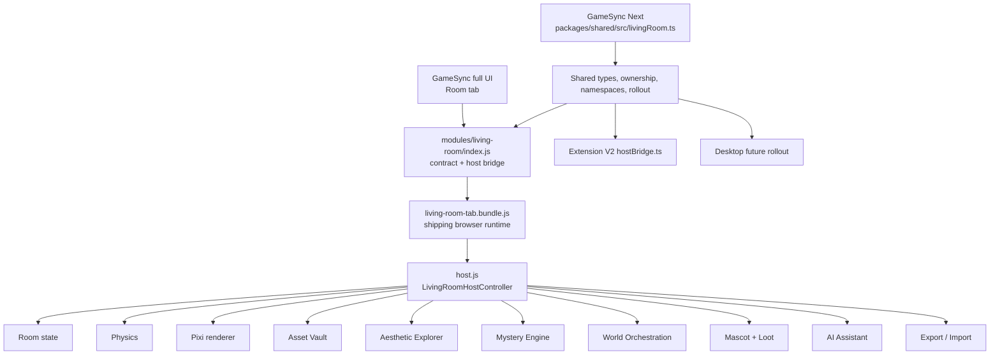

# PRJ-004 - Aesthetic Media Companion / Living Room Platform

## Status at a glance

**Project Constellation ID:** `PRJ-004`  
**Historical Constellation status:** PRECURSOR / MERGED  
**Historical plan lineage:** `master-living-room-aesthetic-plan-v3.md`  
**Newest verified implementation host:** [`Herbertofury/Gamesync`](https://github.com/Herbertofury/Gamesync), shipping extension `0.6.3`  
**Observed GameSync main baseline:** `a8e37976eb0b3ee3c4ec5e802b02d3bfa1f41928`  
**Cross-host contract owner:** [`Herbertofury/GameSync-Next`](https://github.com/Herbertofury/GameSync-Next), [`packages/shared/src/livingRoom.ts`](https://github.com/Herbertofury/GameSync-Next/blob/main/packages/shared/src/livingRoom.ts)

The original Project Constellation record correctly preserves this project as a precursor whose scope overlaps Feature Foundry. Newer project-owned source adds an important refinement: a substantial **GameSync Living Room runtime now exists** and the cross-host ownership/schema contract lives in GameSync Next. Do not create a separate replacement repository merely because the historical PRJ-004 record called the product merged. Treat the old plan as product lineage, GameSync as the strongest verified shipping runtime host, GameSync Next as the shared contract layer, and Feature Foundry as the related authoring/data-platform family.

## Product purpose

The Living Room platform is a persistent interactive room/world inside GameSync that combines:

- a room canvas and object-placement runtime;
- physics and rendered furniture/props;
- an asset vault with classification, tags, favorites, and reusable imported media;
- an aesthetic catalogue, discovery/explorer surfaces, and aesthetic playground behavior;
- a media companion with unified music, film, TV, anime, game, fashion, book, and art entries;
- mascot simulation and room-object interaction;
- loot-to-room progression;
- mystery clues, trinkets, reveal chains, and hints;
- real-time/manual time, weather, season, ambience, and environmental reactions;
- AI-assistant integration;
- JSON export/import, bounded backups, starter templates, onboarding, accessibility, and lightweight diagnostics.

The historical PRJ-004 goals of room runtime, asset vault, aesthetic catalogue/explorer, media companion, mystery/progression, and world orchestration are therefore represented by real current source. This does not mean every historical plan item or every Feature Foundry ambition is already proven in the shipping runtime.

## Current architecture



### Ownership model

The shipping GameSync bridge exposes these seven major subsystem ownership domains:

| Subsystem | Shared contract owner | Reserved implementation family |
| --- | --- | --- |
| Room runtime | `packages/shared/src/livingRoom.ts` | `packages/living-room-runtime/` |
| Mascot simulation | `packages/shared/src/livingRoom.ts` | `packages/living-room-mascots/` |
| Asset vault | `packages/shared/src/livingRoom.ts` | `packages/living-room-vault/` |
| Aesthetic catalogue | `packages/shared/src/livingRoom.ts` | `packages/living-room-catalogue/` |
| Media companion | `packages/shared/src/livingRoom.ts` | `packages/living-room-media/` |
| Mystery engine | `packages/shared/src/livingRoom.ts` | `packages/living-room-mystery/` |
| World orchestration | `packages/shared/src/livingRoom.ts` | `packages/living-room-world/` |

GameSync Next formalizes the same ownership model with typed records, host rollout order, shared storage namespaces, analytics events, QA probes, and an Extension V2 host bridge. Its rollout order is Opera extension, Extension V2, then desktop.

## Repository map

### Shipping GameSync

The primary implementation is under [`app/modules/living-room/`](https://github.com/Herbertofury/Gamesync/tree/main/app/modules/living-room).

| Path | Responsibility |
| --- | --- |
| `app/modules/living-room/manifest.json` | Module identity, retention policy, host target, namespaces, and rollout metadata. |
| `app/modules/living-room/index.js` | Opera-extension bridge, subsystem ownership, feature flags, namespace mapping, analytics names, and runtime entry. |
| `app/modules/living-room/runtime/entry.js` | Publishes `window.GSLivingRoomTab.render()` and `.teardown()`. |
| `app/modules/living-room/runtime/host.js` | Main room controller, lifecycle, input, persistence coordination, physics/render loop, and rail-controller mounting. |
| `roomState.js` | Room schema, entity templates, transforms, lock states, camera, normalization, and manual snapshots. |
| `physics.js` | Rapier-compatible physics path plus fallback physics engine. |
| `renderScene.js` | PixiJS scene rendering and furniture/prop drawing. |
| `vaultState.js` | Asset Vault schema, storage, CRUD, classification overrides, sorting/filtering, and thumbnails. |
| `vaultUI.js` | Asset Vault user interface. |
| `assetTaxonomy.js` / `classifyAsset.js` / `importAsset.js` | Asset classification, affordances, import, and taxonomy behavior. |
| `aestheticCatalogue.js` | Aesthetic catalogue data and behavior. |
| `aestheticDiscovery.js` | External discovery/navigation helpers. |
| `aestheticExplorer.js` | Product-facing explorer. |
| `aestheticPlayground.js` | Aesthetic experimentation surface. |
| `aestheticRemoteData.js` | Remote aesthetic/media data acquisition and caching. |
| `mediaCompanion.js` | Unified media dataset, cards, embedded players, and mini-player behavior. |
| `mascotSim.js` | Room-local mascot simulation. |
| `lootBridge.js` | Converts reward/loot state into room entities and placement/progression behavior. |
| `mysteryEngine.js` | Clue predicates, hint timing, trinkets, progression arcs, and reveal state. |
| `worldOrchestration.js` | Time, weather, seasons, ambience, particles, event bus, and environmental reactions. |
| `aiAssistant.js` | Living Room assistant integration. |
| `exportImport.js` | Export/import, backups, starter layouts, onboarding, accessibility, and diagnostics. |
| `soundCues.js` | Room UI/action sound cues. |
| `living-room.css` | Living Room visual layer. |
| `living-room-tab.bundle.js` | Checked-in browser bundle loaded by the shipping full-page UI. |
| `devroom.html` | Development room surface. |

The current runtime directory contains all of the modules above plus a checked-in `living-room-tab.bundle.js` of roughly 4 MB. The normal GameSync full page loads `modules/living-room/index.js` followed by this bundle.

## Shipping integration

The normal GameSync full UI contains a real **Room** tab with `data-tab="livingroom"`. It loads the Living Room bridge and bundle before the main application entry point. This is a current source integration, not only a design document.

GameSync's module manifest identifies the unit as:

- module ID `gamesync-living-room-phase0`;
- family `living-room-world`;
- module version `0.1.0`;
- host target `gamesync`;
- bundled local runtime;
- internal publication channel;
- state preserved when disabled and when uninstalled unless explicitly purged.

The name still says "Phase 0", but the checked-in runtime now contains room physics/rendering, vault, aesthetic explorer/media, mysteries, world orchestration, mascot/loot integration, AI, and import/export. Treat the manifest's phase label as rollout metadata, not proof that only a skeleton exists.

## Persistent state and schemas

The bridge establishes stable namespace ownership:

| Namespace | Storage key | Purpose |
| --- | --- | --- |
| Room | `gs_living_room_room_v1` | Layout, transforms, camera, snapshots, selected state. |
| Vault | `gs_living_room_vault_v1` | Imported assets, classification, tags, favorites, usage. |
| Loot | `gs_living_room_loot_v1` | Reward-to-room display/progression data. |
| Aesthetics | `gs_living_room_aesthetics_v1` | Aesthetic state used by the runtime/export layer. |
| Mystery | `gs_living_room_mystery_v1` | Clues, trinkets, reveal and progression state. |
| World | `gs_living_room_world_v1` | Time, weather, season, ambience settings and stats. |
| Analytics | `gs_living_room_analytics_v1` | Living Room instrumentation/QA state. |
| Backups | `gs_living_room_backups_v1` | Bounded complete backup records. |
| Onboarding | `gs_living_room_onboarding_v1` | Tour completion/dismissal state. |

The module contract explicitly requires retention on disable/uninstall and automatic restoration. Changes to these keys are migration-sensitive.

## Room runtime

### World and object model

The current schema uses a 1600 x 960 logical room with a floor at `y=774`, ceiling at `y=116`, and 64-pixel wall inset. Initial built-in templates include:

- Cloud Sofa;
- Media Stand;
- Low Table;
- Floor Lamp;
- Arcade Plant;
- Mascot Plush;
- Pixel Trophy;
- Loot Crate.

Objects carry transform, body type, friction, restitution, collision group, lock state, aesthetic tags, visual metadata, and z-index. Current lock states are `Unlocked`, `Locked`, `Frozen`, and `Pinned`.

### User controls

The host controller exposes visible room actions for:

- Save Snapshot;
- Restore Latest;
- Fit View;
- Debug;
- Mascot;
- Chaos Mode.

Keyboard behavior currently includes:

| Key | Action |
| --- | --- |
| `Esc` | Clear current selection. |
| `Delete` / `Backspace` | Remove selected entity. |
| `Q` / `E` | Rotate selected entity by 15 degrees. |
| `D` | Toggle debug state. |
| `M` | Toggle mascot simulation. |
| `C` | Toggle Chaos Mode. |
| `Tab` / `Shift+Tab` | Cycle entity selection. |

Room state watches `chrome.storage.local` for external updates and rejects stale incoming state while local drag/pan mutations are newer.

## Rendering and physics

`renderScene.js` uses PixiJS (`pixi.js/unsafe-eval`, `Application`, `Container`, `Graphics`, `Sprite`, `Text`, `Texture`) for the room scene.

`physics.js` attempts to load `@dimforge/rapier2d-compat` dynamically and initialize Rapier. If that path is unavailable, a fallback physics engine remains available. The room therefore has a deliberate degraded mode rather than making Rapier availability the only path to basic operation.

Dynamic and fixed objects retain physics metadata, sleeping state, contacts, and bounded room geometry. The host loop updates physics, render state, save timing, drag state, and mascot information.

## Asset Vault

`vaultState.js` persists an explicit schema under `gs_living_room_vault_v1`. A vault record can retain:

- source type: file, URL, drag, or capture;
- source URL and/or original filename;
- processed thumbnail;
- original image dimensions;
- classification category, label, confidence, and user-override marker;
- resolved physics preset;
- aesthetic tags;
- affordances;
- favorite state;
- placement/use count;
- created and last-used timestamps.

Supported state operations include add, batch add, remove, update, favorite toggle, record use, reclassification, tag updates, sorting, filtering, search, and statistics. Thumbnail generation is bounded to 512 pixels on the longest dimension and produces WebP thumbnails at the current implementation's chosen quality setting.

A manual reclassification is intentionally explicit: confidence becomes `1.0`, `isUserOverride` is set, and the physics/affordance mapping is updated from the selected taxonomy category.

## Aesthetic catalogue, explorer, and media companion

The runtime has dedicated modules for catalogue data, discovery, explorer UI, playground behavior, remote data, and media.

The Media Companion treats outbound cards and embedded playback as one unified dataset. Its item model currently supports:

- music;
- movie;
- TV;
- anime;
- game;
- fashion;
- book;
- visual art.

Media can use Spotify, YouTube, direct video, or outbound-only links. Current source contains curated starter datasets and a remote-data path, plus embedded playback and a mini-player dock. Embedded-media behavior should be tested under the extension's real Content Security Policy and host permissions rather than assumed from static source inspection.

## Mystery and progression

The Mystery Engine uses persisted clue/trinket state and predicate-driven reveals. Predicates can depend on:

- entity type/count;
- active aesthetic;
- previously discovered clues;
- interaction count;
- elapsed time since mount;
- arrangement;
- time of day;
- mascot availability;
- loot count;
- a secret action sequence.

The checked-in first playable arc is **The Collector's Riddle**. It contains chained clues, progressive hints, a mascot-assisted reveal, a final Collector message, and a night-only follow-up apparition. Current timing constants include a 15-second first-hint delay, 45-second progressive hint interval, and 8-second secret-chain timeout.

Treat this as current implementation content, not a guarantee that every mystery route has been exercised in a fresh real-browser session.

## World orchestration

`worldOrchestration.js` is the shared room ambience controller for:

- real-time, manual, or paused time;
- automatic, manual, or disabled weather;
- automatic, manual, or disabled seasons;
- ambient sounds;
- particle effects;
- decoration-scope settings;
- environment CSS variables;
- mascot/world reactions;
- mystery timing hooks;
- world events.

Current weather types include clear, cloudy, rain, heavy rain, snow, fog, thunderstorm, and wind. Automatic weather uses season-dependent weights. Time is divided into night, dawn, morning, midday, afternoon, dusk, evening, and late night. World state is re-evaluated on a 30-second tick; automatic weather transitions are scheduled at a 10-minute interval, and thunderstorm lightning uses bounded randomized intervals.

World events include time changed, weather changed, season changed, ambient updated, settings changed, and lightning flash. The room host subscribes to ambient updates and forwards lamp-glow state into the Pixi view.

## Mascot, loot, and AI integration

The Living Room host mounts:

- a room-local mascot simulation;
- `lootBridge.js` for converting newly earned or discovered rewards into placeable room entities;
- an AI-assistant controller;
- toast feedback;
- world, mystery, vault, aesthetic, and export/import rail controllers.

This is intentionally connected to the wider GameSync mascot/reward ecosystem. Preserve the boundary between reusable shared mascot engines and the room-local mascot simulation instead of copying mascot behavior into another divergent implementation.

## Export, import, backups, and onboarding

Exports use:

- magic value `GAMESYNC_LIVING_ROOM_EXPORT`;
- export version `1`;
- JSON payloads containing selected Living Room storage namespaces;
- metadata such as export timestamp and entity count.

Import validates the magic and version before writing. Full replacement removes the known Living Room storage keys first; merge mode writes only keys present in the imported payload.

Backups are stored under `gs_living_room_backups_v1` and are bounded to **10** records. Current starter layouts include:

- Empty Room;
- Cozy Starter;
- Gaming Den;
- Study Nook;
- Zen Garden.

Onboarding includes dedicated steps for the room canvas, Asset Vault, Aesthetic Explorer, Mystery Journal, and World & Ambiance. The export/import controller also adds accessibility attributes and basic runtime metrics such as DOM node count and canvas/entity counts.

## Build and install

### Prerequisites

Use a current Node.js version compatible with the checked-in Vite toolchain. Install exact repository dependencies through the lockfile rather than manually reconstructing dependency versions.

### Shipping GameSync build

From the GameSync repository root:

```powershell
npm ci
npm run build
```

The GameSync repository defines:

- `app/` as canonical editable extension source;
- `dist/` as generated production extension output;
- `npm run dev` for Vite development;
- `npm run build` for the production Vite build.

Load the resulting `dist` directory as the unpacked extension in Opera GX. The Vite configuration rebuilds the main HTML/background/content entry points and then copies required runtime closure entries, including the `modules/` tree, into `dist`.

### Important Living Room bundle boundary

The current shipping UI loads the checked-in file:

`app/modules/living-room/runtime/living-room-tab.bundle.js`

The modular Living Room source imports PixiJS and Rapier, but the current root `package.json` does not declare `pixi.js` or `@dimforge/rapier2d-compat`, and this documentation pass found **no repository script that explicitly rebuilds `living-room-tab.bundle.js` from the modular source**.

Therefore:

1. `npm run build` is verified as the GameSync packaging command.
2. The Vite runtime-closure step is verified to copy the Living Room runtime into `dist`.
3. It is **not** verified that `npm run build` regenerates `living-room-tab.bundle.js` from `host.js`, `roomState.js`, `renderScene.js`, and the other modular files.
4. Editing modular Living Room source must not be treated as shipped behavior until the bundle-generation path is recovered/re-established and the resulting bundle is verified in the real extension.

This is currently the highest-value documentation/build reproducibility gap for this project.

## GameSync Next contract and host parity

[`packages/shared/src/livingRoom.ts`](https://github.com/Herbertofury/GameSync-Next/blob/main/packages/shared/src/livingRoom.ts) is the current typed cross-host contract. It defines:

- contract version 1;
- host rollout order: Opera extension, Extension V2, desktop;
- subsystem ownership;
- entity, transform, physics, vault, aesthetic, media, loot, and mystery types;
- namespace constants;
- feature-flag rollout plans;
- analytics events;
- QA probes.

[`apps/extension-v2/src/living-room/hostBridge.ts`](https://github.com/Herbertofury/GameSync-Next/blob/main/apps/extension-v2/src/living-room/hostBridge.ts) imports the shared contract and exposes the Extension V2 ownership/eligibility helpers.

Note the distinction between **rollout-plan defaults** and **shipping host flags**: the GameSync Next shared plan leaves most later features at an `off` default stage until rolled out, while the current shipping GameSync Opera bridge reports its local Living Room feature flags as enabled. Do not flatten these two meanings into one global enabled/disabled truth.

## Relationship to Feature Foundry

The historical PRJ-004 record said most scope appeared inside Feature Foundry. That remains useful lineage, but current evidence supports a more precise ownership model:

- **Feature Foundry** is the related authoring/data-platform family for aesthetics, objects, assets, theme worlds, and professional creation workflows.
- **GameSync Living Room** is a verified current consumer/runtime surface for an interactive personal room/world.
- **GameSync Next shared Living Room contract** is the current cross-host schema and ownership contract.

When transferring Feature Foundry data or tools into the Living Room, preserve explicit adapters and shared schemas. Do not duplicate a second aesthetic database, asset-vault identity system, or world-state owner merely because both products expose similar concepts.

## Safe modification workflow

1. Resolve the current `Herbertofury/Gamesync` main commit before editing.
2. Read `app/modules/living-room/manifest.json`, `index.js`, and the relevant runtime modules.
3. Check `packages/shared/src/livingRoom.ts` in GameSync Next before changing schemas, namespaces, subsystem identities, analytics names, or host ownership.
4. Preserve existing `chrome.storage.local` namespace identities unless a versioned migration is implemented.
5. Make source changes in the smallest owning module rather than expanding `host.js` into a monolith.
6. If changing an entity schema, update normalization/import paths so old stored rooms still load.
7. If changing the Asset Vault schema, preserve explicit user classification overrides, favorites, tags, and provenance.
8. If changing world/mystery state, preserve existing progression and avoid resetting state during an ordinary upgrade.
9. Rebuild the Living Room browser bundle through a verified process before claiming modular source changes are shipping.
10. Run the GameSync production build.
11. Load `dist` in the real browser and test the changed flow.
12. Reload/restart and confirm state persists.

## Verification checklist

There is currently no dedicated Living Room test command in the shipping GameSync root `package.json`. A successful Vite build proves packaging, not end-to-end Living Room correctness. A meaningful runtime qualification should exercise at least:

- Room tab opens from the real full-page GameSync UI.
- Default room renders and can be panned/zoomed.
- Object placement, selection, drag, rotation, delete, lock-state cycle, and snapshots work.
- Dynamic objects move under physics and remain bounded.
- Rapier mode works when available and fallback mode remains usable when unavailable.
- Asset import creates a persistent Vault entry with thumbnail/classification.
- Search, filtering, favorites, reclassification, tags, and placement from the Vault work.
- Aesthetic Explorer opens and selected aesthetic/media state remains coherent.
- Spotify/YouTube/outbound media behavior respects the real extension CSP and permissions.
- Mystery progression can reveal at least the first arc in the intended order.
- World time/weather/season controls visibly alter the room and persist.
- Mascot and loot integration do not corrupt room state.
- Export produces valid `GAMESYNC_LIVING_ROOM_EXPORT` JSON.
- Import/restore and bounded backups work after reload.
- Existing state survives extension reload and browser restart.
- Extension V2 host-bridge behavior remains schema-compatible after shared-contract changes.

Do not claim this whole matrix passed unless it was exercised against the exact built artifact.

## Troubleshooting

### Room source was edited but the browser still shows old behavior

Check whether `living-room-tab.bundle.js` was actually regenerated. The shipping page loads that bundle. `npm run build` currently packages/copies runtime assets but is not verified to rebuild the Living Room bundle from its modular source.

### Physics reports fallback mode

The runtime deliberately has a fallback physics engine when Rapier cannot be loaded. Confirm whether the bundle contains the intended Rapier integration before treating fallback mode as a defect. If full Rapier behavior is required, verify the bundler/dependency path rather than adding an ad hoc second physics implementation.

### Room state appears to revert

Inspect `gs_living_room_room_v1` timestamps and storage-change handling. The host rejects stale external state while a newer local mutation exists, particularly during drag/pan operations.

### Imported assets disappear

Inspect `gs_living_room_vault_v1`, extension storage health, and any import/export operation that performed a full replacement. A full Living Room import removes the known storage namespaces before writing the imported payload.

### Media does not embed

Differentiate data quality from browser restrictions. Confirm the media item's `embedType`/ID, network availability, extension CSP, iframe host permission, and whether the item is meant to be outbound-only.

### Mystery does not advance

Inspect prerequisite clue IDs, interaction/time requirements, mascot state, time of day, loot count, and secret-chain progress. The engine intentionally blocks clues whose predicates are not satisfied.

### Weather or season seems static

Check world settings for manual/paused/disabled modes. Automatic world updates are interval-driven; an immediate visual change should not be assumed when the current mode is automatic.

### Import is rejected

A valid import currently requires `_magic: "GAMESYNC_LIVING_ROOM_EXPORT"`, export version `1`, and an object data payload. Unknown versions are intentionally rejected rather than silently coerced.

## Current unresolved boundaries

- A reproducible checked-in command for rebuilding `living-room-tab.bundle.js` from the modular runtime source was not found in this pass.
- The modular source imports PixiJS and Rapier, but those packages are not declared in the current shipping root dependency list examined in this pass. The historical build provenance of the checked-in bundle therefore needs reconciliation.
- Extension V2 has a verified shared-contract host bridge, but this pass did not prove complete Room UI/runtime parity there.
- Desktop is present in the shared rollout order, but this pass did not prove a complete desktop Living Room implementation.
- The historical `master-living-room-aesthetic-plan-v3.md` remains lineage, while GameSync Next also cites a later `master-living-room-aesthetic-plan-v24-status-applied.md` migration source. The latter was not inspected during this pass.
- This documentation pass inspected source and repository contracts but did not execute a fresh real-Opera Living Room qualification.

## Contribution rules

- Preserve user room, vault, mystery, world, loot, and aesthetic state across ordinary upgrades.
- Keep schemas versioned and migration-aware.
- Keep subsystem ownership aligned with the shared GameSync Next contract.
- Avoid duplicate implementations where Feature Foundry, GameSync shared packages, or existing GameSync modules already own the concept.
- Keep imports/provenance explicit and user-correctable.
- Never replace the real room canvas/runtime with decorative mock controls or disconnected panels.
- Every visible action must perform its stated operation and show truthful failure behavior.
- Verify the generated extension, not just modular source files.

## Documentation maintenance triggers

Update this wiki when any of the following changes materially:

- GameSync Living Room bundle/build ownership;
- subsystem ownership or shared contract version;
- storage schema/namespace versions;
- room entity/physics/render model;
- Vault classification/import behavior;
- Aesthetic Explorer or media-provider behavior;
- mystery/progression rules;
- time/weather/season orchestration;
- mascot/loot integration;
- export/import/backup format;
- Extension V2 or desktop parity;
- real-browser verification evidence.

Prefer current project-owned source and runtime evidence over the older PRJ-004 plan when describing what actually ships, while keeping the historical plan as preserved product lineage.