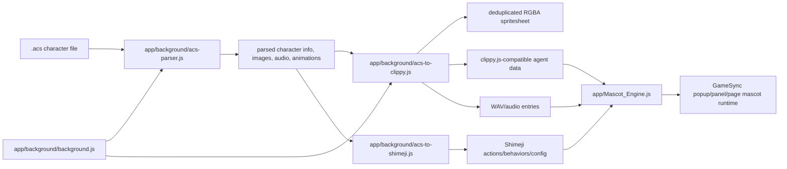

# ACS Agent Parity Runtime Wiki

**Project Constellation ID:** `PRJ-006`
**Status:** SPEC / ACTIVE IMPLEMENTATION TRACK
**Current verified host source:** `Herbertofury/Gamesync`
**Verified GameSync version:** `0.6.3`
**Verified source baseline:** commit `a8e37976eb0b3ee3c4ec5e802b02d3bfa1f41928`
**Historical parity contract:** `acs-agent-parity-checklist-generalized-v3.md`

## Mission

Restore classic Microsoft Agent, Office Assistant, MASH/TMAFE, and Double Agent behavior across the modern mascot runtime without regressing the browser-safe behavior, Shimeji compatibility, persistence, dragging, rendering, and other improvements already present in GameSync.

The Project Constellation record originally treated this as a specification/implementation track whose canonical repository was unresolved. Current repository evidence materially improves that picture: GameSync `0.6.3` contains a real ACS parser, ACS conversion pipeline, Shimeji conversion path, mascot runtime integration, service-worker imports, web-accessible mascot/voice assets, and Microsoft Agent character presets. This wiki therefore treats `Herbertofury/Gamesync` as the strongest currently verified implementation host while preserving the broader historical parity checklist as the acceptance contract.

This does **not** mean complete Microsoft Agent parity is proven. Current source proves substantial implementation, but several classic request, speech, command-window, recognition, and interaction semantics still require explicit runtime qualification.

## Current implementation map



## Verified current source

### `app/background/acs-parser.js`

The current parser is a pure-JavaScript Microsoft Agent Character `.acs` parser designed to run in the Manifest V3 background/service-worker context. Its source identifies two implementation references: the `msagent.js` implementation and the MSAgent Character Data Specification material.

Verified responsibilities include:

- reading little-endian ACS binary structures;
- parsing counted lists, data chunks, strings, rectangles, locations, palettes, compressed blocks, images, animations, character metadata, and related binary structures;
- ACS decompression implemented in JavaScript;
- optional acceleration through the existing legacy WebAssembly accelerator;
- fallback to the JavaScript decompressor when the accelerator is unavailable or fails;
- image/palette processing needed by later rendering and conversion stages.

The fallback rule is important. ACS import must remain functional even when optional acceleration is unavailable.

### `app/background/acs-to-clippy.js`

This module converts parsed ACS data into runtime artifacts usable by GameSync's existing mascot stack. Its source explicitly produces:

1. a deduplicated RGBA spritesheet;
2. a clippy.js-compatible agent data object;
3. Shimeji-compatible actions/behaviors/configuration through the paired converter;
4. extracted audio entries as WAV data.

The converter composites ACS frames, analyzes and deduplicates RGBA output, handles empty frames, creates a grid spritesheet, maps frame coordinates into animation data, converts ACS frame duration units into milliseconds, and preserves sound references.

The frame-analysis path can use the legacy WebAssembly accelerator for RGBA analysis/equality, but it also contains JavaScript fallbacks. This is a performance enhancement, not a required semantic dependency.

### `app/background/acs-to-shimeji.js`

The Shimeji converter maps ACS animation names into Shimeji actions and behaviors so an imported ACS character can participate in the shared Shimeji/mascot runtime rather than existing as an isolated renderer.

The current mapping table includes categories such as:

- rest/idle states;
- blink and multiple idle variants;
- directional gestures;
- directional look/return animations;
- greeting/attention/social actions;
- emotional actions;
- thinking, processing, searching, and suggestion states;
- listening/hearing states;
- office/task animations;
- show/hide behavior;
- movement and return animations;
- special/magic/character-specific actions.

This conversion is compatibility glue. It must not be used as evidence that all Microsoft Agent semantics are equivalent to Shimeji semantics.

### `app/Mascot_Engine.js`

`Mascot_Engine.js` is the current large browser mascot integration surface. The source establishes a stable message contract including operations for:

- retrieving mascot state, timeline, memory, and active-pack runtime;
- setting settings and mode;
- importing/exporting/listing/deleting packs;
- installing bundled reference Shimejis;
- clearing memory and cached packs;
- firing debug events;
- opening extension UI/settings;
- snoozing;
- selecting a mascot;
- toggling interaction mode;
- persisting/restoring tab state.

Current defaults include mascot enablement, quiet/snooze modes, roam/interact modes, size/speed, speech frequency, voice configuration, active pack, personality, engine override, wall/throw mode, Shimeji seed/tick/spawn settings, site policy, Webmeji settings, cooldowns, and per-skill behavior toggles.

The current preset table includes classic Microsoft Agent/Office-style characters such as Merlin, Genie, Robby, Clippy/Clippit, Office assistants, Rover/Earl, Bonzi-related presets, and PF Magic Catz/Dogz/Oddballz placeholders/presets.

Engine identity normalization recognizes ACS as a distinct engine path and keeps Shimeji browser/desktop variants on their own compatibility path.

### `app/background/background.js`

The Manifest V3 service worker imports the real ACS processing pipeline:

- `processAcsFile` and `rgbaToPng` from `acs-to-clippy.js`;
- `parseAcs` and `compositeFrame` from `acs-parser.js`;
- mascot-pack contracts and engine-normalization helpers;
- the Shimeji browser bridge.

This proves ACS support is integrated into the shipping GameSync background runtime rather than existing only as abandoned reference code.

### Manifest/runtime exposure

`app/manifest.json` confirms the shipping extension is Manifest V3 and exposes mascot-related resources needed by the runtime, including:

- `content/mascot/*.js`, `.bin`, and `.json`;
- shared mascot-game resources;
- `Voicepacks/**`;
- `assets/mascot/shimejis/**`;
- `assets/petz/**`;
- Shimeji Browser Engine runtime assets.

It also registers the background service worker and browser permissions used by the surrounding GameSync runtime.

## Current repository layout relevant to ACS parity

| Path | Responsibility |
| --- | --- |
| `app/background/acs-parser.js` | Binary ACS parser, decompression, image/animation structures. |
| `app/background/acs-to-clippy.js` | ACS to spritesheet, clippy-style agent data, audio, and Shimeji conversion orchestration. |
| `app/background/acs-to-shimeji.js` | ACS animation/state mapping into Shimeji actions/behaviors/configuration. |
| `app/background/background.js` | Manifest V3 service-worker integration and message/runtime ownership. |
| `app/Mascot_Engine.js` | Shared browser mascot runtime, UI behavior, settings, engines, packs, state, voice hooks, interactions. |
| `app/background/shimeji-browser-bridge.js` | Shimeji browser compatibility bridge used alongside ACS/runtime features. |
| `app/Voicepacks/` | Voicepack resources exposed by the extension manifest. |
| `app/assets/mascot/shimejis/` | Bundled Shimeji mascot assets. |
| `app/assets/petz/` | Petz-related assets used by the broader shared mascot family. |
| `app/manifest.json` | MV3 registration, permissions, service worker, external/resource exposure. |
| `rust/gs-legacy-accel` | Optional legacy acceleration build target referenced by the package script. |

## Historical parity contract

Project Constellation preserves `acs-agent-parity-checklist-generalized-v3.md` as the broad acceptance contract. It describes an existing foundation of ACS parsing, runtime conversion, spritesheets/audio, `pack.acsAgent` metadata, state/return maps, voice and balloon metadata, queued playback/movement/speech, dragging/idle transitions, and Shimeji compatibility.

The same durable record identifies the following areas as parity gaps that must not be assumed complete merely because parsing/rendering works:

- true `GestureAt()` directional behavior;
- a distinct, correct `Think()` path;
- request objects and classic queue semantics including Wait, Interrupt, StopAll, and Get;
- classic popup/Commands/CommandsWindow/Voice Commands Window behavior;
- speech recognition and command grammar;
- deeper state semantics;
- lip-sync and audio timing;
- local AI/STT/TTS and voice switching where included by the product direction;
- inspector, parity scoring, and authoring tools.

Multiple historical v3 copies were previously recorded. Preserve those until their content hashes and lineage are reconciled; do not discard one solely because another has the same filename.

## What is verified versus unresolved

### Verified from current GameSync source

- a real ACS binary parser exists;
- ACS decompression has JavaScript and optional Wasm paths;
- ACS character frames can be composited and converted into a deduplicated spritesheet;
- ACS audio and animation data flow into the conversion pipeline;
- clippy.js-compatible agent data is generated;
- ACS animation data can also be converted to Shimeji-compatible behavior/configuration;
- the shipping service worker imports ACS parser/converter modules;
- the shared mascot engine contains ACS-aware engine identity and classic character presets;
- mascot/voice/Shimeji/Petz resources are exposed by the MV3 manifest;
- GameSync has a real build path and generated production `dist/` extension.

### Not yet proven by this documentation pass

- complete Microsoft Agent COM/API semantic parity;
- correct `GestureAt()` target/direction behavior under all cases;
- classic request object lifecycle and full Wait/Interrupt/StopAll/Get parity;
- a separately verified `Think()` execution path with correct balloon/state behavior;
- classic Commands/CommandsWindow/Voice Commands Window parity;
- speech recognition/grammar parity;
- exact lip-sync/viseme timing parity;
- desktop-host parity with the browser runtime;
- restart-persistent behavior for every ACS-specific setting and request state;
- end-to-end import/use of a representative corpus of classic ACS files in the currently loaded Opera GX build.

These unresolved items are acceptance work, not permission to replace the current parser/runtime.

## Installing and running the current host

The canonical GameSync repository defines `app/` as editable source and `dist/` as generated production output. Only `dist/` should be loaded unpacked in Opera GX.

From a clean checkout of the GameSync repository:

```powershell
npm ci
npm run build
```

For development:

```powershell
npm run dev
```

The repository's current package scripts also expose:

```powershell
npm run build:wasm:legacy-accel
npm run preview
```

`build:wasm:legacy-accel` rebuilds the optional legacy WebAssembly accelerator used by ACS decompression/frame analysis. ACS correctness must continue to work through the JavaScript fallback when the accelerator is absent.

After `npm run build`, load:

```text
<clone-directory>\dist
```

as the unpacked extension in Opera GX.

## ACS import qualification workflow

A serious parity run should use a curated corpus rather than one character. At minimum include characters that exercise:

- simple idle/rest animations;
- directional gestures and look/return states;
- multiple audio clips;
- branching/return animation behavior;
- transparency/palette edge cases;
- long or unusual animation lists;
- classic assistants with known expected behavior;
- characters containing animations that map poorly or ambiguously into Shimeji concepts.

For each corpus item, record:

1. file SHA-256 and character identity;
2. parser success/failure;
3. parsed character dimensions/palette/animation/audio counts;
4. decompression path used;
5. conversion stats such as total and unique frames;
6. generated spritesheet dimensions;
7. generated clippy-agent animation names;
8. generated Shimeji actions/behaviors;
9. visual comparison against the known classic/reference behavior;
10. audio timing and completion behavior;
11. drag/move/idle/return behavior;
12. speech/thought/request-queue behavior when applicable;
13. restart persistence and repeat-import behavior;
14. console/service-worker errors.

Do not count successful parsing alone as successful runtime parity.

## Modifying the parser safely

When changing `acs-parser.js`:

- preserve byte-order assumptions explicitly;
- keep bounds/length handling defensive;
- preserve the JavaScript decompression path even when Wasm is available;
- validate palette and transparency changes against representative ACS files;
- compare parsed structure counts before/after the change;
- keep malformed/corrupt input failures contained and visible;
- do not silently reinterpret unsupported structures as successful defaults.

A parser optimization is acceptable only if emitted semantic data remains equivalent for the fixture corpus.

## Modifying the conversion layer safely

When changing `acs-to-clippy.js`:

- preserve frame duration conversion;
- preserve audio references;
- preserve branching/exit information when supported by the target representation;
- keep frame deduplication collision-safe;
- retain empty-frame handling;
- compare generated sprite coordinates and animation frame sequences before/after changes;
- verify changes in the real mascot runtime, not only object snapshots.

When changing `acs-to-shimeji.js`:

- treat the mapping table as an adapter, not canonical ACS semantics;
- preserve hidden return/continuation actions where needed;
- avoid converting a semantically distinct ACS state into an unrelated Shimeji action merely to make it animate;
- record unmapped animations instead of silently dropping them;
- protect existing Shimeji behavior from ACS-specific compatibility work.

## Modifying `Mascot_Engine.js`

`Mascot_Engine.js` is shared infrastructure and therefore high-risk. Before editing it:

- identify which engine path owns the behavior;
- preserve Shimeji Browser/Desktop and Webmeji behavior;
- preserve existing settings and tab-state persistence;
- preserve pack import/export behavior;
- preserve drag/roam/interact behavior;
- preserve quiet/snooze modes and attention-budget logic;
- keep ACS-specific compatibility isolated behind engine-aware branches where practical.

Do not repair ACS parity by forcing every mascot engine through ACS semantics.

## Request and state semantics

Classic parity requires an explicit request/state model. The historical checklist names Wait, Interrupt, StopAll, and Get as important compatibility work.

A complete request implementation should track at least:

- request identity;
- owning agent;
- operation type;
- queued/running/completed/cancelled/failed state;
- dependencies or waits;
- interrupt/priority behavior;
- actual animation/audio/speech work associated with the request;
- completion/error payload;
- cleanup and return-state behavior.

UI success must never be emitted before the underlying request is actually complete.

## `GestureAt()` acceptance

Directional gesture selection should be based on the target relative to the agent, not a hard-coded generic gesture. Qualification should cover:

- target left/right/up/down;
- diagonal/near-center ambiguity;
- viewport edges;
- moved/dragged agent positions;
- multiple agents;
- transformed/scaled mascot sizes;
- page zoom and device-pixel-ratio changes.

The visible animation must correspond to the resolved direction and leave the agent in a valid return/idle state.

## `Think()` acceptance

Thinking must remain distinct from speaking. A complete path should prove:

- thought balloon rather than audible speech;
- correct queue participation;
- interruption/cancellation;
- animation/state coordination;
- balloon cleanup;
- return to valid idle/previous state;
- no accidental TTS invocation.

## Commands and voice recognition

Classic command-window and voice-command behavior remains a separate compatibility surface from simply exposing browser menus or generic speech-to-text.

When implemented or audited, verify:

- command enumeration and grouping;
- enable/disable/visibility state;
- activation routes;
- keyboard/mouse behavior;
- voice grammar or intent restrictions;
- error/permission state;
- focus behavior;
- persistence when appropriate;
- no hidden privileged actions from unconstrained recognition text.

## Speech and lip-sync relationship

The separate `PCX-060` ACS Voice / Speech Runtime wiki documents the speech-provider side in more detail. For PRJ-006, the key rule is that speech providers sit behind ACS request/state behavior. High-quality TTS is not Microsoft Agent parity if queue, balloon, animation, cancellation, or state semantics are wrong.

Where real viseme timing is unavailable, approximate mouth animation must be labeled approximate rather than presented as exact lip-sync parity.

## Testing and verification

The current GameSync package exposes build and Bounty-specific tests, but it does **not** expose a dedicated ACS test script in `package.json`. Therefore:

- `npm run build` proves build closure, not ACS behavioral parity;
- Bounty tests do not qualify ACS;
- parser/converter changes need dedicated fixture tests plus real extension/runtime exercises;
- Opera GX qualification should include service-worker and page console checks;
- restart testing is required for stateful mascot/voice settings.

A useful future test suite should include:

- parser fixtures with known metadata/counts;
- decompressor fixtures comparing JS and Wasm outputs;
- renderer/compositor pixel fixtures;
- converter structure snapshots;
- frame deduplication collision cases;
- audio extraction fixtures;
- Shimeji mapping fixtures;
- corrupt/malformed ACS cases;
- real browser import/render interactions;
- request queue/interrupt/StopAll fixtures;
- speech/thought cleanup fixtures.

## Troubleshooting

### ACS import fails immediately

Check the service-worker console first. Confirm the input is a real ACS file, record its hash, and distinguish parser failure from later conversion/render failure. Do not assume every file with an `.acs` extension is structurally valid.

### Character imports but appears blank

Inspect parsed dimensions/palette/image counts, composite-frame output, empty-frame detection, and generated sprite coordinates. A successful metadata parse does not prove image decoding/compositing succeeded.

### Character animates but audio is missing

Check the parsed audio-entry count, frame sound indices, generated audio blobs/URLs, extension resource accessibility, and actual playback errors. Do not replace missing audio with silent success.

### Animation timing looks wrong

ACS frame durations are converted from hundredths of a second to milliseconds. Confirm the conversion value and make sure no later renderer normalizes durations incorrectly.

### Imported agent behaves like a generic Shimeji

Inspect whether the runtime selected the ACS/clippy path or only the converted Shimeji adapter. The Shimeji conversion is useful compatibility output but is not a substitute for ACS-specific request/state semantics.

### Wasm acceleration fails

The JavaScript fallback should continue working. Compare JS and Wasm decompression/frame-analysis outputs before treating an accelerator problem as an ACS-format problem.

### `GestureAt()` or `Think()` seems partially implemented

Test the exact classic behavior rather than relying on animation-name existence. An available `GestureLeft` animation or `Think` animation is not proof that the public behavior/request semantics are correct.

## Release / contribution checklist

Before merging ACS compatibility changes:

- preserve canonical `app/` source and regenerate `dist/` through the normal build;
- run `npm ci` on a clean environment when qualifying dependency-sensitive changes;
- run `npm run build`;
- run parser/converter fixture tests when available;
- compare JavaScript and Wasm paths when the accelerator is touched;
- import multiple known ACS characters in the real extension;
- exercise animations, audio, drag/move/idle/return behavior;
- exercise request/speech/thought semantics if affected;
- restart Opera GX and verify persistent settings/state;
- inspect page and service-worker consoles;
- scan the working tree for secrets before publication;
- document exact fixture hashes and acceptance evidence.

## Highest-value next work

The Project Constellation next action remains correct but can now be made more precise: **audit the verified GameSync `0.6.3` ACS implementation against `acs-agent-parity-checklist-generalized-v3.md`, item by item, and convert every historical gap into a source location plus executable runtime fixture before claiming classic Microsoft Agent parity.**

The first audit targets should be request objects/Wait/Interrupt/StopAll/Get, `GestureAt()`, `Think()`, command-window behavior, speech/recognition coordination, and lip-sync/audio timing because those are the largest semantic gaps between “ACS files render” and “Microsoft Agent behaves correctly.”
