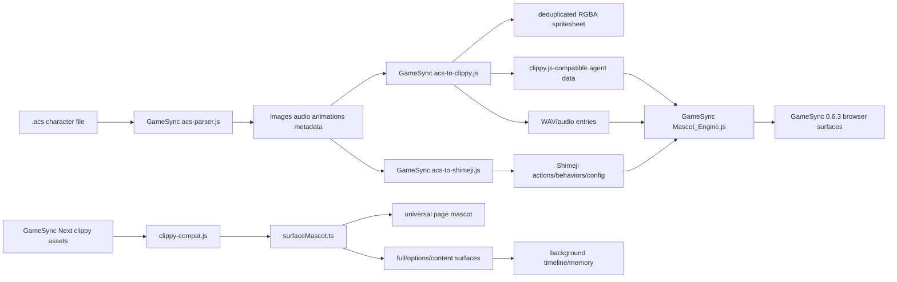

# ACS Agent Parity Runtime Wiki

**Project Constellation ID:** `PRJ-006`
**Status:** SPEC / ACTIVE IMPLEMENTATION TRACK
**Verified shipping host:** `Herbertofury/Gamesync` version `0.6.3`
**Verified next-generation host:** `Herbertofury/GameSync-Next` Extension V2 version `0.8.0`
**GameSync verified source baseline:** commit `a8e37976eb0b3ee3c4ec5e802b02d3bfa1f41928`
**GameSync Next current head observed:** commit `cd906ff0831bf7fc33b41fea31b6f0c004cc1562`
**GameSync Next mascot parity implementation:** commit `60940e8479af518f3373a79efa091902f4843842`
**Historical parity contract:** `acs-agent-parity-checklist-generalized-v3.md`

## Mission

Restore classic Microsoft Agent, Office Assistant, MASH/TMAFE, and Double Agent behavior across the modern mascot runtime without regressing browser-safe behavior, Shimeji compatibility, persistence, dragging, rendering, page/runtime isolation, or the other improvements already present in GameSync.

The Project Constellation record originally treated this as a specification/implementation track whose canonical repository was unresolved. Repository evidence now proves two implementation hosts:

- `Herbertofury/Gamesync` `0.6.3` is the verified shipping browser host and contains the real ACS parser, conversion pipeline, service-worker import path, large shared mascot engine, classic-agent presets, voice resources, and optional legacy Wasm acceleration.
- `Herbertofury/GameSync-Next` Extension V2 `0.8.0` is the verified typed next-generation browser host. It carries a Clippy-compatible runtime asset, typed surface adapter, shared mascot settings, universal all-site page mounting, SPA continuity, timeline/memory integration, and an isolated Opera GX verification path.

This dual-host evidence materially strengthens the project, but it still does **not** prove complete Microsoft Agent parity. In particular, the current GameSync Next compatibility runtime still exposes a stub `gestureAt()` implementation, does not expose a separate `think()` method in the verified compatibility layer, and does not implement classic COM-style request objects with Wait/Interrupt/StopAll/Get semantics.

## Current implementation map



## Authority model

The two verified hosts have different strengths and must not be collapsed into one vague implementation claim.

| Authority lane | Strongest verified source | What it proves |
| --- | --- | --- |
| ACS format ingestion and conversion | GameSync `0.6.3` | Real `.acs` binary parsing, decompression, frame composition, audio extraction, clippy-style conversion, Shimeji conversion, service-worker integration. |
| Shipping broad mascot runtime | GameSync `0.6.3` | Existing `Mascot_Engine.js`, engine selection, pack state, classic presets, voice resources, tab/runtime integration. |
| Typed next-generation mascot surface | GameSync Next `0.8.0` | WXT/React-era surface adapter, Clippy-compatible agent loading, settings integration, timeline/memory, resize/dispose behavior. |
| Universal all-site mascot behavior | GameSync Next `0.8.0` | Site-policy gated mascot mounting on arbitrary pages, SPA route continuity, isolation from the full supported-site overlay runtime, mount diagnostics. |
| Classic ACS semantic parity | Historical parity contract plus runtime evidence | Still incomplete. Parsing/rendering success is not equivalent to classic request, command, recognition, thinking, directional gesture, or lip-sync parity. |

When the two hosts disagree, preserve both behaviors until the intended migration/parity decision is verified. Do not silently treat the V2 surface runtime as a replacement for the shipping ACS parser/converter, and do not treat the older shipping host as the only implementation authority for modern browser-host behavior.

## Verified GameSync `0.6.3` source

### `app/background/acs-parser.js`

The current parser is a pure-JavaScript Microsoft Agent Character `.acs` parser designed to run in the Manifest V3 background/service-worker context. Its source identifies the `msagent.js` implementation and Microsoft Agent Character Data Specification material as implementation references.

Verified responsibilities include:

- reading little-endian ACS binary structures;
- parsing counted lists, data chunks, strings, rectangles, locations, palettes, compressed blocks, images, animations, character metadata, and related structures;
- ACS decompression in JavaScript;
- optional acceleration through the existing legacy WebAssembly accelerator;
- JavaScript fallback when the accelerator is unavailable or fails;
- image/palette processing needed by later rendering and conversion stages.

The fallback rule is important. ACS import must remain functional even when optional acceleration is unavailable.

### `app/background/acs-to-clippy.js`

This module converts parsed ACS data into runtime artifacts usable by GameSync's mascot stack. Its source produces:

1. a deduplicated RGBA spritesheet;
2. a clippy.js-compatible agent data object;
3. Shimeji-compatible actions/behaviors/configuration through the paired converter;
4. extracted audio entries as WAV data.

The converter composites ACS frames, analyzes and deduplicates RGBA output, handles empty frames, creates a grid spritesheet, maps frame coordinates into animation data, converts ACS frame duration units into milliseconds, and preserves sound references.

The frame-analysis path can use the legacy WebAssembly accelerator for RGBA analysis/equality, but it also contains JavaScript fallbacks. This is a performance enhancement, not a required semantic dependency.

### `app/background/acs-to-shimeji.js`

The Shimeji converter maps ACS animation names into Shimeji actions and behaviors so an imported ACS character can participate in the shared Shimeji/mascot runtime rather than existing as an isolated renderer.

The mapping covers categories such as:

- rest/idle states;
- blink and multiple idle variants;
- directional gestures;
- directional look/return animations;
- greeting/attention/social actions;
- emotional actions;
- thinking, processing, searching, and suggestion states;
- listening/hearing states;
- office/task animations;
- show/hide behavior;
- movement and return animations;
- special/magic/character-specific actions.

This conversion is compatibility glue. It must not be used as evidence that all Microsoft Agent semantics are equivalent to Shimeji semantics.

### `app/Mascot_Engine.js`

`Mascot_Engine.js` is the shipping browser mascot integration surface. The source establishes a message contract for operations including:

- retrieving mascot state, timeline, memory, and active-pack runtime;
- setting settings and mode;
- importing/exporting/listing/deleting packs;
- installing bundled reference Shimejis;
- clearing memory and cached packs;
- firing debug events;
- opening extension UI/settings;
- snoozing;
- selecting a mascot;
- toggling interaction mode;
- persisting/restoring tab state.

Current defaults include mascot enablement, quiet/snooze modes, roam/interact modes, size/speed, speech frequency, voice configuration, active pack, personality, engine override, wall/throw mode, Shimeji seed/tick/spawn settings, site policy, Webmeji settings, cooldowns, and per-skill behavior toggles.

The preset table includes classic Microsoft Agent/Office-style characters such as Merlin, Genie, Robby, Clippy/Clippit, Office assistants, Rover/Earl, Bonzi-related presets, and PF Magic Catz/Dogz/Oddballz placeholders/presets.

Engine identity normalization recognizes ACS as a distinct engine path and keeps Shimeji browser/desktop variants on their own compatibility path.

### `app/background/background.js`

The Manifest V3 service worker imports the real ACS processing pipeline:

- `processAcsFile` and `rgbaToPng` from `acs-to-clippy.js`;
- `parseAcs` and `compositeFrame` from `acs-parser.js`;
- mascot-pack contracts and engine-normalization helpers;
- the Shimeji browser bridge.

This proves ACS support is integrated into the shipping background runtime rather than existing only as abandoned reference code.

### Shipping manifest/runtime exposure

`app/manifest.json` exposes mascot-related resources needed by the runtime, including:

- `content/mascot/*.js`, `.bin`, and `.json`;
- shared mascot-game resources;
- `Voicepacks/**`;
- `assets/mascot/shimejis/**`;
- `assets/petz/**`;
- Shimeji Browser Engine runtime assets.

It also registers the background service worker and browser permissions used by the surrounding GameSync runtime.

## Verified GameSync Next Extension V2 `0.8.0` source

### Package/toolchain identity

`apps/extension-v2/package.json` declares version `0.8.0` and provides verified scripts for:

```powershell
npm run dev
npm run build
npm run typecheck:room
npm run lint
npm run zip
npm run verify:opera
npm run verify:same-id-upgrade
npm run verify:offscreen-runtime
```

The `build` script runs the WXT build and then verifies the offscreen runtime. `verify:opera` invokes the repository's isolated Opera GX verifier.

### `apps/extension-v2/assets/content/mascot/clippy-compat.js`

GameSync Next carries a real browser Clippy-compatible runtime asset. Verified capabilities include:

- canonical built-in agent names including Bonzi, Clippy, Genie, Merlin, Rover, and related agents;
- agent and sounds script parsing;
- animation frame playback, branching, exit branching, overlay drawing, and frame sounds;
- a FIFO `ClippyQueue`;
- speech balloon creation, positioning, and timed visible text;
- show/hide, movement, animation playback, speak, delay, stopCurrent, stop, random animate, and reposition behavior;
- drag/event setup and active animation cleanup;
- use of the real bundled clippy agent assets.

The current compatibility layer also exposes two especially important parity boundaries:

- `gestureAt()` currently returns `true` without performing directional gesture selection. This is a source-proven stub, not classic `GestureAt()` parity.
- the verified compatibility layer does not expose a separate `think()` method. Visible balloon speech exists, but classic thought semantics remain a separate acceptance gap.

`stopCurrent()` exits the current animation and closes the balloon. `stop()` clears the queue, exits the current animation, and hides the balloon. Those are useful interruption primitives, but they are not the classic Microsoft Agent request-object model.

### Initialization-order repair at `60940e8479af518f3373a79efa091902f4843842`

The universal mascot parity commit repaired a concrete Clippy initialization-order bug. Before that repair, the dynamically created agent constructor initialized `ClippyQueue` and called `_setupEvents()` before the compatibility prototype methods had been attached. The repair moved queue creation and event setup until after prototype augmentation:

```text
agent._queue = new ClippyQueue(agent._onQueueEmpty.bind(agent));
agent._setupEvents();
```

This matters for PRJ-006 because it is direct proof that classic-style queue behavior in the V2 host has already required compatibility-specific lifecycle repair. Future parity work must therefore test constructor/load order, not merely method existence.

### `apps/extension-v2/src/ui/lib/surfaceMascot.ts`

The typed V2 surface adapter wraps the compatibility agent behind a narrower browser-product contract. The verified agent surface includes:

- `show()` and `hide()`;
- `moveTo()`;
- `speak()`;
- `animate()`;
- `play()`;
- `hasAnimation()`;
- `setInteract()`;
- `stop()`;
- optional `stopCurrent()`.

The module dynamically loads `content/mascot/clippy-compat.js`, injects the clippy stylesheet, creates a fixed-position host, loads the selected agent, applies configured scale and dock side, supports greeting animation candidates, logs timeline events, appends speech memory, repositions on resize, and disposes the agent cleanly.

The adapter deliberately does not claim the whole classic API. Its public controller exposes only `speak`, `animate`, and `dispose` to the surrounding V2 UI. That is a product surface choice, not proof that request/command/Think/GestureAt semantics are complete underneath.

### Universal all-site page mascot runtime

Commit `60940e8479af518f3373a79efa091902f4843842` also moved the V2 mascot from detected-game-only mounting to shared-settings/site-policy mounting on arbitrary pages. Verified behavior includes:

- mascot mounting no longer requires a detected game;
- shared settings and site policy gate the page mascot;
- a lightweight universal mascot runtime owns unrelated pages;
- the full supported-site content runtime takes ownership on GameSync-supported pages so duplicate runtimes do not mount;
- `pushState`, `replaceState`, `popstate`, and hash changes are coordinated for SPA continuity;
- failed mascot mounts are written to the mascot timeline with error and URL detail;
- settings changes and runtime messages can resynchronize or dismiss the page mascot.

The current Opera verifier contains a dedicated universal mascot smoke. It enables Clippy with all-site policy, opens a local unrelated smoke page, waits for exactly one visible content mascot, changes SPA history, verifies the original mascot host survives the route change, proves the full GameSync overlay runtime was not loaded on that unrelated page, checks extension diagnostics for console/page/request errors, captures a screenshot, and restores the original mascot settings afterward.

This is strong browser-host evidence. It still does not exercise a representative ACS import corpus or classic request semantics.

### GameSync Next architecture map

`GAMESYNC.md` records Extension V2's mascot surface as `src/ui/lib/surfaceMascot.ts`, `src/ui/hooks/useSurfaceMascot.ts`, and `src/ui/app/MascotStudioView.tsx`, and explicitly tracks ACS runtime compatibility as a preserved migration concern. The current built V2 asset tree contains the compatibility runtime under `apps/extension-v2/assets/content/mascot/` alongside `engine_clippy.js`, shared mascot engines, Shimeji browser/desktop engines, and Webmeji assets.

## Current repository layout relevant to ACS parity

### GameSync shipping host

| Path | Responsibility |
| --- | --- |
| `app/background/acs-parser.js` | Binary ACS parser, decompression, image/animation structures. |
| `app/background/acs-to-clippy.js` | ACS to spritesheet, clippy-style agent data, audio, and Shimeji conversion orchestration. |
| `app/background/acs-to-shimeji.js` | ACS animation/state mapping into Shimeji actions/behaviors/configuration. |
| `app/background/background.js` | MV3 service-worker integration and message/runtime ownership. |
| `app/Mascot_Engine.js` | Shared browser mascot runtime, settings, engines, packs, state, voice hooks, interactions. |
| `app/background/shimeji-browser-bridge.js` | Shimeji browser compatibility bridge used alongside ACS/runtime features. |
| `app/Voicepacks/` | Voicepack resources exposed by the extension manifest. |
| `app/assets/mascot/shimejis/` | Bundled Shimeji mascot assets. |
| `app/assets/petz/` | Petz-related assets used by the broader shared mascot family. |
| `app/manifest.json` | MV3 registration, permissions, service worker, resource exposure. |
| `rust/gs-legacy-accel` | Optional legacy acceleration build target. |

### GameSync Next host

| Path | Responsibility |
| --- | --- |
| `apps/extension-v2/assets/content/mascot/clippy-compat.js` | Browser Clippy-compatible animation, queue, balloon, movement, speech, stop, drag, and agent-loading runtime. |
| `apps/extension-v2/assets/content/mascot/engine_clippy.js` | Clippy engine integration asset. |
| `apps/extension-v2/assets/Mascot_Engine.js` | Preserved large mascot runtime asset included in the V2 package. |
| `apps/extension-v2/src/ui/lib/surfaceMascot.ts` | Typed V2 adapter that loads Clippy-compatible agents into product surfaces. |
| `apps/extension-v2/src/content/features/pageMascot.ts` | Page mascot lifecycle and site-policy gating. |
| `apps/extension-v2/src/content/runtimeCoordination.ts` | SPA route and full-runtime ownership coordination. |
| `apps/extension-v2/src/content/universalPageMascot.ts` | Lightweight all-site mascot runtime. |
| `apps/extension-v2/src/background/bootstrap.ts` | Mascot settings, timeline/memory, runtime-message ownership. |
| `apps/extension-v2/package.json` | WXT build, lint, typecheck, zip, Opera verification commands. |
| `scripts/verify-extension-v2-opera.js` | Isolated Opera GX end-to-end verifier including universal mascot smoke. |

## Historical parity contract

Project Constellation preserves `acs-agent-parity-checklist-generalized-v3.md` as the broad acceptance contract. It describes an existing foundation of ACS parsing, runtime conversion, spritesheets/audio, `pack.acsAgent` metadata, state/return maps, voice and balloon metadata, queued playback/movement/speech, dragging/idle transitions, and Shimeji compatibility.

The same durable record identifies the following areas as parity gaps that must not be assumed complete merely because parsing/rendering works:

- true `GestureAt()` directional behavior;
- a distinct, correct `Think()` path;
- request objects and classic queue semantics including Wait, Interrupt, StopAll, and Get;
- classic popup/Commands/CommandsWindow/Voice Commands Window behavior;
- speech recognition and command grammar;
- deeper state semantics;
- lip-sync and audio timing;
- local AI/STT/TTS and voice switching where included by the product direction;
- inspector, parity scoring, and authoring tools.

Multiple historical v3 copies were previously recorded. Preserve those until their content hashes and lineage are reconciled; do not discard one solely because another has the same filename.

## What is verified versus unresolved

### Verified from GameSync shipping source

- a real ACS binary parser exists;
- ACS decompression has JavaScript and optional Wasm paths;
- ACS character frames can be composited and converted into a deduplicated spritesheet;
- ACS audio and animation data flow into the conversion pipeline;
- clippy.js-compatible agent data is generated;
- ACS animation data can also be converted to Shimeji-compatible behavior/configuration;
- the shipping service worker imports ACS parser/converter modules;
- the shared mascot engine contains ACS-aware engine identity and classic character presets;
- mascot/voice/Shimeji/Petz resources are exposed by the MV3 manifest;
- GameSync has a real build path and generated production `dist/` extension.

### Verified from GameSync Next `0.8.0`

- a real Clippy-compatible animation/balloon/queue runtime ships as a V2 asset;
- the queue and event setup initialization-order defect was repaired in the universal mascot parity commit;
- typed surface loading uses real bundled agent assets and Clippy-compatible CSS;
- V2 surfaces can show, move, speak, animate, stop, and dispose the agent through the compatibility layer;
- page mascot mounting uses shared settings and site-policy controls;
- unrelated pages can host a lightweight mascot without loading the full GameSync overlay runtime;
- SPA history changes preserve one mascot host rather than remounting duplicates;
- mount failures are reported through the mascot timeline;
- the isolated Opera verifier contains a dedicated universal mascot runtime smoke and restores settings afterward.

### Source-proven gaps in GameSync Next

- `gestureAt()` is currently a stub returning `true`;
- no separate `think()` method was found in the verified compatibility layer;
- `speak()` is visible balloon speech in the compatibility layer, not by itself proof of audible TTS;
- `stopCurrent()` and `stop()` are queue/animation/balloon primitives, not classic request objects;
- Wait/Interrupt/StopAll/Get request-object semantics are not implemented by the verified compatibility layer;
- classic Commands/CommandsWindow/Voice Commands Window parity is not proven;
- speech recognition/grammar parity is not proven;
- exact lip-sync/viseme timing parity is not proven;
- V2 browser-host parity does not prove desktop-host parity;
- the current Opera universal mascot smoke does not import a representative `.acs` corpus.

These unresolved items are acceptance work, not permission to replace the current parser/runtime or to downgrade the stronger V2 browser-host improvements.

## Installing and running the GameSync shipping host

The canonical GameSync repository defines `app/` as editable source and `dist/` as generated production output. Only `dist/` should be loaded unpacked in Opera GX.

From a clean checkout:

```powershell
npm ci
npm run build
```

For development:

```powershell
npm run dev
```

The current package scripts also expose:

```powershell
npm run build:wasm:legacy-accel
npm run preview
```

`build:wasm:legacy-accel` rebuilds the optional legacy WebAssembly accelerator used by ACS decompression/frame analysis. ACS correctness must continue to work through the JavaScript fallback when the accelerator is absent.

After `npm run build`, load:

```text
<clone-directory>\dist
```

as the unpacked extension in Opera GX.

## Installing and verifying the GameSync Next host

From the GameSync Next repository root, install the workspace dependencies according to the repository's package-lock/workspace instructions, then build Extension V2 from its package or workspace command path. The verified Extension V2 package scripts are:

```powershell
cd apps\extension-v2
npm run build
npm run typecheck:room
npm run lint
npm run verify:opera
```

For development or packaging:

```powershell
npm run dev
npm run zip
```

The Opera verifier targets the built `.output/chrome-mv3` extension, starts an isolated Opera GX profile by default, discovers the loaded extension through CDP, and exercises real browser flows. Use that verifier before claiming V2 browser-host parity for a changed mascot path.

## ACS import qualification workflow

A serious parity run must use a curated corpus rather than one character. At minimum include characters that exercise:

- simple idle/rest animations;
- directional gestures and look/return states;
- multiple audio clips;
- branching/return animation behavior;
- transparency/palette edge cases;
- long or unusual animation lists;
- classic assistants with known expected behavior;
- characters containing animations that map poorly or ambiguously into Shimeji concepts.

For each corpus item, record:

1. file SHA-256 and character identity;
2. parser success/failure;
3. parsed character dimensions/palette/animation/audio counts;
4. decompression path used;
5. conversion stats such as total and unique frames;
6. generated spritesheet dimensions;
7. generated clippy-agent animation names;
8. generated Shimeji actions/behaviors;
9. visual comparison against known classic/reference behavior;
10. audio timing and completion behavior;
11. drag/move/idle/return behavior;
12. speech/thought/request-queue behavior when applicable;
13. restart persistence and repeat-import behavior;
14. console/service-worker errors;
15. behavior comparison between GameSync shipping and GameSync Next when the same converted agent assets can be loaded in both hosts.

Do not count successful parsing alone as successful runtime parity.

## Modifying the parser safely

When changing `acs-parser.js`:

- preserve byte-order assumptions explicitly;
- keep bounds/length handling defensive;
- preserve the JavaScript decompression path even when Wasm is available;
- validate palette and transparency changes against representative ACS files;
- compare parsed structure counts before/after the change;
- keep malformed/corrupt input failures contained and visible;
- do not silently reinterpret unsupported structures as successful defaults.

A parser optimization is acceptable only if emitted semantic data remains equivalent for the fixture corpus.

## Modifying the conversion layer safely

When changing `acs-to-clippy.js`:

- preserve frame duration conversion;
- preserve audio references;
- preserve branching/exit information when supported by the target representation;
- keep frame deduplication collision-safe;
- retain empty-frame handling;
- compare generated sprite coordinates and animation frame sequences before/after changes;
- verify changes in the real mascot runtime, not only object snapshots.

When changing `acs-to-shimeji.js`:

- treat the mapping table as an adapter, not canonical ACS semantics;
- preserve hidden return/continuation actions where needed;
- avoid converting a semantically distinct ACS state into an unrelated Shimeji action merely to make it animate;
- record unmapped animations instead of silently dropping them;
- protect existing Shimeji behavior from ACS-specific compatibility work.

## Modifying `Mascot_Engine.js`

`Mascot_Engine.js` is shared infrastructure and therefore high-risk. Before editing it:

- identify which engine path owns the behavior;
- preserve Shimeji Browser/Desktop and Webmeji behavior;
- preserve existing settings and tab-state persistence;
- preserve pack import/export behavior;
- preserve drag/roam/interact behavior;
- preserve quiet/snooze modes and attention-budget logic;
- keep ACS-specific compatibility isolated behind engine-aware branches where practical.

Do not repair ACS parity by forcing every mascot engine through ACS semantics.

## Modifying the GameSync Next compatibility runtime

Changes to `apps/extension-v2/assets/content/mascot/clippy-compat.js` are high-risk because the file owns queueing, animation, balloon behavior, drag events, movement, and agent load order.

Before changing it:

- preserve the post-prototype queue/event initialization order fixed at `60940e8479af518f3373a79efa091902f4843842`;
- preserve animation exit branching and frame sounds;
- preserve `stopCurrent()` and `stop()` cleanup behavior;
- keep movement and balloon positioning valid under fixed-position V2 surfaces;
- distinguish new classic semantics from convenience methods already used by `surfaceMascot.ts`;
- keep universal page mascot and full/options surfaces compatible;
- run the Opera universal mascot smoke after changes;
- add focused tests for any newly implemented `gestureAt`, `think`, request, or command semantics instead of relying on the generic mascot visibility smoke.

## Request and state semantics

Classic parity requires an explicit request/state model. The historical checklist names Wait, Interrupt, StopAll, and Get as important compatibility work.

A complete request implementation should track at least:

- request identity;
- owning agent;
- operation type;
- queued/running/completed/cancelled/failed state;
- dependencies or waits;
- interrupt/priority behavior;
- actual animation/audio/speech work associated with the request;
- completion/error payload;
- cleanup and return-state behavior.

UI success must never be emitted before the underlying request is actually complete.

GameSync Next's `ClippyQueue` is useful infrastructure for sequencing callbacks, but it is not itself a Microsoft Agent request-object implementation. Do not rename the existing queue as parity without adding request identity, lifecycle, waits/dependencies, cancellation outcomes, and observable completion/error state.

## `GestureAt()` acceptance

Directional gesture selection must be based on the target relative to the agent, not a hard-coded generic gesture. The current GameSync Next compatibility runtime's `gestureAt()` is a stub and should be treated as an explicit red acceptance item.

Qualification must cover:

- target left/right/up/down;
- diagonal/near-center ambiguity;
- viewport edges;
- moved/dragged agent positions;
- multiple agents;
- transformed/scaled mascot sizes;
- page zoom and device-pixel-ratio changes.

The visible animation must correspond to the resolved direction and leave the agent in a valid return/idle state.

## `Think()` acceptance

Thinking must remain distinct from speaking. The current verified GameSync Next compatibility layer does not expose a separate `think()` method.

A complete path must prove:

- thought balloon rather than audible speech;
- correct queue participation;
- interruption/cancellation;
- animation/state coordination;
- balloon cleanup;
- return to valid idle/previous state;
- no accidental TTS invocation.

## Commands and voice recognition

Classic command-window and voice-command behavior remains a separate compatibility surface from generic browser menus, the GameSync command center, or unconstrained speech-to-text.

When implemented or audited, verify:

- command enumeration and grouping;
- enable/disable/visibility state;
- activation routes;
- keyboard/mouse behavior;
- voice grammar or intent restrictions;
- error/permission state;
- focus behavior;
- persistence when appropriate;
- no hidden privileged actions from unconstrained recognition text.

GameSync Next's `open-command-center` browser command is product navigation and must not be presented as Microsoft Agent CommandsWindow parity.

## Speech and lip-sync relationship

The separate `PCX-060` ACS Voice / Speech Runtime wiki documents the speech-provider side in more detail. For PRJ-006, the key rule is that speech providers sit behind ACS request/state behavior. High-quality TTS is not Microsoft Agent parity if queue, balloon, animation, cancellation, or state semantics are wrong.

GameSync Next's verified `ClippyBalloon.speak()` path displays queued balloon text. The V2 surface adapter calls that `speak()` path and logs speech memory, but that source evidence alone does not prove audible TTS. Audible voice-provider behavior must be qualified separately.

Where real viseme timing is unavailable, approximate mouth animation must be labeled approximate rather than presented as exact lip-sync parity.

## Testing and verification

### Shipping GameSync

The current GameSync package exposes build and project-specific tests, but it does **not** expose a dedicated ACS test script in `package.json`. Therefore:

- `npm run build` proves build closure, not ACS behavioral parity;
- unrelated feature tests do not qualify ACS;
- parser/converter changes need dedicated fixture tests plus real extension/runtime exercises;
- Opera GX qualification should include service-worker and page console checks;
- restart testing is required for stateful mascot/voice settings.

### GameSync Next

Extension V2 does provide a real `verify:opera` path. Its universal mascot smoke proves visible Clippy mounting, settings/site-policy behavior, SPA host preservation, lightweight/full-runtime isolation, diagnostics cleanliness, screenshot capture, and settings restoration.

That verifier is necessary but insufficient for PRJ-006 completion. Add focused ACS parity lanes for:

- `gestureAt()` directional resolution;
- `think()` behavior;
- request lifecycle and Wait/Interrupt/StopAll/Get;
- speech versus thought cleanup;
- animation and audio completion ordering;
- imported ACS assets loaded through the V2 compatibility host;
- restart persistence where stateful;
- cross-host behavior comparison against GameSync `0.6.3`.

A useful combined future test suite should include:

- parser fixtures with known metadata/counts;
- decompressor fixtures comparing JS and Wasm outputs;
- renderer/compositor pixel fixtures;
- converter structure snapshots;
- frame deduplication collision cases;
- audio extraction fixtures;
- Shimeji mapping fixtures;
- corrupt/malformed ACS cases;
- real browser import/render interactions;
- request queue/interrupt/StopAll fixtures;
- speech/thought cleanup fixtures;
- GameSync Next constructor/load-order regression coverage;
- universal page mascot regression coverage.

## Troubleshooting

### ACS import fails immediately

Check the shipping GameSync service-worker console first because the verified `.acs` parser/converter currently lives there. Confirm the input is a real ACS file, record its hash, and distinguish parser failure from later conversion/render failure.

### Character imports but appears blank

Inspect parsed dimensions/palette/image counts, composite-frame output, empty-frame detection, and generated sprite coordinates. A successful metadata parse does not prove image decoding/compositing succeeded.

### Character animates but audio is missing

Check parsed audio-entry count, frame sound indices, generated audio blobs/URLs, extension resource accessibility, and actual playback errors. Do not replace missing audio with silent success.

### Animation timing looks wrong

ACS frame durations are converted from hundredths of a second to milliseconds. Confirm the conversion value and make sure no later renderer normalizes durations incorrectly.

### GameSync Next mascot fails to load

Inspect the mascot timeline for `surface-mount-error`, confirm `clippy-compat.js`, clippy CSS, and the selected agent assets are present in the built extension, and confirm the post-prototype queue/event initialization order has not regressed.

### GameSync Next mascot appears but `GestureAt()` does nothing

This is expected from the currently verified source because `gestureAt()` is a stub returning `true`. Treat the behavior as an open parity gap rather than a runtime mystery.

### Imported agent behaves like a generic Shimeji

Inspect whether the runtime selected the ACS/clippy path or only the converted Shimeji adapter. The Shimeji conversion is useful compatibility output but is not a substitute for ACS-specific request/state semantics.

### Wasm acceleration fails

The JavaScript fallback should continue working. Compare JS and Wasm decompression/frame-analysis outputs before treating an accelerator problem as an ACS-format problem.

### `Think()` seems to speak instead

Do not route thinking through ordinary `speak()` merely because a balloon is available. The V2 compatibility layer currently lacks a separately verified `think()` method; implement and qualify thought-specific semantics before calling it parity.

### Universal page mascot duplicates after navigation

Run the Extension V2 Opera universal mascot smoke and inspect runtime-coordination ownership. The verified behavior is one preserved lightweight mascot host across SPA history changes on unrelated pages, with the full GameSync content runtime taking ownership on supported pages.

## Release / contribution checklist

Before merging ACS compatibility changes:

- preserve canonical GameSync parser/converter source and regenerate shipping `dist/` through the normal build;
- preserve GameSync Next's current WXT/React browser-host improvements;
- run clean dependency installation/build steps appropriate to each touched repository;
- run `npm run build` for affected hosts;
- run parser/converter fixture tests when available;
- compare JavaScript and Wasm paths when the accelerator is touched;
- import multiple known ACS characters in the real extension;
- exercise animations, audio, drag/move/idle/return behavior;
- exercise request/speech/thought semantics if affected;
- run GameSync Next `npm run verify:opera` for V2 mascot/runtime changes;
- restart Opera GX and verify persistent settings/state;
- inspect page and service-worker consoles;
- prove the loaded extension is the changed build, not stale output or another profile;
- scan the working tree for secrets before publication;
- document exact fixture hashes and acceptance evidence.

## Highest-value next work

The next action is now more precise than the older single-host wording:

**Build one executable dual-host ACS parity ledger that maps every item in `acs-agent-parity-checklist-generalized-v3.md` to the shipping GameSync implementation, the GameSync Next implementation, a fixture, a real browser workflow, and an observed result.**

Prioritize these source-proven gaps first:

1. replace GameSync Next's stub `gestureAt()` with target-relative directional behavior and a browser fixture;
2. add a distinct `Think()` path with thought-balloon, queue, cancellation, cleanup, and no accidental TTS;
3. implement explicit classic request objects and Wait/Interrupt/StopAll/Get lifecycle semantics above the raw `ClippyQueue`;
4. qualify command/CommandsWindow behavior separately from GameSync's own command center;
5. qualify speech/recognition coordination and lip-sync/audio timing;
6. run the same representative ACS corpus through shipping GameSync conversion and the V2 Clippy-compatible host, preserving exact hashes and cross-host results.

Parsing and rendering are already real. The remaining work is to make the classic semantics equally real without regressing the stronger modern browser runtime.