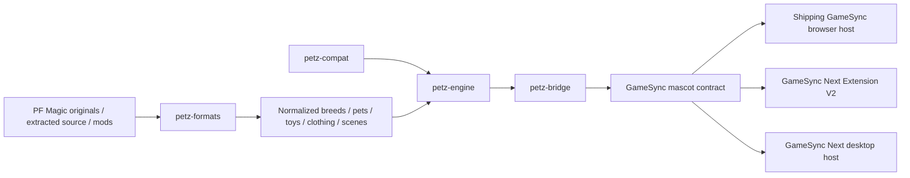

# PRJ-007 - PF Magic Petz Runtime Integration

**Project Constellation ID:** `PRJ-007`  
**Status:** ACTIVE GameSync / Mascot integration track  
**Goal:** keep one PF Magic Petz behavior/runtime core and integrate it through GameSync hosts without flattening Petz into ordinary mascot animation.  
**Historical rollout intent:** shipping GameSync -> GameSync Next Extension V2 -> desktop host.  
**Current strongest implementation source:** `Herbertofury/GameSync-Next` `main` at `cd906ff0831bf7fc33b41fea31b6f0c004cc1562`.  
**Shipping parity source:** `Herbertofury/Gamesync` `0.6.3` at `a8e37976eb0b3ee3c4ec5e802b02d3bfa1f41928`.  
**Current integration blocker:** [GameSync Next issue #9](https://github.com/Herbertofury/GameSync-Next/issues/9) is still a real defect on `main`. Draft [PR #10](https://github.com/Herbertofury/GameSync-Next/pull/10) stages the shared persistence repair on branch `automation/petz-bridge-persistence-20260818`; current GitHub branch head is `2612396804b44399b7b23b4f32f21217325da79c`, and the PR remains open, draft, mergeable and unmerged. Exact-head private Petz run `32459020450` and Secret Scan `32459020441` failed before receiving workflow-step payloads, so cross-restart persistence is **not** accepted on `main`.

## Project ownership and boundaries

PRJ-007 owns the **integration and rollout** of PF Magic Petz behavior through actual GameSync hosts. It is related to, but distinct from:

- **PCX-061 Petz Shared Core**, which owns the reusable Petz domain/runtime boundary;
- **PRJ-005 Mascot / Screenmate Platform**, which hosts Petz alongside ACS, Shimeji and other mascot engines;
- **PCX-042 GameSync Next**, which contains the strongest typed cross-host Petz implementation evidence.

The architectural rule is strict: **one Petz core, host adapters around it**. A browser-only rewrite, a second unrelated desktop engine, or a generic mascot sprite loop is not a valid substitute for PF Magic behavior integration.

## Source resolution

### GameSync Next

`Herbertofury/GameSync-Next` contains four dedicated typed Petz workspaces:

| Package | Responsibility |
| --- | --- |
| `packages/petz-engine` | Platform-agnostic simulation/domain core, pet state, physics, actions, motives, save data and custom content. |
| `packages/petz-compat` | Per-game compatibility packs for Dogz/Catz/Oddballz/Petz/Babyz plus Mega mode. |
| `packages/petz-formats` | Readers/parsers/scanners for Petz source and mod content. |
| `packages/petz-bridge` | Adapter between `PetzEngine` and GameSync host/mascot contracts. |

All four are private TypeScript workspace packages at version `0.1.0` with explicit `build` and `typecheck` scripts.

### Shipping GameSync

`Herbertofury/Gamesync` remains the current JavaScript shipping/parity baseline. Its editable source is `app/`, generated production extension is `dist/`, and the mascot runtime already recognizes PF Magic-style Catz, Dogz and Oddballz presets/resources. Do not replace shipping behavior by assumption merely because a newer typed implementation exists.

### Historical PF Magic source

Project continuity preserves the historical local source path:

`C:\\Users\\Owner\\Desktop\\GameSync\\PF Magic`

That path is important provenance, but it is not currently readable through the connected GitHub/Drive source used for this pass. Do not claim byte-for-byte identity between that historical tree and current typed packages until it is recovered, hashed and reconciled.

## Architecture



Parsing, compatibility and Petz behavior belong in shared packages. Browser APIs, rendering, persistence adapters and host lifecycle belong at host boundaries.

## Shared Petz engine

`packages/petz-engine` is intentionally platform-agnostic. Its public surface includes family/compatibility types, motives, personality, actions, physics, animations, breeds, toys, clothing, environments, save data, custom-content bundles, state-machine helpers and the `PetzEngine` controller.

### Supported family identities

Current typed families include:

- `dogz1`
- `catz1`
- `oddballz`
- `petz2`
- `petz3`
- `petz4`
- `babyz`
- `petz5`

A deliberate `mega` compatibility mode combines the family set. Mega mode is not evidence that every original title behaves identically.

### Motives and personality

The engine models six 0-100 motives: hunger, happiness, energy, social, fun and comfort. It also carries a 22-trait PF Magic-style personality record rather than a single generic personality flag.

The action selector is motive/personality aware. Examples include low energy increasing sit/sleep weight, low fun increasing play weight, species-specific vocal behavior and comfort influencing grooming.

### Action and physics surface

The typed action union includes locomotion, interaction and family-specific behavior such as `idle`, `walk`, `run`, `sit`, `sleep`, `eat`, `play`, `petting`, `pickup`, `thrown`, `fall`, `land`, `drag`, `toy_interact`, `groom`, cat/dog vocal actions, `scratch`, `roll`, `jump`, `climb`, `arrive`, `leave`, `breed`, `nurse`, `bounce`, `zap`, `morph` and `custom`.

The state machine applies gravity, velocity, ground/wall collision and friction. Physics is domain behavior, not merely display/CSS behavior.

## Compatibility and format packages

`@gamesync/petz-compat` stores per-family physics, AI timing, motive multipliers, species support, frame timing, breeding/clothing capabilities, save-format identity, playscene/toy-closet/hexing/genexing flags, LNZ generation, folder conventions and official breed IDs.

`@gamesync/petz-formats` separates source-format handling into dedicated readers/parsers such as `breed-reader.ts`, `lnz-parser.ts`, `pet-file-parser.ts`, `toy-parser.ts`, `clothing-parser.ts`, `scene-parser.ts` and `content-scanner.ts`.

When extending a parser:

1. preserve the original source bytes;
2. parse into a typed intermediate model;
3. distinguish unknown fields from true zero/default values;
4. add deterministic fixtures;
5. make failures actionable and non-destructive;
6. never silently coerce one Petz generation into another compatibility mode.

## Host bridge

`packages/petz-bridge/src/mascot-bridge.ts` is the cross-host integration boundary. It constructs `PetzEngine`, loads the selected compatibility/content pack, maps Petz events to host audio, resolves asset keys, starts/stops a `requestAnimationFrame` loop, caps frame delta at 100 ms, exposes mascot-compatible state and forwards drag/petting interactions.

A host provides:

- `resolveAssetUrl(assetKey)`;
- `playSound(soundUrl)`;
- `savePetData(petId, data)`;
- `loadPetData(petId)`.

The mascot-facing state includes pet identity/name, pack identity, sprite URL, position, facing, action, drag state, scale and horizontal flip.

### Current `main` persistence defect

GameSync Next `main` still has the source-proven issue #9 failure:

1. `spawnPet()` reads with `loadPetData(breedId)`;
2. shutdown writes with `savePetData(pet.id, data)`;
3. the returned saved object is not hydrated into the spawned pet;
4. shutdown serializes whole-engine state per pet rather than an explicitly scoped one-pet save;
5. the API shape does not provide stable independent persistence identity for two same-breed pets across restart.

This means save plumbing exists on `main`, but bridge-level cross-restart persistence is incomplete.

The current typed bridge also supplies placeholder environment values (`cursorX = 0`, `cursorY = 0`, `cursorNear = false`, `nearbyToyId = null`) to the Petz tick environment. Live cursor/toy integration therefore remains a separate host-wiring acceptance gap.

## Draft PR #10 persistence repair

Draft PR #10 is the current concrete repair lane. It is **staging evidence, not shipping behavior**. GitHub currently reports:

- base: `main` `cd906ff0831bf7fc33b41fea31b6f0c004cc1562`;
- branch: `automation/petz-bridge-persistence-20260818`;
- actual branch head: `2612396804b44399b7b23b4f32f21217325da79c`;
- state: open, draft, mergeable, unmerged;
- 21 commits, nine changed files, 1,441 additions and 24 deletions.

The staged repair provides:

- `PetzEngine.serializePet(petId)` for one-pet persistence without mutating unrelated engine state;
- `PetzEngine.restorePet(save)` for additive restore without clearing other live pets;
- optional host-owned stable `persistenceId` on `PetzMascotBridge.spawnPet()`;
- legacy breed-key fallback;
- matching read/write persistence identity;
- compatibility with direct one-pet saves and historical whole-engine `{ pets: [...] }` saves where a matching breed exists;
- restoration of position, velocity, facing, action/timers, animation/frame timing, drag/paused/asleep flags, ancestry/generation, offset identity, motives, personality, genetics, wardrobe and lifecycle state;
- optional persistence diagnostics with fresh-spawn fallback for invalid/corrupt saves;
- cleanup of live runtime-pet to persistence-ID mappings;
- asynchronous `destroy()` that awaits every per-pet save before resolving.

`scripts/petz/persistence-regression.mjs` exercises the actual proposal source and covers two same-breed stable slots, exact IDs, position/physics/action/motive restoration, additive second-pet restore, post-restore interaction, legacy whole-engine compatibility, corrupt-save fallback and a gated asynchronous host save proving teardown remains pending until persistence is durable.

### Canonical acceptance lane

The current branch consolidates Ferrum acceptance into `.github/workflows/petz-persistence-verify.yml`. A duplicate `.github/workflows/petz-ferrum-run65-current.yml` was removed after consolidation.

The primary lane pins the newest durably verified Ferrum run-65 product:

- product `56879a6410f41b3142ad97f21d4ffefb9ca1b5d3`;
- tested proposal `8dbcaebb0bb74df13b773b60dea1850002310b58`;
- tested/product tree `b5c85e072b1126a71d8970997a09be01ae799ee6`;
- full Ferrum CI `32369906986`;
- Playwright `1.63.0-alpha-2026-08-20`;
- Electron `43.4.0`;
- `@electron/packager` `20.3.0`.

Workflow-canonicalization commit `55baa805cb36eed5154ce6ec30159de0cbf9cfae` moved the run-65 proof into the primary lane. Current PR head `2612396804b44399b7b23b4f32f21217325da79c` removes the redundant run-65 workflow while preserving the same Petz/Ferrum acceptance requirements.

Fresh exact-head private evidence is still blocked before code execution:

- Petz persistence run `32459020450`, job `96701992871`: failure before workflow-step payload;
- Secret Scan `32459020441`, job `96701992684`: failure before workflow-step payload.

These are infrastructure non-executions, not product failures or passes. Public Ferrum Petz recovery also remains fail-closed until it has read-only `FERRUM_GAMESYNC_READ_TOKEN` / `GH_PAT` access to the private GameSync repositories or executable private GameSync Actions allocation is restored.

Do not merge or describe PR #10 as accepted until this exact head executes the full Petz regression/build/parity/Ferrum/restart/security surface.

## Build and verification

### Prerequisites

Use the canonical GameSync Next checkout with Node/npm and the repository lockfile:

```powershell
npm ci
```

### Build and typecheck Petz packages explicitly

The current root `build:packages` script does not include the Petz workspaces, so verify them explicitly:

```powershell
npm --workspace packages/petz-engine run build
npm --workspace packages/petz-engine run typecheck
npm --workspace packages/petz-compat run build
npm --workspace packages/petz-compat run typecheck
npm --workspace packages/petz-formats run build
npm --workspace packages/petz-formats run typecheck
npm --workspace packages/petz-bridge run build
npm --workspace packages/petz-bridge run typecheck
```

Recommended dependency order for diagnosis is engine -> compat -> formats -> bridge.

### Whole-platform checks

```powershell
npm run audit:gamesync-parity
npm --workspace apps/extension-v2 run build
npm --workspace apps/extension-v2 run lint
npm --workspace apps/extension-v2 run typecheck:room
npm --workspace apps/extension-v2 run verify:same-id-upgrade
node scripts/verify-extension-v2-opera.js
```

For PR #10, also run the exact-source persistence regression:

```powershell
node --test scripts/petz/persistence-regression.mjs
```

A local green regression is necessary but insufficient. The changed build still needs host restart/persistence identity proof plus security and integrity gates.

## Adding or changing content

### Add a Petz family/version

1. add/extend the family identity only when the compatibility boundary truly differs;
2. create the compatibility pack from verified behavior/format evidence;
3. extend parsers only where the source format requires it;
4. register breeds/content as typed pack data;
5. build/typecheck engine, compat, formats and bridge;
6. add host coverage;
7. compare representative behavior against shipping/original evidence.

### Add a breed

Preserve stable family/breed identity, keep animations/sounds referenced by asset keys, register the pack, spawn directly through `PetzEngine`, spawn through `PetzMascotBridge`, verify renderer/audio behavior, and verify persistence only after the bridge repair is accepted.

### Add a host

A new host adapter must provide real asset resolution, audio, persistence and frame/tick lifecycle without duplicating Petz domain logic. Minimum proof should create and render cat/dog/Oddballz samples, pet/drag/throw, observe autonomous motive-driven behavior, play audio, save/restart/restore, preserve identity, exercise at least one parsed/custom-content fixture and surface missing-asset/format failures truthfully.

## Test strategy

A serious regression surface should cover:

- pure engine motive/action/physics/drag/throw/petting/save/restore behavior;
- compatibility identity and cross-family leakage prevention;
- LNZ/breed/PET/toy/clothing/scene fixtures, including malformed input;
- bridge RAF lifecycle, delta cap, asset/audio forwarding and state mapping;
- stable-key persistence and two same-breed independent pets;
- non-destructive additive restore;
- corrupt/missing save fallback;
- real cursor/toy environment data when wired;
- Extension V2 and desktop host parity;
- changed-build identity across restart.

Compilation-only acceptance is not sufficient.

## Troubleshooting

### Petz package builds but disappears in the app

Confirm the host actually imports the Petz bridge/package and the built artifact contains that integration. Workspace presence alone does not prove runtime wiring.

### Bridge fails after an engine change

Build/typecheck `petz-engine`, then `petz-compat`, then `petz-bridge`. Verify exported action/state/type contracts remain aligned.

### Pet appears but does not react to cursor or toys

The current typed bridge still supplies placeholder cursor/toy environment fields. Prove live host environment data is reaching the bridge before blaming AI selection.

### Pet saves but does not restore on `main`

This is the known issue #9 path: reads and writes use different identities and loaded state is not hydrated. Do not add a second host-only persistence layer around the defect.

### Two same-breed pets collide in persistence

Each persistent pet needs a stable host-owned identity distinct from breed ID and from ephemeral runtime ID. Verify both pets survive restart independently and restoring one does not clear the other.

### Correct breed loads with wrong game behavior

Check pack family and compatibility-pack selection. Do not silently fall back to Mega mode when exact family behavior is expected.

### Whole `npm run build` passes while Petz is broken

The root shared-package build currently omits Petz workspaces. Run the explicit Petz package commands and host-specific Petz scenarios.

## Verified versus unresolved

### Verified from source

- typed, platform-agnostic Petz engine exists;
- eight Petz family identifiers plus Mega compatibility are modeled;
- six motives, 22 personality traits, actions, physics, save data and custom content are modeled;
- dedicated compatibility and format packages exist;
- a typed host bridge exists;
- shipping GameSync remains the parity baseline;
- current `main` persistence failure is source-proven;
- draft PR #10 contains a source-inspected stable-identity/additive-restore repair and exact-source regression;
- run-65 Ferrum acceptance is consolidated into the primary Petz workflow.

### Still unresolved

- accepted cross-restart persistence on GameSync Next `main`;
- exact-head execution of PR #10's Petz/Ferrum/security surface;
- complete original PF Magic behavioral parity across all supported games;
- byte reconciliation against the historical local PF Magic source tree;
- dedicated package-local Petz test scripts and root aggregate build inclusion;
- live cursor/toy environment wiring;
- fresh typed-bridge qualification in every browser/desktop host;
- proof that every preserved original/mod resource maps to a working interaction.

## Current next checkpoint

The highest-value next step is **exact-current-head execution**, not another persistence redesign:

1. restore executable private GameSync Actions allocation or authorize the public Ferrum recovery lane for read-only private checkout;
2. execute PR #10 head `2612396804b44399b7b23b4f32f21217325da79c` through frozen install, Petz build/typecheck and `persistence-regression.mjs`;
3. execute current parity/integrity checks plus exact-build Ferrum worker recovery, full restart, persistence, identity and diagnostics;
4. pass Secret Scan and final stale-main check;
5. only then promote the repair through the repository's authorized merge workflow;
6. after merge, run representative Catz, Dogz and Oddballz scenarios in shipping GameSync, Extension V2 and desktop and record a behavior/parity ledger;
7. reconcile the historical PF Magic source tree when available and preserve hashes/provenance.

Do not declare the rollout complete until stable Petz identities, state and interactions survive real host use and restart.
