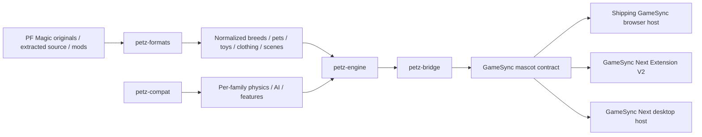

# PRJ-007 - PF Magic Petz Runtime Integration

**Project Constellation ID:** PRJ-007
**Status:** ACTIVE GameSync / Mascot integration track
**Goal:** keep one PF Magic Petz behavior/runtime core and integrate it through GameSync hosts without flattening Petz into ordinary mascot animation.
**Historical rollout intent:** GameSync shipping extension -> GameSync Next Extension V2 -> desktop host.
**Current strongest source evidence:** `Herbertofury/GameSync-Next` contains a typed, platform-agnostic Petz core plus compatibility, format and mascot-bridge packages; `Herbertofury/Gamesync` remains the current shipping JavaScript extension and parity baseline.
**Current integration blocker:** [GameSync Next issue #9](https://github.com/Herbertofury/GameSync-Next/issues/9) records a source-proven persistence defect in `packages/petz-bridge/src/mascot-bridge.ts`: spawn-time loading uses `breedId`, shutdown saving uses generated `pet.id`, and the loaded value is ignored. Cross-restart Petz persistence through the typed bridge is therefore not complete.
**Important boundary:** source now proves a real cross-host Petz architecture exists in GameSync Next, but this documentation pass does not claim complete original PF Magic behavioral parity or a freshly exercised end-to-end Petz flow in every host.

## 1. What this project owns

PRJ-007 is the **integration and rollout project** for PF Magic Petz across GameSync. It is related to, but not the same as, `PCX-061 - Petz Shared Core`.

- **PCX-061** owns the reusable Petz domain/runtime boundary.
- **PRJ-007** owns getting that core into the actual GameSync hosts with preserved behavior, assets, persistence, interaction and compatibility.
- **PRJ-005** is the larger Mascot / Screenmate umbrella that hosts Petz alongside ACS, Shimeji and other mascot engines.
- **PCX-042** is the typed GameSync Next platform that now contains the strongest shared-core implementation evidence.

The architectural rule remains: **one Petz core, host adapters around it**. A browser-only engine, a second unrelated desktop implementation, or a generic mascot sprite loop is not a valid substitute for cross-host Petz integration.

## 2. Current source resolution

### GameSync Next

`Herbertofury/GameSync-Next` is the strongest current source for the reusable Petz architecture. The monorepo explicitly combines Extension V2, desktop/server hosts and shared packages, while retaining the current JavaScript GameSync extension as its parity baseline.

The current `packages/` tree includes four dedicated Petz packages:

| Package | Role |
| --- | --- |
| `packages/petz-engine` | Platform-agnostic simulation/domain core. |
| `packages/petz-compat` | Per-game compatibility packs and merged Mega mode. |
| `packages/petz-formats` | Readers/parsers/scanners for Petz source and mod content formats. |
| `packages/petz-bridge` | Adapter between `PetzEngine` and the GameSync mascot contract. |

All four are private TypeScript workspace packages at version `0.1.0` with explicit `build` and `typecheck` scripts.

### Shipping GameSync

`Herbertofury/Gamesync` remains the current JavaScript extension parity baseline. Its canonical editable source is `app/`, and its generated production extension is `dist/`. The shipping mascot host already recognizes PF Magic presets such as classic Catz, Dogz and Oddballz and contains a substantial browser-side Petz implementation and packaged resource tree.

### Historical PF Magic source

Project continuity records preserve the historical local source location:

`C:\Users\Owner\Desktop\GameSync\PF Magic`

That path is important provenance, but it is not directly readable through the connected GitHub/Drive evidence used for this pass. Do not claim byte-for-byte identity between that local tree and the current GitHub packages until the local source is reconciled and hashed.

## 3. Current architecture



The most important separation is that parsing/compatibility/domain behavior is not supposed to live inside one UI host. Rendering, browser APIs, storage and host lifecycle belong at adapter boundaries.

## 4. `@gamesync/petz-engine`

`packages/petz-engine` is the typed shared runtime. Its public API exports:

- Petz family and compatibility types;
- motives and personality models;
- action, physics, animation and breed types;
- toys, clothing and environments;
- save data and custom-content bundle types;
- default motives, personality, physics and engine configuration;
- the pure pet state machine;
- drag and petting interaction functions;
- serialize/restore helpers;
- the `PetzEngine` controller.

### Supported family identifiers

The current type system explicitly supports:

- `dogz1`
- `catz1`
- `oddballz`
- `petz2`
- `petz3`
- `petz4`
- `babyz`
- `petz5`

A `mega` compatibility mode is also defined for merged behavior.

### Motives

The typed engine currently models six 0-100 motives:

- hunger
- happiness
- energy
- social
- fun
- comfort

The pure state machine decays these motives over time and applies action-specific recovery. Examples currently implemented include eating restoring hunger, sleeping restoring energy, play/toy interaction restoring fun, petting restoring happiness/social, and grooming restoring comfort.

### Personality

The current model contains 22 PF Magic-style personality traits rather than a single generic personality flag. The traits include liveliness, playfulness, independence, confidence, naughtiness, acrobaticness, patience, kindness, nurturing, finickiness, intelligence, messiness, quirkiness, insanity, constitution, metabolism, dogginess, love destiny, fertility, love loyalty, libido and offspring-sex tendency.

The package also records the seven traits that the community-standard unibreed personality fix resets to 50.

### Action model

The typed action union covers core locomotion and interaction plus species/family behavior, including:

`idle`, `walk`, `run`, `sit`, `sleep`, `eat`, `play`, `petting`, `pickup`, `thrown`, `fall`, `land`, `drag`, `toy_interact`, `groom`, `meow`, `bark`, `hiss`, `growl`, `purr`, `wag_tail`, `scratch`, `roll`, `jump`, `climb`, `arrive`, `leave`, `breed`, `nurse`, `bounce`, `zap`, `morph`, and `custom`.

This semantic action surface should remain stable across hosts. Host code may map it to different renderers, but it should not erase the meaning of the action.

## 5. Pet state machine

`packages/petz-engine/src/pet-state.ts` is intentionally pure logic: no DOM, no renderer and no platform-specific storage.

A pet instance owns:

- stable instance/name/breed/compat identity;
- current action, elapsed time and action duration;
- animation/frame state;
- physics and facing;
- six motives;
- the 22-trait personality record;
- age and interaction timestamps;
- wardrobe;
- genetics;
- dragging, paused and asleep flags.

### Tick order

The current tick path performs, in order:

1. age advancement;
2. motive decay when not dragging;
3. physics when not dragging;
4. action-timer transition;
5. animation-frame advancement and per-frame velocity updates.

The action selector is motive- and personality-aware. For example, low energy increases sit/sleep weighting, low fun increases play weighting, species controls cat/dog vocal actions, and low comfort increases grooming weight.

### Physics

The shared state machine applies gravity, velocity, ground collision, wall collision/bounce and ground friction. Physics is part of domain behavior, not merely a CSS/display concern.

## 6. `PetzEngine` controller

`packages/petz-engine/src/engine.ts` coordinates pets and content packs without depending on a specific UI host.

Verified responsibilities include:

- loading/unloading content packs;
- registering breeds, toys, clothing and environments;
- spawning/removing/querying pets;
- enforcing `maxPets`;
- advancing all pets through `tick()`;
- forwarding drag and petting interactions;
- serializing engine/pet state;
- restoring pet state after required breed packs are loaded;
- exposing and updating engine configuration;
- loading/unloading custom content bundles.

### Custom content

The engine has explicit conversion paths for custom breeds, toys, clothing and scenes. Custom content is gated by `moddingEnabled` and registered into the same engine maps rather than a separate fake-preview path.

## 7. `@gamesync/petz-compat`

`petz-compat` captures per-game behavioral differences so one engine can run family-specific modes instead of hard-coding a single Petz release.

Each compatibility pack records:

- physics constants;
- AI timing;
- motive decay multipliers;
- available species;
- base frame timing;
- breeding and clothing support;
- save-format identity;
- playscene/toy-closet/hexing/genexing flags;
- LNZ format generation;
- data-folder convention;
- breed-file extension;
- Add Clothing / Flat Clothing support;
- unibreed compatibility;
- official breed IDs.

Current registered packs cover Dogz 1, Catz 1, Oddballz, Petz 2, Petz 3, Petz 4, Babyz and Petz 5.

### Mega mode

`buildMegaCompat()` creates a merged `Mega Petz (All Games)` profile using Petz 5 as the technical base, averaged physics/AI timing and the combined breed list. Treat Mega mode as a deliberate cross-version mode, not evidence that every original title behaves identically.

## 8. `@gamesync/petz-formats`

The format package is the input/recovery layer for authentic Petz content. Its current source tree contains dedicated modules for:

- `breed-reader.ts`
- `lnz-parser.ts`
- `pet-file-parser.ts`
- `toy-parser.ts`
- `clothing-parser.ts`
- `scene-parser.ts`
- `content-scanner.ts`

This separation matters. Parsing original or modded content should normalize into typed Petz data before the engine or UI consumes it. Do not bury format parsing inside a browser component.

### Modification rule

When extending a format parser:

1. preserve the original bytes/source artifact as evidence;
2. parse into a typed intermediate structure;
3. distinguish unknown/unsupported fields from zero/default values;
4. add deterministic fixtures for each format family;
5. keep parser failures actionable and non-destructive;
6. do not silently coerce one Petz generation into another compatibility mode.

## 9. `@gamesync/petz-bridge`

`packages/petz-bridge/src/mascot-bridge.ts` is the cross-host integration boundary. Its own source states that it is consumed by both the shipping Opera extension and Extension V2.

The bridge:

- constructs `PetzEngine` using the pack family;
- loads the content pack;
- resolves asset keys through host callbacks;
- maps Petz events to host audio;
- starts/stops a `requestAnimationFrame` simulation loop;
- caps a frame delta at 100 ms to reduce spiral-of-death behavior;
- exposes mascot-compatible state for every pet;
- forwards drag and petting interactions;
- exposes the underlying engine and compatibility pack.

### Host callback contract

A host must provide:

- `resolveAssetUrl(assetKey)`
- `playSound(soundUrl)`
- `savePetData(petId, data)`
- `loadPetData(petId)`

The mascot-facing state includes instance ID/name, pack identity, sprite URL, x/y, facing, action, drag state, scale and horizontal flip.

### Current persistence limitation

The bridge currently calls `loadPetData()` when spawning, but restoring that returned save is marked `TODO`. On `destroy()`, it serializes and saves engine data. Therefore **save plumbing exists, but the bridge's load/restore path is not yet complete**. Do not claim cross-restart Petz persistence in GameSync Next until this TODO is implemented and runtime-tested.

### Source-proven persistence identity defect

The current source contains a second persistence problem beyond the unfinished restore branch. `spawnPet()` calls `loadPetData(breedId)`, while `destroy()` iterates the current pets and calls `savePetData(pet.id, data)`. Those are different identities: a breed identifier is used for the read path and a generated pet instance identifier is used for the write path.

The same shutdown loop calls `this.engine.serialize()` for every pet before saving, so the data handed to each per-pet key is currently the whole engine snapshot rather than an explicitly scoped single-pet snapshot.

This is tracked in [GameSync Next issue #9](https://github.com/Herbertofury/GameSync-Next/issues/9). The source-proven defects are:

1. a later spawn cannot discover a save written under a generated `pet.id` by reading under `breedId`;
2. even when `loadPetData()` returns an object, that returned state is ignored because the restore branch is still a TODO;
3. the current API shape does not by itself provide a stable persistence identity for two pets of the same breed across restarts.

The preservation-first repair contract is to introduce an explicit stable persistence identity at the bridge/host boundary and add a non-destructive single-pet restore path to `PetzEngine`. Whole-engine restore for each spawn would be unsafe because restoring one pet must not clear or replace already-running pets.

Minimum acceptance for the repair:

- spawn a pet, mutate motives/position/action, save/destroy, construct a new bridge, and restore the same state;
- persist two pets of the same breed independently;
- restoring a second pet does not clear the first;
- missing or corrupt saves fall back to a fresh spawn with a visible/traceable host error path where appropriate;
- drag, petting and simulation continue after restore;
- Extension V2 and every shipping host consuming the bridge perform restart proof against the changed build;
- `petz-engine`, `petz-bridge`, and affected host build/typecheck gates pass;
- the runtime proves the loaded artifact is the changed build rather than stale output.

Do not add a second host-only persistence system as a workaround. The shared bridge contract should become internally consistent so every consuming host receives the same persistence semantics.

### Current environment limitation

The bridge currently constructs tick-environment cursor fields with `cursorX = 0`, `cursorY = 0`, `cursorNear = false`, and `nearbyToyId = null`. Host integration for live cursor proximity and nearby-toy detection therefore needs verification before those AI behaviors can be considered fully connected through this bridge.

## 10. Relationship to the shipping JavaScript Petz runtime

Shipping GameSync already has Petz-aware mascot presets and a browser implementation. GameSync Next is not supposed to replace that behavior by assumption. Its own repository defines the current JavaScript extension as the user-facing parity baseline and provides a parity-audit workflow.

Migration should therefore be treated as a ledger:

| Behavior | Shipping GameSync | Typed Petz packages | Host proof required |
| --- | --- | --- | --- |
| family/breed identity | implemented source exists | typed | compare exact IDs and mappings |
| motives | Petz-specific runtime | typed six-motive model | long-running behavior comparison |
| AI/actions | Petz-specific runtime | typed action/state machine | representative Catz/Dogz/Oddballz traces |
| physics | browser runtime | platform-agnostic physics | drag/throw/fall/edge parity |
| formats | preserved resources/packs | dedicated parser package | fixture corpus |
| persistence | browser mascot infrastructure | serialize plus load/save identity mismatch and ignored restore | stable-key multi-pet restart proof |
| rendering | sprite/GIF and Ballz paths | renderer-neutral state | host renderer parity |
| audio | packaged resources | event/callback contract | actual host playback |
| custom content | pack/resource paths | typed custom bundle support | import and reload proof |

## 11. Build and typecheck commands

### Prerequisites

Use the canonical `Herbertofury/GameSync-Next` checkout with Node/npm and the repository lockfile.

```powershell
npm ci
```

### Build the Petz packages explicitly

The current root `build:packages` script builds schema/shared/engine/core/pixi-game/ui and does **not** list the Petz workspaces. Until that is deliberately changed and verified, build/typecheck the Petz packages explicitly:

```powershell
npm --workspace packages/petz-engine run build
npm --workspace packages/petz-engine run typecheck

npm --workspace packages/petz-compat run build
npm --workspace packages/petz-compat run typecheck

npm --workspace packages/petz-formats run build
npm --workspace packages/petz-formats run typecheck

npm --workspace packages/petz-bridge run build
npm --workspace packages/petz-bridge run typecheck
```

Recommended dependency order for build diagnosis is engine -> compat -> formats -> bridge. `petz-compat` depends on `petz-engine`; `petz-bridge` depends on both `petz-engine` and `petz-compat`.

### Whole-platform verification

The GameSync Next repository also defines the broader parity and Extension V2 verification path:

```powershell
npm run audit:gamesync-parity
npm --workspace apps/extension-v2 run build
npm --workspace apps/extension-v2 run lint
npm --workspace apps/extension-v2 run typecheck:room
npm --workspace apps/extension-v2 run verify:same-id-upgrade
node scripts/verify-extension-v2-opera.js
```

These checks are useful platform gates, but none is a substitute for a Petz-specific runtime test unless the Petz scenario is actually exercised.

## 12. How to extend the integration

### Add a new Petz family/version

1. Add or extend the family type only when the compatibility boundary truly differs.
2. Create the compatibility pack with verified physics/AI/format/features.
3. Extend format parsing only where the source format requires it.
4. Add breeds/content as typed pack data.
5. Run engine/compat/formats/bridge build and typecheck.
6. Add host adapter coverage.
7. Compare behavior against the shipping/reference implementation or original-game evidence.

### Add a breed

1. Preserve stable family and breed identity.
2. Parse or author the breed into `PetzBreed` without host-only fields.
3. Keep animations/sounds referenced by asset keys.
4. Verify the content pack registers it.
5. Spawn through `PetzEngine` directly.
6. Spawn through `PetzMascotBridge`.
7. Verify the actual host renderer and audio path.
8. Verify persistence after the bridge restore path is complete.

### Add a host

A new host adapter must provide real asset resolution, sound playback, persistence and a frame/tick lifecycle. It should map Petz state into the host without duplicating Petz domain logic.

Minimum proof for a new host:

- create a pet from a real pack;
- render at least one cat, dog and Oddballz creature;
- pet, drag and throw;
- observe motive-driven autonomous action changes;
- play mapped audio;
- save, restart/reload and restore;
- preserve family/breed/instance identity;
- exercise at least one parsed/custom content fixture;
- record errors for missing assets/formats instead of silently substituting unrelated content.

## 13. Testing strategy

The Petz workspaces currently expose `build` and `typecheck`, but no dedicated Petz test script is declared in their package manifests. This is a documentation and engineering gap, not permission to treat compilation as runtime proof.

A serious Petz regression suite should cover:

### Pure engine tests

- motive decay bounds and action recovery;
- AI weighting for low energy/fun/social/comfort;
- species-specific vocal behavior;
- action priority and interruption;
- physics edge/ground behavior;
- drag/throw/petting transitions;
- serialize/restore round trip;
- max-pet enforcement;
- pack load/unload;
- custom bundle load/unload.

### Compatibility tests

- every family resolves to the intended compatibility pack;
- breed IDs and feature flags remain stable;
- Mega mode combines without mutating source packs;
- format/feature differences do not leak between families.

### Format fixtures

- representative LNZ files;
- breed files;
- `.pet` saves;
- toys;
- clothing;
- scenes;
- intentionally malformed/truncated inputs;
- community/modded samples with known expected output.

### Bridge/runtime tests

- RAF start/stop and delta cap;
- asset resolution;
- sound event forwarding;
- state mapping to the mascot contract;
- drag and pet forwarding;
- stable-key save/restore round trip through the bridge;
- two same-breed pets persisting independently;
- non-destructive restoration that does not clear already-running pets;
- missing/corrupt save fallback behavior;
- live cursor/toy environment integration once wired;
- Extension V2 and desktop host parity.

## 14. Troubleshooting

### Petz package compiles alone but disappears in the app

Check whether the host actually imports `@gamesync/petz-bridge` or another Petz package. Workspace presence does not prove runtime wiring. Then verify the host build includes the package and that no old browser-only runtime is being exercised instead.

### `petz-bridge` build fails after an engine change

Build/typecheck `petz-engine` first, then `petz-compat`, then the bridge. Confirm exported type names and action/state contracts still match.

### Pet appears but never reacts to cursor/toys

The current typed bridge uses placeholder cursor/toy environment values. Confirm the host is supplying live environment data before debugging AI as if the domain state machine were receiving those signals.

### Pet is saved but not restored after restart

Inspect both the persistence key and restore implementation. Current source reads with `loadPetData(breedId)`, writes with `savePetData(pet.id, data)`, and ignores a returned loaded object. A host can therefore have successfully stored data that a later spawn cannot locate through the current key path. Fix the shared bridge identity contract and the non-destructive single-pet restore path described in issue #9 rather than adding another persistence layer around the defect.

### Two same-breed pets overwrite, disappear, or restore incorrectly

Do not key persistence only by breed. Each persistent pet needs a stable identity that survives restart and remains distinct from another pet of the same breed. Regression-test two same-breed pets and verify restoring the second does not clear the first.

### Correct breed exists but wrong game behavior is used

Inspect the pack family and `getCompatPack(pack.family)`. Do not fall back to a generic or Mega profile when exact per-version behavior is expected.

### A source/mod file is present but cannot load

Start in `petz-formats`: determine whether the file is recognized, parsed and normalized. Do not patch the UI to read a format directly as a workaround.

### Whole `npm run build` passes but Petz changes are broken

The root `build:packages` script currently omits the Petz packages. Run their explicit workspace build/typecheck commands and then run host-specific Petz scenarios.

## 15. Verified behavior versus unresolved work

### Verified from current source

- a typed platform-agnostic Petz engine exists;
- the engine models multiple pets, packs, motives, 22 personality traits, actions, physics, save data and custom content;
- per-game compatibility packs exist for Dogz 1, Catz 1, Oddballz, Petz 2, Petz 3, Petz 4, Babyz and Petz 5;
- a Mega compatibility profile exists;
- dedicated Petz format readers/parsers/scanners exist;
- a typed mascot bridge exists and states it is consumed by shipping Opera GameSync and Extension V2;
- GameSync Next contains Extension V2 and desktop hosts in the same monorepo;
- the shipping JavaScript extension remains the parity baseline;
- the current typed bridge persistence failure is source-proven: load and save identities differ, and returned loaded state is ignored.

### Still unresolved or incomplete

- complete original PF Magic behavioral parity across every supported game;
- byte-level reconciliation against the historical local `PF Magic` source tree;
- dedicated automated Petz test suites in the current Petz package manifests;
- automatic inclusion of Petz workspaces in the current root `build:packages` command;
- [GameSync Next issue #9](https://github.com/Herbertofury/GameSync-Next/issues/9): stable persistence identity plus non-destructive single-pet restore across restart;
- live cursor/toy environment data in the inspected bridge implementation;
- fresh real-browser qualification of the typed bridge;
- fresh desktop runtime qualification;
- proof that every preserved original/mod resource is represented by a working interaction.

## 16. Current next checkpoint

The highest-value next engineering/documentation checkpoint is to turn the typed Petz packages into a **provable cross-host parity lane**, starting with the source-proven persistence blocker:

1. resolve issue #9 by defining a stable bridge/host persistence identity and implementing non-destructive single-pet restore;
2. prove spawn -> mutate -> save/destroy -> new bridge -> restore with the same pet state;
3. prove two same-breed pets persist independently and restoring one never clears the other;
4. add dedicated engine/compat/formats/bridge tests, including corrupt/missing save fallback;
5. feed real cursor/toy environment data through the bridge;
6. make the intended root build/test pipeline include the Petz packages or add a documented Petz aggregate command;
7. run representative Catz, Dogz and Oddballz scenarios in shipping GameSync, Extension V2 and desktop;
8. record a behavior/parity ledger with exact build identities;
9. reconcile the historical `PF Magic` source tree when it becomes accessible and preserve hashes/provenance.

Do not declare the rollout complete until the same stable Petz identities, core state and user interactions survive real host use and restart rather than merely compiling.